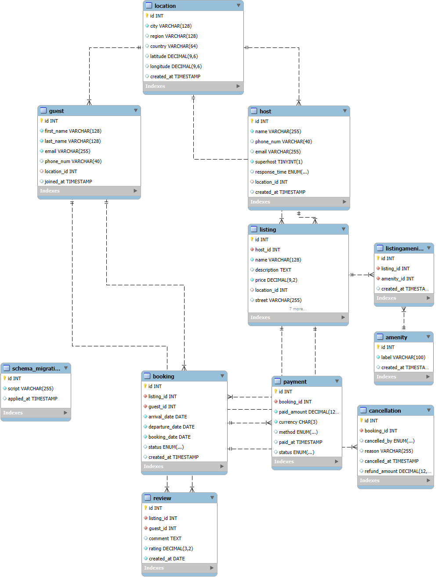
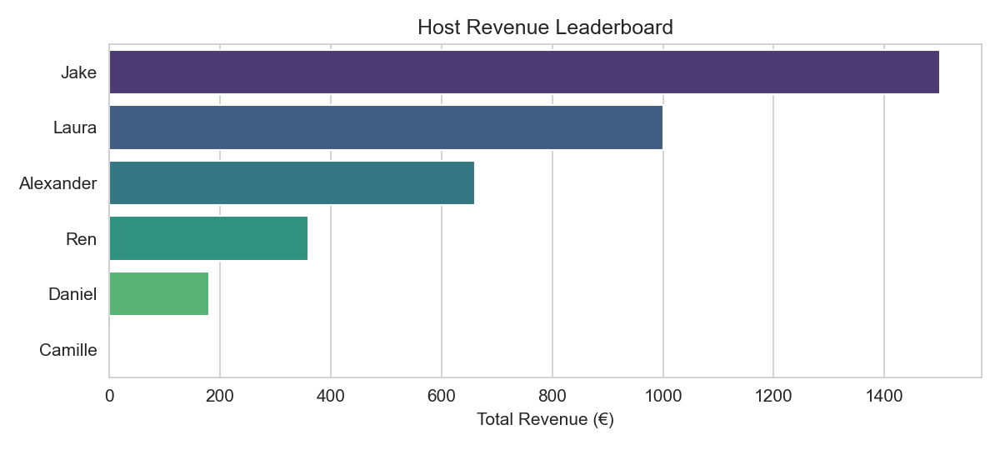
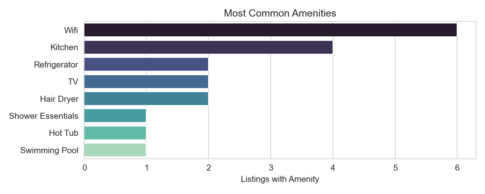
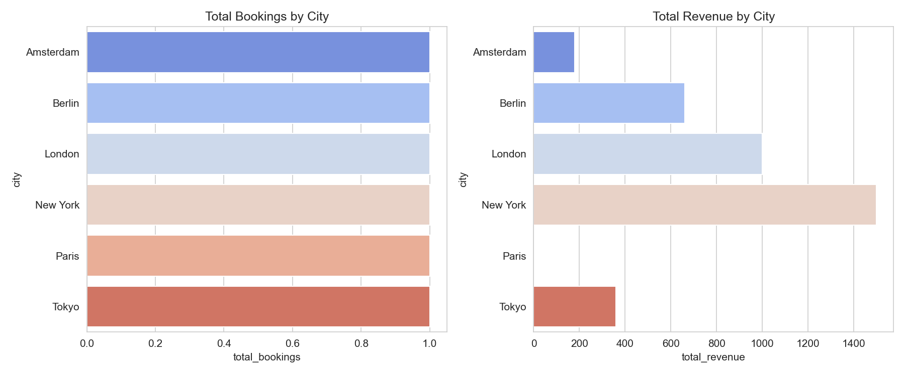

# Airbnb Analytics — SQL & Data Visualisation Project

## Overview
This project delivers a complete, end-to-end workflow for designing, populating, and analysing a relational database modeled on Airbnb operations.  

Features include:
- Normalised database schema
- Rich sample dataset
- Advanced SQL analytics
- Materialised views for performance optimisation
- Python integration for visualisation and export

All analytical outputs are automatically **date-stamped** for reproducibility and historical comparison.

---

## Database Schema


**Key Entities:**
- **Host** — property owners offering listings
- **Guest** — customers booking listings
- **Listing** — properties available for booking
- **Booking** — confirmed stays with associated dates
- **Payment** — financial transactions linked to bookings
- **Amenity** — features available in listings
- **Materialised Views** — pre-aggregated datasets for high-performance reporting

---

## Analytical Outputs
1. **Host Revenue Leaderboard** — identifies top-earning hosts based on total paid revenue.
2. **City Performance** — compares booking volume and total revenue across cities.
3. **Amenities Frequency** — ranks the most common property features.
4. **Materialised View Reporting** — demonstrates query performance benefits when using pre-aggregated datasets.

Each output is saved in:
- **CSV format** (`exports/`) for further analysis or integration
- **PNG format** (`docs/`) for reporting and dashboards

---

## Tech Stack
- **Database**: MySQL 8.x
- **Scripting & Analysis**: Python 3.x, pandas, matplotlib, seaborn, mysql-connector-python
- **Development Environment**: Jupyter Notebook, VS Code
- **Version Control**: Git & GitHub

---

## Setup Instructions
1. **Clone the repository**:
   ```bash
   git clone https://github.com/cherylisabella/codebook/database-management/airbnb.git
   cd airbnb

2. **Create and seed the database**
- Open **MySQL Workbench** (or your preferred MySQL client) and execute the following scripts in order:
  1. `sql/01_create_schema.sql`
  2. `sql/02_seed_data.sql`
  3. *(Optional)* `sql/05_views_materialised.sql` — for pre-aggregated metrics.

3. **Install Python dependencies**
   ```bash
   pip install -r requirements.txt
   
4. **Run the analysis**:
- Open notebooks/analysis.ipynb in Jupyter or VS Code.
- Execute cells in sequence to generate CSV and PNG outputs.

---

## Sample Outputs





