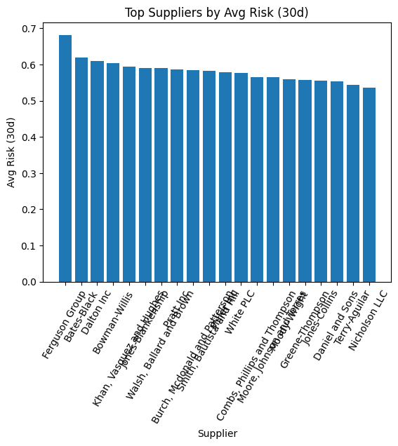
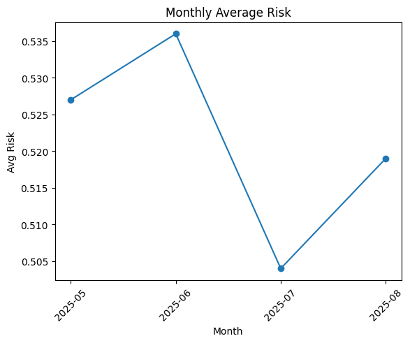

# Supply Chain Risk Management Platform -  SQL, Data Visualisation & Machine Learning Project 

A data-driven platform to monitor, score, predict and visualise supplier and shipment risks.

**Tech stack:**
- **MySQL 8** — schema, materialised views, analytical queries.
- **Python** — ETL pipeline for ingestion, transformation, and scoring.
- **ML** — predictive delay models.
- **GitHub Actions** — automated nightly reporting.

---

## 1. Database Schema
**Tables**
- **Supplier** — company metadata, financial score.
- **Route** — origin/destination, mode, distance.
- **Shipment** — links suppliers to routes and dates.
- **Incident** — disruptions (storms, strikes, etc.).
- **RiskFactor** — reference risk sources.
- **ShipmentRiskScore** — AI-generated risk & delay predictions.

**Indexes**
- Supplier + route composite.
- Incident date.
- Risk score.

---

## 2. SQL Components
- **`sql/views_procedures.sql`**
  - `mv_high_risk_shipments` — shipments over risk threshold.
  - `mv_country_corridors` — aggregated corridor stats.
  - Stored procs for refreshing all MVs.
- **`sql/analytical_queries.sql`**
  - 30-day supplier risk
  - Top shipments
  - Monthly trends
  - Corridor stats
  - Incident impacts
  - Supplier rankings
  - Distance vs risk
  - Risk momentum
  - Corridor exposure
  - Rolling 30-day risk

---

## 3. ETL Layer
- **`etl/config.py`** — loads DB settings from `.env`.
- **`etl/ingest_mock_apis.py`** — mock incidents & risk factor data.

---

## 4. Machine Learning
- **`ml/train_delay_model.py`** — trains Gradient Boosting delay model.
- **`ml/score_shipments.py`** — scores active shipments.

---

## 5. Reporting
- **`notebooks/generate_plots.py`** — generates:
  - CSV exports → `/exports`
  - PNG charts → `/docs`

---

## 6. Environment Setup
**`.env`** at project root:
```
DB_HOST=localhost
DB_PORT=3306
DB_USER=root
DB_PASS=yourpassword
DB_NAME=supply_chain_risk
EXPORTS_DIR=
DOCS_DIR=
```
*(Add `.env` to `.gitignore` — never commit it)*

---

## 7. Automation (GitHub Actions)
**Workflow:** `.github/workflows/pipeline.yml`  

**Steps:**
1. Checkout code
2. Install Python & MySQL client
3. Load DB creds from GitHub Secrets
4. Run ETL
5. Run analytical queries
6. Commit new exports

**Schedule:**
- Daily at 01:00 UTC
- Manual trigger via “Run workflow”

**Secrets required:**  
`DB_HOST`, `DB_PORT`, `DB_USER`, `DB_PASS`, `DB_NAME`

---

## 8. Running Locally
```bash
# 1. Create DB & schema
mysql -u root -p < sql/schema.sql
mysql -u root -p supply_chain_risk < sql/views_procedures.sql

# 2. Install dependencies
python -m venv .venv
source .venv/bin/activate
pip install -r requirements.txt

# 3. Populate mock data
python etl/ingest_mock_apis.py

# 4. Train & score
python ml/train_delay_model.py
python ml/score_shipments.py

# 5. Generate reports
python notebooks/generate_plots.py
```

---

## 10. Example Outputs





---

## 📂 Project Documentation Artifacts (`docs/`)

This folder contains generated project documentation and visualisations:

| File / Asset | Description |
|--------------|-------------|
| `ERD.png` | Entity Relationship Diagram exported from MySQL Workbench, showing all tables, relationships, and materialised views. |
| `schema.sql` | Full database schema dump (`mysqldump --no-data`) for reproducibility. |
| `supplier_risk_30d_YYYYMMDD_HHMM.png` | Bar chart of top suppliers by average risk score over the past 30 days. |
| `corridor_risk_barh_YYYYMMDD_HHMM.png` | Horizontal bar chart of the top international trade corridors ranked by average risk score. |
| `monthly_risk_trend_YYYYMMDD_HHMM.png` | Line chart showing month-by-month changes in average shipment risk. |
| `*_YYYYMMDD_HHMM.csv` | Raw CSV exports matching each visualisation, for downstream analysis in BI tools. |

All artifacts in `docs/` are **auto-generated** as part of the pipeline:
- **Local development** → `python notebooks/generate_plots.py`
- **GitHub Actions** → Nightly pipeline run automatically refreshes exports and plots.