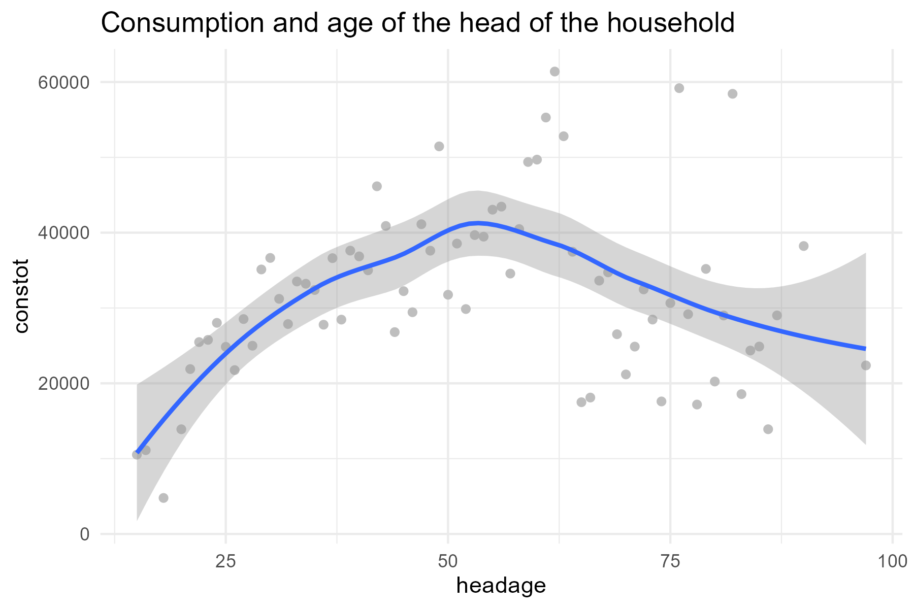
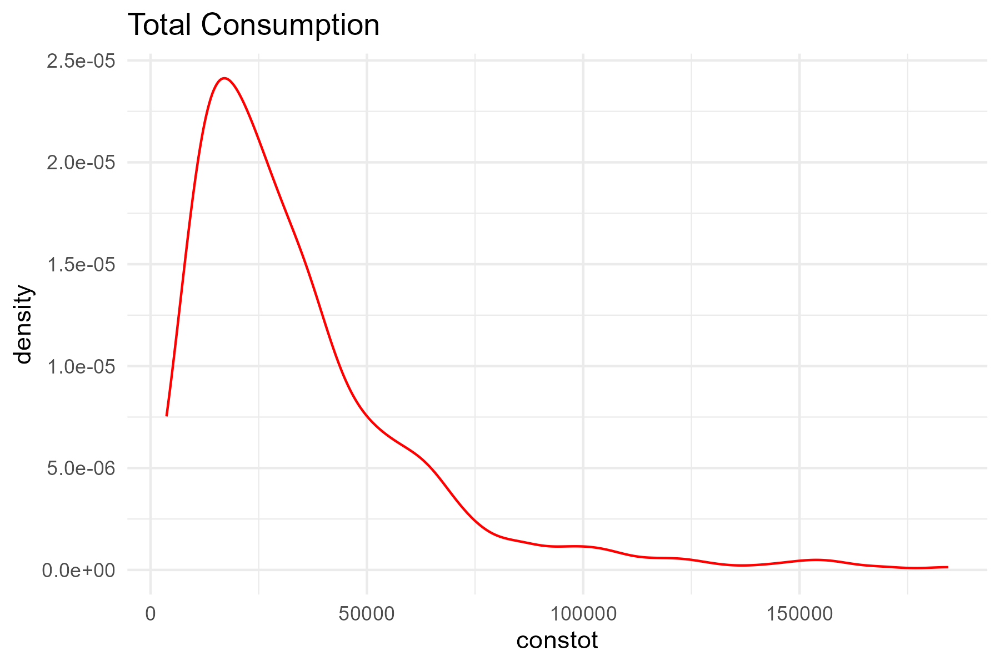
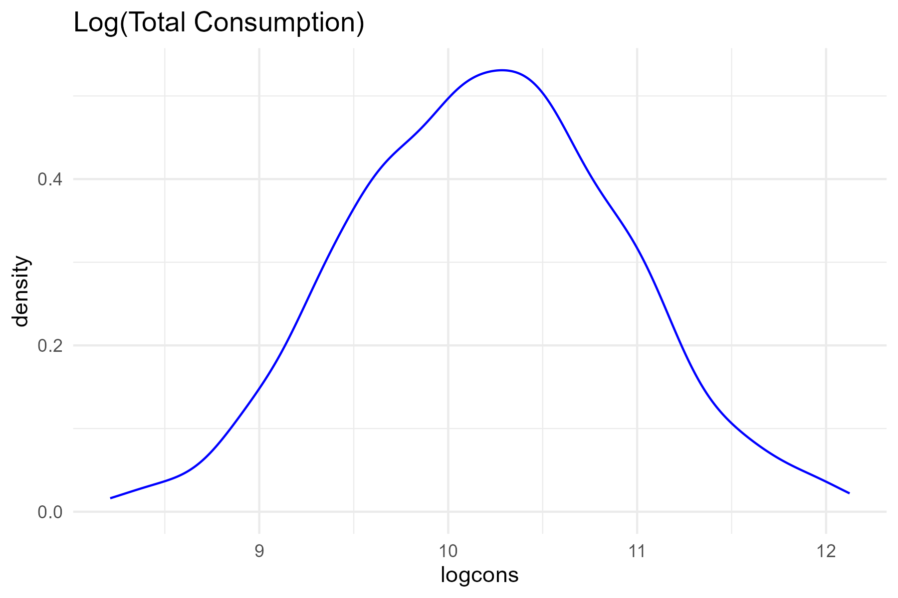

# Econometrics Problem Set 2

## Exercise 1
You want to analyze the optimal use of your time investment as a graduate student. You distribute a survey among a random sample of recently graduated students, and ask their time allocation during graduate school. You have a question indicating average grades, the number of hours per week for study, the number of hours per week for sleep, and the number of hours per week for all other activities. You estimate the regression:

 
$log(grades)=\beta_0+\beta_1study+\beta_2sleep+u$

**1a. Variable analysis:** 

The reason for not including the number of hours of other activities is because they are implicitly included in the other variables for sleeping and studying hours. The total time per week is fixed (168 hours) - including them as a separate variable would introduce multicollinearity, and make it impossible to estimate the coefficients correctly.

**1b. Interpretation of estimate for β2 (~0.01):** 

Interpretation of $\beta_2 = 0.01$: Cetrus paribus, an additional hour of sleep is associated with a 1 percent increase in a student's grades.

**1c. A variable that is likely included in u and that could cause a violation of the zero conditional mean assumption:** 

- $student's\ ability:$ If more able students tend to study less but still achieve high grades, the estimate of $\beta_1$ might be *biased downward* because the model would attribute their high performance to fewer hours of study when, in fact, they're doing well due to their ability.
- $sleep:$ It is not obvious how ability influences it, but we could hypothesize that more able students manage their time better, so they might sleep more. This would mean that $\beta_2$ is *biased upward*, inaccurately suggesting that more sleep is associated with higher grades when, in reality, it's the student's ability that allows them to sleep more and still perform well.
- $motivation:$ Higher motivation likely leads to more hours of study and potentially higher grades, causing an *upward bias* in the estimates of $\beta_1$ and $\beta_2$.

-------------------------------------

## Exercise 2
For your job as a policy advisor, you need to come up with the best possible estimate of a parameter $\beta$ by searching the literature. You find one study with an unbiased estimate of $\beta = 5.0$, with estimated variance of $\beta = 8.0$, from a regression with an $R^2=0.86$. Another study uses another dataset and finds an unbiased estimate of $\beta=6.0$ with estimate variance of $\beta = 4.0$, from a regression with a $R^2=0.43$.

**2a. Comparison of estimates:** 
Since the goal is to come up with the best possible estimate of $\beta$, the estimate with variance of 4.0 would be preferred since it’s lower variance indicates that the estimate is more precise

**2b. Improvement of estimates:** 

Given access to the two datasets, we could use the weighted average of the two estimates:

$$\hat{\beta} = \frac{\frac{\beta_1}{Var(\beta_1)} + \frac{\beta_2}{Var(\beta_2)}}{\frac{1}{Var(\beta_1)} + \frac{1}{Var(\beta_2)}} = \frac{\frac{5}{8} + \frac{6}{4}}{\frac{1}{8} + \frac{1}{4}} \approx 5.67$$

-------------------------------------

## Exercise 3
Imagine you want to analyze whether people who were affected by hurricane Maria in Puerto Rico are more likely to favor the Democratic party rather than the Republican political party. You have data on 1000 households and know whether their property was on the path of the hurricane. Meteorologists have told you that the path of hurricane Maria was unpredictable, and also not related to the path of other hurricanes. You also know the amount of $ people spent after the hurricane to fix their damaged houses, and whether they get any help from the government for doing so. 

**3a. Commentary on the inclusion of variable for the $ people spent to reconstruct their house:**

Including a variable for the $ people spent to reconstruct their house has some problems associated with it. For one, the amount of money spent on reconstruction may be endogenously determined, since it may be affected by unobserved factors not in the model that are also correlated with political preferences. E.g. households with more money are able to spend more money on reconstruction, and people with more money are usually aligned with a certain political party. In this way, omitted variable bias could be an issue if there are factors not included in the analysis that affect both the amount of money spent on reconstruction and also political party alignment. At first glance, the amount of money spent on reconstruction could be used as a measure of the extent of damage due to the hurricane, but as is established in the question, the hurricane path is random and unpredictable, meaning that the extent of the hurricane damage should not be correlated with political alignment (as it would likely be if we used the amount of money spent on reconstruction as a variable, which is likely correlated with political alignment). As such, it may not be prudent to include the amount of money spent on reconstruction as it could likely lead to bias and endogeneity.

**3b. Commentary on inclusion of a variable indicating the $ amount received from the government as help:** 

Whether it would be a good or bad idea to include a variable indicating the $ amount received from the government as help depends on the context and objective of the analysis. On the one hand, if a household's political alignment is affected by receiving government aid (which it could likely be), it would be important to control for this if we were interested in quantifying the whole effect of the hurricane only. In this way, if we include the government help variable, then we are analyzing the effect of the hurricane on political alignment while controlling for government assistance, and thus not studying the total effect of the hurricane on political alignment. Government help is a consequence of the hurricane itself, so if we are interested in the whole effect of the hurricane on political alignment, controlling the government help may not be a good idea since it would not include the effects on political alignment through the conduit of government aid (which is a result of the hurricane itself). Moreover, there could also be issues of endogeneity and selection bias, since government help may be systematically more focused on certain types of households, which could then also be correlated with political preferences. E.g. if households with more/less money or in certain neighbourhoods get more aid the amount of money that a household has is also correlated with political alignment.

-------------------------------------

## Computer Exercise
The dataset nichh.dta contains data from 582 households in Nicaragua. It is a subset of the 1998 Living Standard Measurement Survey (LSMS). We want to analyze this data to understand the returns to different household assets (number of male and female adults, education and age of the household head, and total land owned) and the role of isolation (measured as the distance to school, and the distance to a health centre).  We will use total household consumption, expressed in Cordobas, as a measure of household welfare. 

**1. Summary statistics:**

## Descriptive Statistics

  
| Household Statistic                                | Mean        | St. Dev.    | Min        | Max        | N   |
|------------------------------------------|-------------|-------------|------------|------------|-----|
| 15-64                               | 1.270       | 0.996       | 0          | 6          | 582 |
| 15-64                               | 1.595       | 0.999       | 0          | 8          | 582 |
| head of hh age                     | 46.014      | 15.721      | 15         | 97         | 582 |
| head of hh educ                    | 5.628       | 5.222       | 0          | 20         | 576 |
| total consumption                   | 34,596.900  | 27,105.440  | 3,680.866  | 184,360.800| 582 |
| dist to health center (km)          | 4.076       | 2.351       | 0.000      | 13.000     | 582 |
| dist to school (km)                 | 3.263       | 2.197       | 0.050      | 9.500      | 581 |
| owned land (in ha)                  | 3.380       | 25.944      | 0.000      | 423.000    | 582 |

- On average, households have around 1.3 adult males and 1.6 adult females, with the number of adults varying significantly between households. 
- Education levels vary, with an average of 5.6 years of schooling. 
- Total consumption averages 34,596.9 Cordobas, but with substantial variation, reflecting wide disparities in household welfare. 
- We observe the same disparities for land ownership, where the mean is equal to 3 330ha and the maximum is 423000 ha. 

**2. Specification of model that allows for increasing returns to household assets:**

A model that allows for increasing returns to household assets could be the log-linear model, where we regress the log of the consumption of the household on the different household assets. 
$log(constot_i) = \beta_0 + \beta_1\times adultm_i + \beta_2\times adultf_i +  \beta_3\times headage_1 + \beta_4\times headeduc_i + \beta_5 healthkm_i + u$

 **Log-linear Model Regression Results** 

| **Dependent variable:** | log(constot) |
|-------------------------|------------|
| **adultm**              | 0.114\*** (0.025) |
| **adultf**              | 0.192\*** (0.025) |
| **headage**             | 0.007\*** (0.002) |
| **headeduc**            | 0.068\*** (0.005) |
| **healthkm**            | -0.012 (0.011) |
| **schoolkm**            | -0.019\* (0.011) |
| **Constant**            | 9.170\*** (0.109) |
| **Observations**        | 575 |
| **R²**                  | 0.335 |
| **Adjusted R²**         | 0.327 |
| **Residual Std. Error** | 0.588 (df = 568) |
| **F Statistic**         | 47.583\*** (df = 6; 568) |
|-------------------------|-------------------------|
| **Note:**               | * p<0.1; ** p<0.05; *** p<0.01 |

**Interpretation of coefficients:**

- `adultm` and `adultf`: Ceteris paribus, an additional woman or man in the household is associated with a 19% and 11% increase in household consumption, respectively. This result is significant at the 1% level. The observed relation can be considered as important compared to the other one observed : 

- `headage`: Ceteris paribus, an increase of one unit in the age of the household head, as well as an additional year of education, is also associated with an increase in household consumption. Even though these relationships are significant at the 1% level, the relations observed are smaller, with increases in consumption of only 0.7% and 6%, respectively.

- `healthkm` and `schoolkm`: Ceteris paribus, an increase of one kilometer in the distance between the household and a school/health service is associated with a decrease in household consumption. This effect is slightly significant at the 10% level for school services. Both relationships are minor: 0.1% for health services and 0.2% for schools.

In our sample, only the composition of the household appears to be strongly related to household consumption.

**3. Minimum significance level needed to reject hypothesis that age of household head does not affect total household consumption:**

We first isolate the relation between headage and hh consumption :

 
| **Dependent variable:** | constot |
|:------------------------|:-------:|
| **headage**             | 141.081** (71.350) |
| **Constant**            | 28,105.250*** (3,469.091) |
| **Observations**        | 582 |
| **R²**                  | 0.007 |
| **Adjusted R²**         | 0.005 |
| **Residual Std. Error** | 27,037.820 (df = 580) |
| **F Statistic**         | 3.910** (df = 1; 580) |
|-------------------------|-------------------------|
| **Note:**               | * p<0.1; ** p<0.05; *** p<0.01 |

Since the p-value for the estimate of the relation between hh consumption and age equals 0.0484789,, we can reject the null hypothesis that the age of the household head has no effect on consumption at the 4.8 level, which is below the standard significance level of 5%.

**4. Analysis of hypothesis that household consumption would start declining after a household head has reached a certain threshold age:**

The older the head of household, the older the other members of the household: children may grow up and leave the household. This can lead to an overall decline in consumption. Graphically, we represent consumption on the age of the household head in grey. In blue, we plot the average consumption of the household for each age. Overall, it starts trending downwards from the age of ~55. 

**5. Estimation of model from qn 2 - household heads with at least primary school completed (i.e. 6 years of schooling or more) versus all others:**

**Impact of Education Level of Head on Household Consumption**
 
| **Variable**                  | **Primary Education (1)**        | **No Primary Education (2)**      |
|:------------------------------|:---------------------------------:|:---------------------------------:|
| **Male Adults**                | 3,212.696* (1,824.675) | 3,428.023*** (1,051.068) |
| **Female Adults**              | 6,560.449*** (1,734.644) | 6,362.518*** (1,092.092) |
| **Age of Head**                | 461.268*** (134.247)   | 194.046*** (67.953)    |
| **Education Level of Head**    | 2,756.155*** (353.787)  | 1,634.459** (631.761)  |
| **Distance to Health Center**  | -544.064 (674.633)                | -353.037 (478.128)                |
| **Distance to School**         | -213.362 (750.575)               | -868.984* (504.666)    |
| **Constant**                   | -13,642.850* (7,367.412) | 3,188.558 (4,939.599)             |
| **Observations**               | 278                               | 297                               |
|--------------------------------|-----------------------------------|-----------------------------------|
| **R²**                         | 0.284                             | 0.190                             |
| **Adjusted R²**                | 0.268                             | 0.173                             |
| **Residual Std. Error**        | 26,074.570 (df = 271)             | 18,848.850 (df = 290)             |
| **F Statistic**                | 17.917*** (df = 6; 271) | 11.350*** (df = 6; 290) |
|--------------------------------|-----------------------------------|-----------------------------------|
| **Note:**                      | * p<0.1; ** p<0.05; *** p<0.01 |

**Results:** 

- These results seem to indicate that having more women in the household is associated with an increase of +6362 C for families in which the head has no primary education, and +6560 for families where the head has at least primary education.

- The variables do not tell us anything about women's labour; we can therefore imagine that, for instance, having more women in the household allows educated men to "focus" more on their jobs and, therefore, earn more money. In this way, women's impact on consumption would come through men's labour.

**6. Alternatives to using either household consumption or log(household consumption) as dependent variables:**

    
    

As seen in the red plot (`total consumption`), consumption is highly right-skewed. Thus, taking the logarithm of consumption helps achieve normality because the transformation makes the distribution more symmetric. Moreover, consumption is always greater than 0 in our sample, so using the logarithm does not reduce the sample size.

Taking the logarithm of consumption (blue plot) analysis can facilitate the interpretation of the coefficient, as we are now interested in the effect of a change of one unit of the dependent variable in terms of the percentage change in consumption.

**7. Impact of distance to school and health services on households’ welfare:**

- `schoolkm`: The dataset did not consider household composition when analyzing the impact of distance to schools and health services on household welfare. Household composition (e.g., the number of children) is essential for understanding how distance influences welfare, as different households have varying needs. To draw more meaningful conclusions, creating subgroups based on household composition would help better isolate the effects of distance on welfare.

- `healthkm`: While the dataset can provide insights into the impact of health service distance on consumption, as noted in Q2, this is not the most critical variable for understanding household welfare variations. Additional data on health service accessibility—for instance, distinguishing a 10 km distance by road versus a 5 km walk—or details about available services would provide a deeper and more nuanced analysis.

