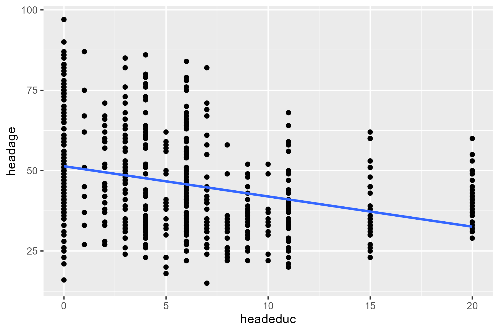
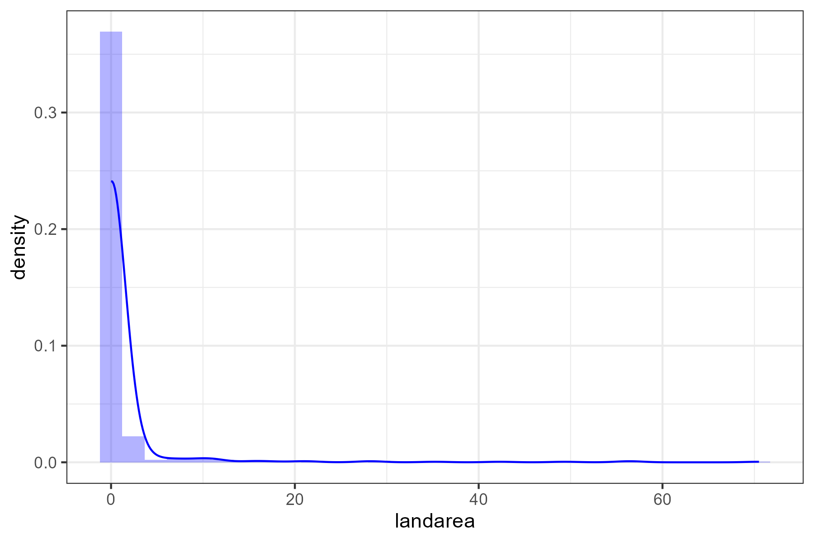

# Econometrics Problem Set 3

## Exercise A: "Legal Determinants of World Cup Success" Paper (by Mark West)

### 1a. Critique of the econometric strategy used in  “Legal determinants of World Cup Success” by Mark West
In this article, we detect some potential violations of the Gauss-Markov Assumptions.

The paper's model specification for each country is:

<p align="center">
  $Fifa\ Ranking = \beta_0 + \beta_1 \times Rule of Law + \beta_3 \times Antidirector Rights + \beta_4 \times Origin + \beta_5 \times NumProPlayers + u$
</p>

This model proposed aims to explain a country's FIFA ranking based mainly on the rule of law and other independent variables like the strength of antidirector rights, and the number of professional players. While the model appears linear, certain violations of the Gauss-Markov assumptions may lead to biased or inefficient estimates, which would compromise the validity of the conclusions drawn from the paper.

**1. Violation of Random Sampling (Independence of Observations):**
One key Gauss-Markov assumption is that the sample should consist of independently and identically distributed (i.i.d.) observations. However, the dataset uses samples from only 21 or 49 countries. The selection of countries that made it to the finals of the World Cup is inherently non-random, which likely influences their success beyond the legal determinants being analyzed. For example, countries selected for the sample have not only strong legal frameworks but likely have a rich footballing culture and historical success internationally which are likely correlated with factors such as football infrastructure or investment in youth development which are omitted from the model.

**2. Linearity**: The model assumes a linear relationship between legal variables (e.g., Rule of Law, French Origin) and FIFA points, but this relationship could be more complex and non-linear for variables like "number of professional soccer players per capita" on FIFA points may exhibit diminishing returns or threshold effects.If the relationship is non-linear but the model assumes linearity, the estimated coefficients could be biased and inconsistent, leading to incorrect inferences about how legal variables affect soccer success.

**3. Homoscedasticity:**: The variance of the error term might not be constant across all levels of the independent variables. Countries with large football programs might have more predictable performance, introducing heteroscedasticity. For example, wealthier countries with strong football programs may have more predictable FIFA rankings, while poorer countries could see more fluctuation due to unstable investments in their soccer programs. This would lead to heteroscedasticity, where errors for certain countries (e.g., Brazil or Germany) are much smaller compared to less developed soccer nations).
- A country with worse football investment/institutions, can have unpredictable performance (due for instance to a once-in-a-lifetime naturally talented team) which leads to non-constant error variance and less precise estimations.

**4. Omitted Variable Bias**: The assumption of a zero conditional mean implies that the error term $u$ should have an expected value of zero, conditional on the independent variables. However, in this model, the error term may capture omitted variables that influence FIFA rankings but are correlated with the included regressors. For instance, cultural factors or the popularity of football in a country could significantly affect a nation’s FIFA ranking. These cultural factors may also be correlated with the rule of law or the number of professional players which leads to omitted variable bias. If football is deeply embedded in a country's national identity, it could result in better training systems, greater player investment, and supportive legal structures. All of this creates a correlation with both the rule of law and the number of professional players. Another important omitted variable is population size. Countries with larger populations will likely have a larger talent pool, increasing the chances of developing top professional players. If this is not accounted for, it would likely be absorbed into the error term, which could be correlated with variables like "NumProPlayers," introducing bias.

**5. Multicollinearity**:  While perfect multicollinearity is unlikely, there could be high correlations between some of the independent variables in the mode that can inflate standard errors and reduce the precision of the coefficient estimates. Variables like “Rule of Law” “Antidirector Rights” and “Origin” reflect the quality of a country’s institutions, making it plausible that they are highly correlated. For example, countries with a strong rule of law are also likely to have strong anti-director rights, and these factors could be influenced by a shared legal origin (e.g., civil law versus common law). Additionally, certain legal origins (such as French or Scandinavian) might be associated with high Rule of Law scores, creating collinearity between these variables.

**6. Endogeneity**: There could be reverse causality between soccer success and some of the predictors. For example, strong legal systems might not only affect soccer success but also be influenced by a country’s global stature, including soccer performance.


### 1b. Analysis of estimations related to the determinants of World Cup success
The variability of the results leads us to question if the estimates are robust. We also note that given the small sample size used for each specification, we should not rely entirely on their outcomes. Then, the lack of attempt to give a causality interpretation makes this model irrelevant to determining World Cup soccer success, and the conclusions drawn are limited to correlations.
However, if we were to select one as a starting point, the specification with the highest $R^2$ might be the best or at least be a starting point in establishing the relation between the legal origin and soccer performances. Within the limitation of the data, it still explains the most variance in FIFA ranking points among the tested models which could provide insights into potential correlations. 

Given the limitations identified above, a better model to determine World Cup ranking would involve variables that account for the sports legal institutions, cultural practices, investment in infrastructures etc to account for potential sources of endogeneity and omitted variable bias.


### 2. Effect of missing observations on estimates
**True** - Missing observations can affect both the precision and bias of estimates.

- `Precisions`: Randomly or non-randomly missing, missing observations reduce the sample size, which in turn impacts the precision of the estimates. As standard error is inversely related to the square root of the sample size, fewer observations mean larger standard errors - the estimate is less reliable, as there is more uncertainty in its accuracy. Likewise, a smaller sample size leads to a higher standard deviation, which means greater variance in the estimates and so less precision. This is reflected in wider confidence intervals and less certainty about the estimated coefficients. 

- `Bias`: Whether missing observations lead to bias depends on why the data is missing. If the missing data is missing completely at random, where the likelihood of a data point being missing is unrelated to the data itself, the estimates remain unbiased (although this makes the estimators less precise because of the reduction of the sample size). If the missing values are missing based on the value of an independent variable (we only selected a subpopulation), as long as there is enough variation in the independent variables in this subpopulation, the estimates also remain unbiased. However, if the data is missing not at random, where the missingness is systematically related to certain characteristics of the dependent variable, it introduces bias. The sample is no longer representative of the population. The mathematical explanation is therefore that the estimates are different from the expected true values. For example, in the context of the links between quality and original legal system and success in the World Cup, if countries that did not make it to the finals are systematically missing from the dataset, or if countries with weaker legal institutions are missing “rule of law” data, this would introduce bias into the results. The dataset does not accurately represent the full range of variation in the global population. These missing observations are not random; they are systematically related to the outcome variables of interest (Fifa ranking) and lead to biased estimates.

-------

## Coding Exercise

**1. Minimum significance level to reject null hypothesis**

<p align="center">
  $H_0:$ Household head’s education has no effect on consumption. <br>
  $H_1:$ Household head’s education affects consumption.
</p>

<div align="center">
  
**Regression Results for Log-linear Model**

| **Statistic**                                               | **Value**                          |
|-------------------------------------------------------------|------------------------------------|
| **Dependent variable:**                                     | Log of Total Household Consumption |
| **Male Adults**                                             | 0.115<sup>***</sup> (0.025)        |
| **Female Adults**                                           | 0.195<sup>***</sup> (0.025)        |
| **Head's Age**                                              | 0.006<sup>***</sup> (0.002)        |
| **Head's Education**                                        | 0.066<sup>***</sup> (0.005)        |
| **Distance to Health Center (km)**                          | -0.011 (0.010)                     |
| **Distance to School (km)**                                 | -0.020<sup>*</sup> (0.011)         |
| **Land Owned**                                              | 0.004<sup>***</sup> (0.001)        |
| **Constant**                                                | 9.178<sup>***</sup> (0.108)        |
| **Observations**                                            | 575                                |
| **R<sup>2</sup>**                                           | 0.354                              |
| **Adjusted R<sup>2</sup>**                                  | 0.346                              |
| **Residual Std. Error**                                     | 0.580 (df = 567)                   |
| **F Statistic**                                             | 44.449<sup>***</sup> (df = 7; 567) |
|-------------------------------------------------------------|------------------------------------|
| **Note:**                                                   | <sup>*</sup> p<0.1; <sup>**</sup> p<0.05; <sup>***</sup> p<0.01 |
</div>

The minimum significance level at which we can reject the null hypothesis that the education level of the household head does not affect total household consumption corresponds to when the p-value for the coefficient for the household head’s education variable is less than our chosen significance level. Estimating the log-linear regression model, we find the p-value for Head's Education to be 1.7682225 × 10−4; as also shown in table 1, this means that the coefficient for the household head’s education variable is highly statistically significant and below any conventional significance level (e.g. 0.05, 0.01, or 0.001). Thus, there is strong evidence that the household head’s education significantly affects total household consumption, also controlling for other variables such as age, number of male and female adults, land owned, and distances to school and health center. The minimum significance level at which we can reject the null hypothesis is any level more than 1.7682225 × 10−4.


**2. Test of significance**

We need to perform a test on two coefficients from the same model. Thus, we clearly state our null hypothesis and our (one-sided) alternative hypothesis as follows:

<p align="center">
  $H_0: \beta_m \leq \beta_1 \Longleftrightarrow \beta_m - \beta_1 \leq 0$ <br>
  $H_1: \beta_m > \beta_1$ (one-sided)
</p>

In order to test that, define $\beta_m + \beta_f = \theta$. In our case, we hypothesise that $\theta = 0$. We can substitute $\beta_m$ for $\theta + \beta_f$ in our regression, so that

$log(constot) = \beta_0 + \beta_madultm + \beta_fadultf + ... + \epsilon$

$log(constot) = \beta_0 + (\theta+\beta_f)adultm + \beta_fadultf + ... + \epsilon$ (under the null) 

$log(constot) = \beta_0 + \theta adultm + \beta_f(adultm + adultf) + ... + \epsilon$

Thus, we rerun the regression
```{r}
reg2 <- lm(log(constot) ~ adultm + I(adultm + adultf) + headage + headeduc + healthkm + schoolkm + landarea, nichh) # transformed regression

reg2pvalue <- summary(reg2)$coefficients[2,4] # significant at the 5% level
```
<div align="center">
  
**Regression Results after removing land area over 100ha**

| **Statistic**                                              | **Value**                                    |
|------------------------------------------------------------|----------------------------------------------|
| **Dependent variable:**                                    | Log of Total Household Consumption           |
| **Head's Age**                                             | 0.006<sup>***</sup> (0.002)                  |
| **Head's Education**                                       | 0.065<sup>***</sup> (0.005)                  |
| **Male Adults**                                            | 0.114<sup>***</sup> (0.025)                  |
| **Female Adults**                                          | 0.193<sup>***</sup> (0.025)                  |
| **Land Owned**                                             | 0.010<sup>**</sup> (0.004)                   |
| **Distance to School (km)**                                | -0.010 (0.011)                               |
| **Distance to Health Center (km)**                         | -0.020<sup>*</sup> (0.011)                   |
| **Constant**                                               | 9.181<sup>***</sup> (0.108)                  |
| **Observations**                                           | 569                                          |
| **R<sup>2</sup>**                                          | 0.336                                        |
| **Adjusted R<sup>2</sup>**                                 | 0.327                                        |
| **Residual Std. Error**                                    | 0.579 (df = 561)                             |
| **F Statistic**                                            | 40.484<sup>***</sup> (df = 7; 561)           |
|------------------------------------------------------------|----------------------------------------------|
| **Note:**                                                  | <sup>*</sup> p<0.1; <sup>**</sup> p<0.05; <sup>***</sup> p<0.01 |
</div>

To compare if the coefficients for male and female adults in the regression are statistically different from each other (or in this case if male is greater than female), we use a t-test for the difference between the two coefficients. 

The test-statistic is calculated by subtracting the estimated returns (i.e. coefficient) for male adults by the coefficient of female adults and then dividing the sum of the standard errors of the estimates: 

<p align="center">
  $t = \frac{\hat{\beta}_{\text{male}} - \hat{\beta}_{\text{female}}}{\sqrt{\text{Var}(\hat{\beta}_{\text{male}}) + \text{Var}(\hat{\beta}_{\text{female}})}}$
</p>

- The calculated t-stat is -2.25, which implies that the coefficient for female adults is actually greater than the coefficient for male adults (so opposite of the alternative hypothesis). However, we need to check whether this difference is statistically significant by computing the p-value.

- The test statistics follows a t-distribution, which approaches the normal distribution as sample size is large (as is the case here with 567 degrees of freedom). Importantly, The further the test statistic is from zero, the more probable that the studied difference in the two coefficients is statistically significant. The p-value (calculated based on the test statistic) is the probability of getting a value of the test statistic as extreme or more extreme as the one calculated (i.e. test statistic that is less than -2.25), assuming that the null hypothesis is true. For a one-tailed test, where we are specifically testing if the returns to male adults are greater than those to female adults, the p-value can be calculated using the cumulative distribution function of the t-distribution. The p-value of 0.0369795 confirms that this difference is statistically significant at the 5% significance level.


**3. Joint significance of the 2 distance variables**

In order to test for joint hypothesis that are not linear combinations of coefficients, we need an F-test. The formula is as follows: 

<p align="center">
  $F \equiv \frac{(R^2_{\text{ur}} - R^2_{r}) / q}{(1 - R^2_{\text{ur}}) / (n - k - 1)}$ (one-sided)
</p>

- $H_0:$ The distance variables (distance to school and health clinic) are not jointly significant, i.e. their coefficients are equal to zero.  
- $H_1:$ either one of the distance variables is significantly affecting household consumption.

We can use an F-test to test whether the two variables are jointly significant; we test whether the coefficients of these variables are significantly different from zero when considered together. 
We construct a reduced regression model, which removes the distance variables and thus allows us to compare to the original model to see if the distance variables add meaningful effect. 
We calculate the RSS of both models and then use the formula for calculating the F-statistic. Using the formula for F-statistic, we find: $F \equiv \frac{(R^2_{ur}-R^2_r)/q}{(1-R^2_{ur})/(n-k-1)}$ = 2.5157156.

Then, calculating the p-value we find it to be equal to 0.080988, meaning there is a 0.080988, chance of observing an F-statistic as extreme or more than 2.5157156, given the null hypothesis is true. In this way, we can say that the variables are jointly significant at the 0.1 level (10%) and means that at this significance level we can reject the null hypothesis and say that at least one of the distance variables is significantly affecting household consumption. Overall, isolation has an impact on household welfare at the 10% level (but not at other conventional levels such as e.g. 5%).


**4. Correlation between household's educ and age**

<div align="center">

</div>

Calculating the correlation between household head education and age, we obtain a value of -0.3117732.

There is a moderate negative correlation between the household's age and its education. This correlation has two implications:

- Multicollinearity = our estimation is going to be less efficient
- Omitted variable bias (if not controlled for)

**5. Coefficient Test**

We need to test a hypothesis on a single regression coefficient:
<p align="center">
  $H_0: \beta_{educ} = 0.06$
</p>
<p align="center">
  $H_1: \beta_{educ} \neq 0.06$ (two-sided)
</p>

$t-test = \frac{\hat{\beta}-\beta_{H_0}}{se(\hat{\beta})}= \frac{0.06574516-0.06}{0.004904345}=1.171443$


We can perform a t-test to test whether the coefficient of education is different from 0.06. We find a test-statistic of 1.1714425 and a p-value of for a two-sides test of 0.2414208. With this p-value, we fail to reject the nulll hypothesis even at the standard 10% level. 


**6. Restimation of model** 
<div align="center">

</div>

Looking at the summary statistics and Figure 1, the density plot for households' land area is skewed to the left, with most households having around 25ha. 

As seen in Table 2, the estimated coefficient for the land area variable (after removing households with more than 100ha) is 0.0102082. On the other hand, the estimated land area coefficient for the first model without removing these households is 0.0038917..  These results show that the coefficient estimate is higher for the model removing households with more than 100ha of land, and implies that land area has a larger effect on household consumption and larger land owners may have been deflating the estimate of the effect of land area on household consumption. Importantly, the p-value of the estimated coefficient for land area for this new regression becomes 3.4993249 × 10−5, meaning it is significant at the 5% level, as opposed to having a p-value of 3.4993249 × 10−5, and thus being significant at the 1% level when estimating with the model where we do not remove households with land area above 100ha.

Land area is a proxy for the wealth of a household - once we remove households with very high land area (of which there are 6 with above 100ha), the coefficient estimate of land area increases. This suggests that owning land may not contribute towards household income proportionally, with the rate at which land area is related with more income decreases as land area increases i.e. it has diminishing returns. Households have different consumption patterns, and controlling for house size, there may be an upper threshold after which household consumption does not continue to increase by as much as before this threshold.


**7. Additional variable**

An additional variable could be access to electricity (a proxy for infrastructure development). In general, infrastructure development is a critical factor in household welfare and consumption as it can significantly improve quality of life and economic productivity. Therefore, it will likely positively affects household consumption and could reduce the coefficients of other endowment variables by explaining more of the variance in consumption. For example, households with higher land endowment may have higher consumption due to their ability to generate more income. However, part of that consumption may actually be driven by whether the household has access to electricity. Including such a variable therefore provides a more complete understanding of how households convert their resources into welfare, as infrastructure plays a crucial role in that process.
