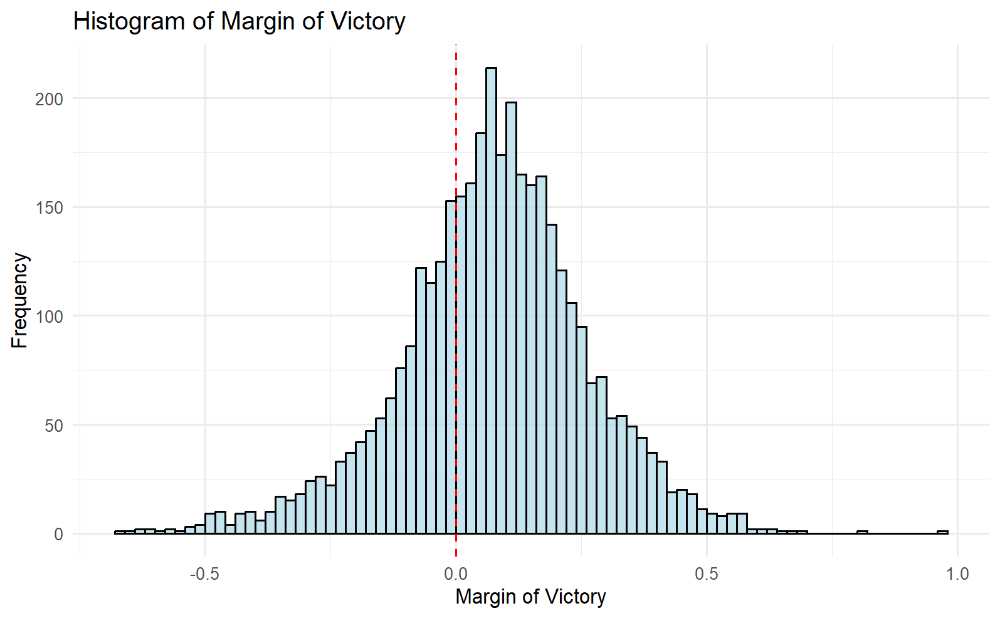
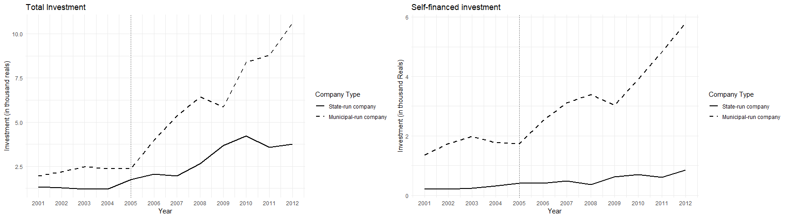
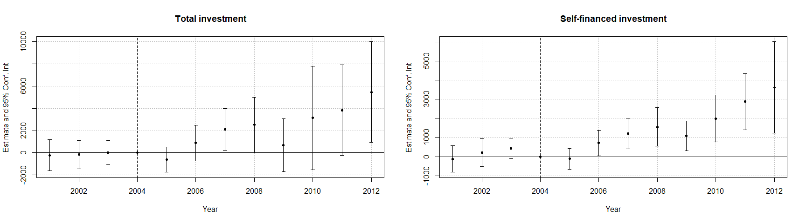
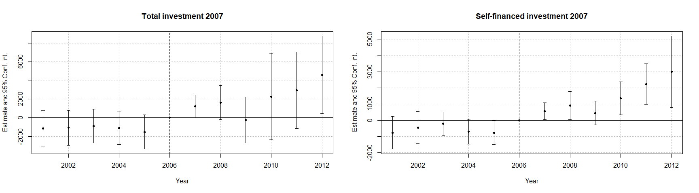
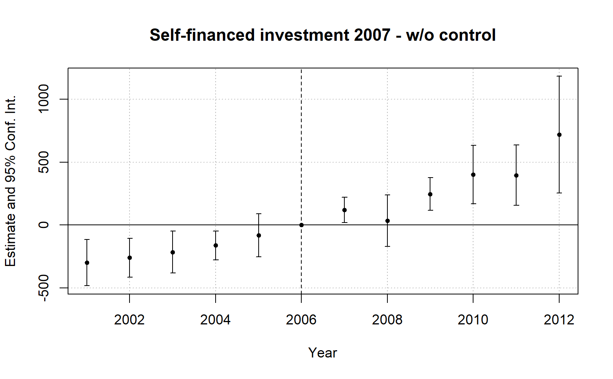

# Econometrics 2 Homework 3 - Empirical Application

Concepts convered: Regression Discontinuity Design (RDD) and Difference-in-Differences (DiD)

## Exercise 1 - RDD: Asher and Novosad (2017) Politics and Local Economic Growth: Evidence from India

**1. Absence of manipulation around the threshold**

The histogram suggests that there is no evidence of manipulation in the margin of victory. The distribution of the variable appears smooth around the threshold, indicating a lack of irregularities. Had there been a manipulation, we would expect to see a concentration of observations immediately beyond the threshold, potentially indicating electoral bias in favor of the ruling party. However, no such pattern is observed, allowing us to conclude that candidates aligned with the ruling party did not have the ability to influence the election outcomes.

**2. Scatter plots for employment growth and night lights**

A discontinuity in employment growth is observed for constituencies aligned with the government. The graph indicates that firms in these constituencies experienced higher growth compared to others. While the increase in night lights is less pronounced, it appears to follow a similar trend, suggesting a potential correlation with the observed employment growth.

**3. Magnitudes of the effects (for employment growth)**

| Linear Approximation    |      |
|-------------------------|-----------------|
| **Code:**               | `lm(formula = growth ~ aligned + margin + m_a, data = elections_con_panel)` |
| **(Intercept)**         | 0.022871*** (0.0040673), t = 5.6231, p = 2.014e-08 |
| **aligned**             | 0.005150* (0.0024768), t = 2.0794, p = 0.03765 |
| **margin**              | -0.004952 (0.0115964), t = -0.4270, p = 0.66937 |
| **m_a**                 | -0.015060 (0.0173320), t = -0.8689, p = 0.38494 |
| **Observations**        | 3,708           |
| **R²**                  | 0.003176        |
| **Adjusted R²**         | 0.00237         |
| **Residual Std. Error** | 0.03832 (df = 3708) |
| **F Statistic**         | 3.938*** (df = 3; 3708) |
| **Note:**               | *p<0.1; **p<0.05; ***p<0.01 |
| **Note:**               | t = t-test statistic |

| Third Order Polynomial |  |
|------------------------|------------|
| **Code:** | `lm(formula = growth ~ aligned + margin + m_a + m2 + m3 + m2_a + m3_a, data = elections_con_panel)` |
| **(Intercept)** | 0.018315*** (0.002693), t = 6.800, p = 1.22e-11 |
| **aligned** | 0.010204** (0.003441), t = 2.966, p = 0.00304 |
| **margin** | -0.121428* (0.052822), t = -2.299, p = 0.02157 |
| **m_a** | 0.1103208* (0.0540673), t = 2.0404, p = 0.041378 |
| **m2** | -0.5430324* (0.2723820), t = -1.9936, p = 0.046264 |
| **m3** | -0.6256111. (0.3277227), t = -1.9090, p = 0.056344 |
| **m2_a** | 0.4316853 (0.3280955), t = 1.3157, p = 0.188346 |
| **m3_a** | 0.8213190* (0.3310837), t = 2.4807, p = 0.013157 |
| **Observations** | 3,704 |
| **R²** | 0.00661 |
| **Adjusted R²** | 0.004732 |
| **Residual Std. Error** | 0.03827 (df = 3704) |
| **F Statistic** | 3.521*** (df = 7; 3704), p = 0.0009003 |
| **Note:** | *p<0.1; **p<0.05; ***p<0.01 |
| **Note:** | t = t-test statistic |

| Local linear approximation with a bandwidth of 5.1 percent | |
|-----------------------------------------------------------|------------|
| **Code:** | `lm(formula = growth ~ aligned + margin + m_a, data = subset(elections_con_panel, margin >= -0.051 & margin <= 0.051))` |
| **(Intercept)** | 0.012234** (0.004016), t = 3.046, p = 0.00240 |
| **aligned** | 0.016861** (0.005741), t = 2.937, p = 0.00341 |
| **margin** | -0.341422* (0.140538), t = -2.429, p = 0.01535 |
| **m_a** | 0.354430. (0.194839), t = 1.819, p = 0.06929 |
| **Observations** | 768 |
| **R²** | 0.01996 |
| **Adjusted R²** | 0.01611 |
| **Residual Std. Error** | 0.03968 (df = 764) |
| **F Statistic** | 5.187*** (df = 3; 764), p = 0.001495 |
| **Note:** | *p<0.1; **p<0.05; ***p<0.01 |
| **Note:** | t = t-test statistic |

| Summary table | Linear (1) | Polynomial (2) | Local Linear (3) |
|---------------|------------|----------------|------------------|
| **Code:** | `lm(formula = log(employment_growth) ~ ruling_party + margin + margin_x_ruling)` | `lm(formula = log(employment_growth) ~ ruling_party + margin + margin_x_ruling + margin2 + margin3 + margin2_x_ruling + margin3_x_ruling)` | `lm(formula = log(employment_growth) ~ ruling_party + margin + margin_x_ruling, data = subset(data, abs(margin) <= bandwidth))` |
| **Ruling Party** | 0.005** (0.002) | 0.010*** (0.004) | 0.017*** (0.006) |
| **Margin of Victory** | -0.005 (0.012) | -0.121** (0.051) | -0.341*** (0.126) |
| **Margin X Ruling** | -0.015 (0.017) | 0.110** (0.054) | 0.354** (0.154) |
| **Margin²** |  | -0.543** (0.272) |  |
| **Margin³** |  | -0.626* (0.328) |  |
| **Margin² X Ruling** |  | 0.432 (0.328) |  |
| **Margin³ X Ruling** |  | 0.821** (0.331) |  |
| **Note:** | *p<0.1; **p<0.05; ***p<0.01 |  |  |

All coefficients for the three regressions are statistically significant at conventional levels. The results demonstrate a consistent pattern across the different model specifications. We observe that the magnitude of the coefficients increases when moving from a linear to a polynomial approximation. Similarly, when we restrict the sample to the specified bandwidth in the local linear regression, we see a further increase in the magnitude of the coefficients.

Notably, the standard errors also increase in the local linear model, which is an expected outcome due to the reduced number of observations within the bandwidth. This trade-off between precision and potential bias reduction is characteristic of such localized approaches.

The increasing magnitude of the coefficients across models suggests that the simpler linear approximation may underestimate the effect, while the polynomial and local linear models capture more nuanced relationships in the data. However, the larger standard errors in the local linear model indicate increased uncertainty in these estimates, highlighting the importance of considering both the point estimates and their precision when interpreting the results.

**4. Replicate table 2**

| **Table 2: Effects of party alignment on economic outcomes** | Jobs: Local Linear | Jobs: Polynomial | Lights: Local Linear |
|-------------------------------------------------------------|--------------------|------------------|----------------------|
| **Ruling Party**                                            | 0.017*** (0.005)  | 0.009** (0.004)  | 0.033** (0.013)      |
| **Margin of Victory**                                       | -0.362*** (0.104) | -0.111** (0.043) | -0.713* (0.364)      |
| **Margin X Ruling**                                         | 0.343** (0.160)   | 0.112** (0.050)  | 0.697 (0.570)        |
| **Margin²**                                                 |                   | -0.419* (0.223)  |                      |
| **Margin³**                                                 |                   | -0.442* (0.268)  |                      |
| **Margin² X Ruling**                                        |                   | 0.387 (0.258)    |                      |
| **Margin³ X Ruling**                                        |                   | 0.517* (0.283)   |                      |
| **Observations**                                            | 768               | 3,712            | 2,240                |
| **R²**                                                     | 0.171             | 0.149            | 0.475                |
| **Note:**                                                  | *p<0.1; **p<0.05; ***p<0.01 |

**4a. Interpret the coefficients**

Table 2 shows that constituencies where a politician aligned with the ruling party won the elections experienced higher local economic outcomes. Columns 1 to 4 present the results for private employment, while columns 5 and 6 display results for night lights. In terms of magnitude, on average, being in a constituency aligned with the ruling party increases employment growth by approximately 1.7% per year when calculated with a local linear approximation, and 0.9% when using a 3rd order polynomial. Similarly, when analyzing changes in night lights, the results show that, on average, having a politician aligned with the ruling party increases night light intensity by 3.3%. Notably, the coefficients remain almost unchanged when including constituency fixed effects and baseline levels of the outcome variables, lending further evidence to the robustness of the results.

**4b. Compare the estimates columns 1 and 3**

The estimates in columns 1 and 3 capture the effects of being in a constituency governed by a politician aligned with the ruling party, using two different specifications for the forcing variable. Column 1 employs a local linear approximation with a 5.1 percent bandwidth, while column 3 uses the full sample with a 3rd order polynomial. As is typical in RDD settings, estimating the effect within a narrower bandwidth should yield a more accurate estimate, as the bias is expected to be lower. However, restricting the sample also increases the magnitude of the standard errors due to the reduced number of observations.

Following this logic, it is likely that the estimate in column 3 is affected by downward bias, given that the estimate in column 1 is higher. Nevertheless, since the magnitudes of these coefficients are relatively close to each other, it is likely that they are not statistically different from one another.

## Exercise 2 - DiD: Plous (2020) The Buck Stops Where? Federalism, Uncertainty, and Investment in the Brazilian Water and Sanitation Sector

**1. Trajectories of total investment and self-financed investment**

The graphs indicate that, prior to the policy implementation, both municipal and other types of companies were following a similar trajectory. However, there is a significant spike in investment for municipal companies immediately after the policy was announced in 2005.

**2. Replicate findings of Table 3**

<table> <tr> <th>OLS Estimation Details</th> <th>Estimate</th> <th>Std. Error</th> <th>t value</th> <th>Pr(>|t|)</th> </tr> <tr> <td>Observations:</td> <td colspan="4">14,460</td> </tr> <tr> <td>Fixed-effects:</td> <td colspan="4">code: 1,205, year: 12</td> </tr> <tr> <td>Standard-errors:</td> <td colspan="4">Clustered (company)</td> </tr> <tr> <td>muni_companyxlaw</td> <td>2868.317279</td> <td>1318.842550</td> <td>2.174875</td> <td>3.1228e-02 *</td> </tr> <tr> <td>pop_log</td> <td>-205.063428</td> <td>2595.309023</td> <td>-0.079013</td> <td>9.3713e-01</td> </tr> <tr> <td>gdp_share_state</td> <td>5302.782277</td> <td>2779.791121</td> <td>1.907619</td> <td>5.8377e-02 .</td> </tr> <tr> <td>gdp_share_brazil</td> <td>-91887.876788</td> <td>58299.946774</td> <td>-1.576123</td> <td>1.1713e-01</td> </tr> <tr> <td>gdp_log</td> <td>-44.215478</td> <td>1991.272582</td> <td>-0.022205</td> <td>9.8231e-01</td> </tr> <tr> <td>taxes_share_state</td> <td>-3289.264032</td> <td>1264.309727</td> <td>-2.601628</td> <td>1.0221e-02 *</td> </tr> <tr> <td>taxes_share_brazil</td> <td>56057.577141</td> <td>7521.584754</td> <td>7.452894</td> <td>7.0644e-12 ***</td> </tr> <tr> <td>taxes_log</td> <td>682.065120</td> <td>651.414873</td> <td>1.047052</td> <td>2.9678e-01</td> </tr> <tr> <td>ag_area</td> <td>0.030726</td> <td>0.035959</td> <td>0.854467</td> <td>3.9423e-01</td> </tr> <tr> <td>ag_harvest</td> <td>-0.034646</td> <td>0.054019</td> <td>-0.641370</td> <td>5.2227e-01</td> </tr> <tr> <td>ag_value</td> <td>-0.001506</td> <td>0.004161</td> <td>-0.361906</td> <td>7.1794e-01</td> </tr> <tr> <td>livestock</td> <td>0.002092</td> <td>0.015108</td> <td>0.138466</td> <td>8.9006e-01</td> </tr> <tr> <td>temper</td> <td>-125.259570</td> <td>236.187325</td> <td>-0.530340</td> <td>5.9667e-01</td> </tr> <tr> <td>precip</td> <td>20.221634</td> <td>20.657516</td> <td>0.978900</td> <td>3.2923e-01</td> </tr> <tr> <td>baseinvestTT</td> <td>0.133642</td> <td>0.081002</td> <td>1.649854</td> <td>1.0109e-01</td> </tr> <tr> <td colspan="5">Significance codes: 0 '***' 0.001 '**' 0.01 '*' 0.05 '.' 0.1 ' ' 1</td> </tr> <tr> <td colspan="5">RMSE: 8,622.0, Adj. R²: 0.800155, Within R²: 0.299985</td> </tr> </table>

---

<table> <tr> <th>OLS Estimation Details</th> <th>Estimate</th> <th>Std. Error</th> <th>t value</th> <th>Pr(>|t|)</th> </tr> <tr> <td>Dependent Variable:</td> <td colspan="4">invest_own</td> </tr> <tr> <td>Observations:</td> <td colspan="4">14,460</td> </tr> <tr> <td>Fixed-effects:</td> <td colspan="4">code: 1,205, year: 12</td> </tr> <tr> <td>Standard-errors:</td> <td colspan="4">Clustered (company)</td> </tr> <tr> <td>muni_companyxlaw</td> <td>1797.987774</td> <td>490.318938</td> <td>3.666976</td> <td>0.00034158 ***</td> </tr> <tr> <td>pop_log</td> <td>-62.687157</td> <td>522.507888</td> <td>-0.119974</td> <td>0.90466676</td> </tr> <tr> <td>gdp_share_state</td> <td>322.851588</td> <td>266.231973</td> <td>1.212670</td> <td>0.22718806</td> </tr> <tr> <td>gdp_share_brazil</td> <td>9816.845143</td> <td>6020.371771</td> <td>1.630604</td> <td>0.10510011</td> </tr> <tr> <td>gdp_log</td> <td>-387.302478</td> <td>190.814304</td> <td>-2.029735</td> <td>0.04417521 *</td> </tr> <tr> <td>taxes_share_state</td> <td>-280.999673</td> <td>253.563963</td> <td>-1.108200</td> <td>0.26957299</td> </tr> <tr> <td>taxes_share_brazil</td> <td>268.990332</td> <td>1527.886265</td> <td>0.176054</td> <td>0.86049226</td> </tr> <tr> <td>taxes_log</td> <td>166.599491</td> <td>140.898274</td> <td>1.182410</td> <td>0.23893930</td> </tr> <tr> <td>ag_area</td> <td>-0.015831</td> <td>0.010817</td> <td>-1.463475</td> <td>0.14545812</td> </tr> <tr> <td>ag_harvest</td> <td>0.013173</td> <td>0.011821</td> <td>1.114422</td> <td>0.26690455</td> </tr> <tr> <td>ag_value</td> <td>0.000775</td> <td>0.001271</td> <td>0.609933</td> <td>0.54284164</td> </tr> <tr> <td>livestock</td> <td>-0.001464</td> <td>0.009277</td> <td>-0.157803</td> <td>0.87482732</td> </tr> <tr> <td>temper</td> <td>36.185024</td> <td>56.895893</td> <td>0.635987</td> <td>0.52576744</td> </tr> <tr> <td>precip</td> <td>-3.978697</td> <td>6.196427</td> <td>-0.642095</td> <td>0.52180458</td> </tr> <tr> <td>baseinvestTT</td> <td>0.010149</td> <td>0.005131</td> <td>1.978027</td> <td>0.04978250 *</td> </tr> <tr> <td colspan="5">Significance codes: 0 '***' 0.001 '**' 0.01 '*' 0.05 '.' 0.1 ' ' 1</td> </tr> <tr> <td colspan="5">RMSE: 2,321.3, Adj. R²: 0.583619, Within R²: 0.033481</td> </tr> </table>

---

<table> <tr> <th>OLS Estimation Details</th> <th>Estimate</th> <th>Std. Error</th> <th>t value</th> <th>Pr(>|t|)</th> </tr> <tr> <td>Dependent Variable:</td> <td colspan="4">invest_resources_large</td> </tr> <tr> <td>Observations:</td> <td colspan="4">14,460</td> </tr> <tr> <td>Fixed-effects:</td> <td colspan="4">code: 1,205, year: 12</td> </tr> <tr> <td>Standard-errors:</td> <td colspan="4">Clustered (company)</td> </tr> <tr> <td>muni_companyxlaw</td> <td>2124.044908</td> <td>921.128858</td> <td>2.305915</td> <td>0.022504 *</td> </tr> <tr> <td>pop_log</td> <td>-595.047228</td> <td>499.721689</td> <td>-1.190757</td> <td>0.235655</td> </tr> <tr> <td>gdp_share_state</td> <td>1026.253855</td> <td>953.332332</td> <td>1.076491</td> <td>0.283459</td> </tr> <tr> <td>gdp_share_brazil</td> <td>4458.634187</td> <td>14398.129019</td> <td>0.309668</td> <td>0.757249</td> </tr> <tr> <td>gdp_log</td> <td>-451.068780</td> <td>380.428386</td> <td>-1.185686</td> <td>0.237646</td> </tr> <tr> <td>taxes_share_state</td> <td>-1112.181502</td> <td>464.756769</td> <td>-2.393040</td> <td>0.017963 *</td> </tr> <tr> <td>taxes_share_brazil</td> <td>5187.410072</td> <td>4398.594299</td> <td>1.179334</td> <td>0.240158</td> </tr> <tr> <td>taxes_log</td> <td>610.301301</td> <td>270.843859</td> <td>2.253333</td> <td>0.025708 *</td> </tr> <tr> <td>ag_area</td> <td>-0.013571</td> <td>0.010676</td> <td>-1.271172</td> <td>0.205662</td> </tr> <tr> <td>ag_harvest</td> <td>0.017031</td> <td>0.016851</td> <td>1.010635</td> <td>0.313841</td> </tr> <tr> <td>ag_value</td> <td>-0.000983</td> <td>0.002099</td> <td>-0.468068</td> <td>0.640425</td> </tr> <tr> <td>livestock</td> <td>0.010486</td> <td>0.008966</td> <td>1.169567</td> <td>0.244055</td> </tr> <tr> <td>temper</td> <td>-129.703602</td> <td>116.656658</td> <td>-1.111841</td> <td>0.268010</td> </tr> <tr> <td>precip</td> <td>-10.148654</td> <td>11.308454</td> <td>-0.897440</td> <td>0.370942</td> </tr> <tr> <td>baseinvestTT</td> <td>0.003882</td> <td>0.010483</td> <td>0.370266</td> <td>0.711714</td> </tr> <tr> <td colspan="5">Significance codes: 0 '***' 0.001 '**' 0.01 '*' 0.05 '.' 0.1 ' ' 1</td> </tr> <tr> <td colspan="5">RMSE: 3,892.7, Adj. R²: 0.394464, Within R²: 0.022657</td> </tr> </table>

---

<table> <tr> <th>OLS Estimation Details</th> <th>Estimate</th> <th>Std. Error</th> <th>t value</th> <th>Pr(>|t|)</th> </tr> <tr> <td>Dependent Variable:</td> <td colspan="4">invest_resources_small</td> </tr> <tr> <td>Observations:</td> <td colspan="4">14,460</td> </tr> <tr> <td>Fixed-effects:</td> <td colspan="4">code: 1,205, year: 12</td> </tr> <tr> <td>Standard-errors:</td> <td colspan="4">Clustered (company)</td> </tr> <tr> <td>muni_companyxlaw</td> <td>-92.675145</td> <td>297.962012</td> <td>-0.311030</td> <td>0.756215</td> </tr> <tr> <td>pop_log</td> <td>1543.352997</td> <td>842.765753</td> <td>1.831295</td> <td>0.069067 .</td> </tr> <tr> <td>gdp_share_state</td> <td>-1801.203706</td> <td>949.673508</td> <td>-1.896656</td> <td>0.059822 .</td> </tr> <tr> <td>gdp_share_brazil</td> <td>-1510.512925</td> <td>17892.998430</td> <td>-0.084419</td> <td>0.932837</td> </tr> <tr> <td>gdp_log</td> <td>1444.336975</td> <td>894.850123</td> <td>1.614055</td> <td>0.108646</td> </tr> <tr> <td>taxes_share_state</td> <td>-533.075171</td> <td>620.565307</td> <td>-0.859015</td> <td>0.391721</td> </tr> <tr> <td>taxes_share_brazil</td> <td>6224.467573</td> <td>6004.411527</td> <td>1.036649</td> <td>0.301590</td> </tr> <tr> <td>taxes_log</td> <td>148.519971</td> <td>410.265633</td> <td>0.362009</td> <td>0.717861</td> </tr> <tr> <td>ag_area</td> <td>0.025069</td> <td>0.028322</td> <td>0.885126</td> <td>0.377524</td> </tr> <tr> <td>ag_harvest</td> <td>-0.043901</td> <td>0.042237</td> <td>-1.039404</td> <td>0.300312</td> </tr> <tr> <td>ag_value</td> <td>0.002960</td> <td>0.002342</td> <td>1.263648</td> <td>0.208343</td> </tr> <tr> <td>livestock</td> <td>-0.005928</td> <td>0.005647</td> <td>-1.049673</td> <td>0.295579</td> </tr> <tr> <td>temper</td> <td>12.511084</td> <td>116.533243</td> <td>0.107361</td> <td>0.914648</td> </tr> <tr> <td>precip</td> <td>4.457527</td> <td>7.521252</td> <td>0.592658</td> <td>0.554315</td> </tr> <tr> <td>baseinvestTT</td> <td>0.010770</td> <td>0.007642</td> <td>1.409276</td> <td>0.160851</td> </tr> <tr> <td colspan="5">Significance codes: 0 '***' 0.001 '**' 0.01 '*' 0.05 '.' 0.1 ' ' 1</td> </tr> <tr> <td colspan="5">RMSE: 3,342.5, Adj. R²: 0.446494, Within R²: 0.050361</td> </tr> </table>

---

<table> <tr> <th>OLS Estimation Details</th> <th>Estimate</th> <th>Std. Error</th> <th>t value</th> <th>Pr(>|t|)</th> </tr> <tr> <td>Dependent Variable:</td> <td colspan="4">invest_in_water</td> </tr> <tr> <td>Observations:</td> <td colspan="4">14,460</td> </tr> <tr> <td>Fixed-effects:</td> <td colspan="4">code: 1,205, year: 12</td> </tr> <tr> <td>Standard-errors:</td> <td colspan="4">Clustered (company)</td> </tr> <tr> <td>muni_companyxlaw</td> <td>521.280302</td> <td>599.200123</td> <td>0.869960</td> <td>0.38573089</td> </tr> <tr> <td>pop_log</td> <td>-29.861162</td> <td>1692.695807</td> <td>-0.017641</td> <td>0.98594886</td> </tr> <tr> <td>gdp_share_state</td> <td>1227.010431</td> <td>1515.854479</td> <td>0.809451</td> <td>0.41955504</td> </tr> <tr> <td>gdp_share_brazil</td> <td>-4231.491674</td> <td>34879.130877</td> <td>-0.121319</td> <td>0.90360315</td> </tr> <tr> <td>gdp_log</td> <td>-296.721257</td> <td>1419.196388</td> <td>-0.209077</td> <td>0.83467566</td> </tr> <tr> <td>taxes_share_state</td> <td>-1406.764539</td> <td>931.108280</td> <td>-1.510850</td> <td>0.13295895</td> </tr> <tr> <td>taxes_share_brazil</td> <td>16250.107002</td> <td>4487.137212</td> <td>3.621487</td> <td>0.00040172 ***</td> </tr> <tr> <td>taxes_log</td> <td>441.186810</td> <td>496.195591</td> <td>0.889139</td> <td>0.37537132</td> </tr> <tr> <td>ag_area</td> <td>0.003294</td> <td>0.019006</td> <td>0.173305</td> <td>0.86264870</td> </tr> <tr> <td>ag_harvest</td> <td>-0.007600</td> <td>0.029473</td> <td>-0.257879</td> <td>0.79685871</td> </tr> <tr> <td>ag_value</td> <td>0.000271</td> <td>0.001668</td> <td>0.162344</td> <td>0.87125646</td> </tr> <tr> <td>livestock</td> <td>0.000796</td> <td>0.008657</td> <td>0.091934</td> <td>0.92687444</td> </tr> <tr> <td>temper</td> <td>-70.569859</td> <td>159.879354</td> <td>-0.441394</td> <td>0.65957165</td> </tr> <tr> <td>precip</td> <td>11.898536</td> <td>10.545661</td> <td>1.128287</td> <td>0.26102426</td> </tr> <tr> <td>baseinvestTT</td> <td>0.088835</td> <td>0.047403</td> <td>1.874023</td> <td>0.06289858 .</td> </tr> <tr> <td colspan="5">Significance codes: 0 '***' 0.001 '**' 0.01 '*' 0.05 '.' 0.1 ' ' 1</td> </tr> <tr> <td colspan="5">RMSE: 5,399.0, Adj. R²: 0.686967, Within R²: 0.258719</td> </tr> </table>

---

<table> <tr> <th>OLS Estimation Details</th> <th>Estimate</th> <th>Std. Error</th> <th>t value</th> <th>Pr(>|t|)</th> </tr> <tr> <td>Dependent Variable:</td> <td colspan="4">invest_in_sewer</td> </tr> <tr> <td>Observations:</td> <td colspan="4">14,460</td> </tr> <tr> <td>Fixed-effects:</td> <td colspan="4">code: 1,205, year: 12</td> </tr> <tr> <td>Standard-errors:</td> <td colspan="4">Clustered (company)</td> </tr> <tr> <td>muni_companyxlaw</td> <td>1868.815000</td> <td>856.357071</td> <td>2.182285</td> <td>3.0666e-02 *</td> </tr> <tr> <td>pop_log</td> <td>183.170114</td> <td>1000.464781</td> <td>0.183085</td> <td>8.5498e-01</td> </tr> <tr> <td>gdp_share_state</td> <td>3464.469841</td> <td>1164.461287</td> <td>2.975170</td> <td>3.4209e-03 **</td> </tr> <tr> <td>gdp_share_brazil</td> <td>-81654.700034</td> <td>22053.038188</td> <td>-3.702651</td> <td>3.0048e-04 ***</td> </tr> <tr> <td>gdp_log</td> <td>469.859498</td> <td>707.314720</td> <td>0.664286</td> <td>5.0754e-01</td> </tr> <tr> <td>taxes_share_state</td> <td>-1529.745983</td> <td>544.776413</td> <td>-2.808025</td> <td>5.6573e-03 **</td> </tr> <tr> <td>taxes_share_brazil</td> <td>34521.776641</td> <td>6038.671368</td> <td>5.716783</td> <td>5.7924e-08 ***</td> </tr> <tr> <td>taxes_log</td> <td>94.308104</td> <td>321.719954</td> <td>0.293137</td> <td>7.6983e-01</td> </tr> <tr> <td>ag_area</td> <td>0.004666</td> <td>0.018815</td> <td>0.248006</td> <td>8.0447e-01</td> </tr> <tr> <td>ag_harvest</td> <td>-0.007003</td> <td>0.025125</td> <td>-0.278734</td> <td>7.8084e-01</td> </tr> <tr> <td>ag_value</td> <td>-0.000709</td> <td>0.002961</td> <td>-0.239398</td> <td>8.1113e-01</td> </tr> <tr> <td>livestock</td> <td>0.000670</td> <td>0.009368</td> <td>0.071478</td> <td>9.4311e-01</td> </tr> <tr> <td>temper</td> <td>-7.813557</td> <td>103.439302</td> <td>-0.075538</td> <td>9.3989e-01</td> </tr> <tr> <td>precip</td> <td>1.457762</td> <td>12.585516</td> <td>0.115829</td> <td>9.0795e-01</td> </tr> <tr> <td>baseinvestTT</td> <td>0.044647</td> <td>0.025928</td> <td>1.721979</td> <td>8.7163e-02 .</td> </tr> <tr> <td colspan="5">Significance codes: 0 '***' 0.001 '**' 0.01 '*' 0.05 '.' 0.1 ' ' 1</td> </tr> <tr> <td colspan="5">RMSE: 5,137.1, Adj. R²: 0.698175, Within R²: 0.19717</td> </tr> </table>

---

<table> <tr> <th>OLS Estimation Details</th> <th>Estimate</th> <th>Std. Error</th> <th>t value</th> <th>Pr(>|t|)</th> </tr> <tr> <td>Dependent Variable:</td> <td colspan="4">invest_in_other</td> </tr> <tr> <td>Observations:</td> <td colspan="4">14,460</td> </tr> <tr> <td>Fixed-effects:</td> <td colspan="4">code: 1,205, year: 12</td> </tr> <tr> <td>Standard-errors:</td> <td colspan="4">Clustered (company)</td> </tr> <tr> <td>muni_companyxlaw</td> <td>431.188486</td> <td>147.531974</td> <td>2.922678</td> <td>0.00401558 **</td> </tr> <tr> <td>pop_log</td> <td>-50.818867</td> <td>179.653047</td> <td>-0.282872</td> <td>0.77767000</td> </tr> <tr> <td>gdp_share_state</td> <td>-50.325156</td> <td>150.859336</td> <td>-0.333590</td> <td>0.73916118</td> </tr> <tr> <td>gdp_share_brazil</td> <td>658.076709</td> <td>4203.883923</td> <td>0.156540</td> <td>0.87582059</td> </tr> <tr> <td>gdp_log</td> <td>-97.311415</td> <td>189.881962</td> <td>-0.512484</td> <td>0.60907649</td> </tr> <tr> <td>taxes_share_state</td> <td>-50.078218</td> <td>57.502265</td> <td>-0.870891</td> <td>0.38522399</td> </tr> <tr> <td>taxes_share_brazil</td> <td>2663.535209</td> <td>790.481460</td> <td>3.369510</td> <td>0.00096034 ***</td> </tr> <tr> <td>taxes_log</td> <td>-6.362182</td> <td>40.684157</td> <td>-0.156380</td> <td>0.87594674</td> </tr> <tr> <td>ag_area</td> <td>0.001276</td> <td>0.003652</td> <td>0.349260</td> <td>0.72739067</td> </tr> <tr> <td>ag_harvest</td> <td>0.000515</td> <td>0.004114</td> <td>0.125100</td> <td>0.90061419</td> </tr> <tr> <td>ag_value</td> <td>-0.000335</td> <td>0.000456</td> <td>-0.733106</td> <td>0.46465321</td> </tr> <tr> <td>livestock</td> <td>-0.001685</td> <td>0.001406</td> <td>-1.197981</td> <td>0.23283920</td> </tr> <tr> <td>temper</td> <td>-4.772696</td> <td>32.415678</td> <td>-0.147234</td> <td>0.88314756</td> </tr> <tr> <td>precip</td> <td>0.327785</td> <td>1.921372</td> <td>0.170599</td> <td>0.86477193</td> </tr> <tr> <td>baseinvestTT</td> <td>0.004785</td> <td>0.004178</td> <td>1.145246</td> <td>0.25395601</td> </tr> <tr> <td colspan="5">Significance codes: 0 '***' 0.001 '**' 0.01 '*' 0.05 '.' 0.1 ' ' 1</td> </tr> <tr> <td colspan="5">RMSE: 1,172.7, Adj. R²: 0.488028, Within R²: 0.024925</td> </tr> </table>

---

**2b. How substantial are the effects?**

Table 3 shows the reform's effects on municipal-led companies. The coefficients for total investment and self-investment are statistically significant at conventional levels. The effects are substantial: Total Investment and Self-financed investment coefficients show increases of more than double compared to the dependent variable's mean. On average, total investment in municipal-led enterprises increased by 2,868 thousand reals annually after the reform. Similarly, self-financed investment in municipal-led companies rose by an average of 1,798 thousand reals yearly post-reform.

**2b. Graph with effects for each year**

The graphs for both total investment and self-financed investment illustrate the investment behavior of municipality-led firms compared to state-led firms before and after the reform. Crucially for the Difference-in-Differences (DiD) approach, the absence of significant differences before the reform's announcement provides evidence of parallel trends. After the reform's announcement, we observe that both total and self-financed investments begin to increase gradually. The differences are more pronounced in the case of self-investment, which experiences significant increases starting from 2006.

**3. Using actual year of implementation as treatment year**

Using the year of the reform's implementation as the comparison point allows us to assess potential anticipation effects. As mentioned in the paper, it was widely known that the law would be approved following its announcement in 2005. Consequently, we might have expected some increases in investment prior to its implementation. Both figures suggest that investment patterns began changing between 2005 and 2006, indicating some anticipation before the law's approval. However, even when disregarding these anticipation effects, the pre-trend coefficients are not statistically different from zero, supporting the validity of the parallel trends assumption.

**Bonus question: How would a graph without parallel trends look like?**

