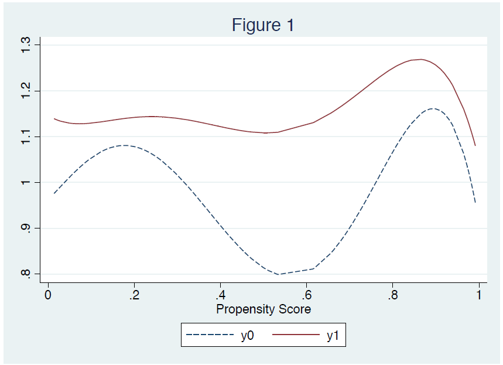

# Homework 4 - Estimation of Average Treatment Effects (ATE) and Propensity Score Matching in Treatment Effect Models

# Exercise 1
### Question 1

We start with the ignorability assumption:
<p align="center">$y_0, y_1 \perp T \mid X$</p>

This implies that, conditional on $X$, the treatment assignment $T$ is independent of potential outcomes. The Average Treatment Effect (ATE) is defined as:
<p align="center">$\text{ATE} = \mathbb{E}[y_1 - y_0]$</p>

Using the law of iterated expectations, we write:
<p align="center">$\text{ATE} = \mathbb{E}_X \left[\mathbb{E}[y_1 - y_0 \mid X]\right]$</p>

From ignorability, we replace $\mathbb{E}[y_1 \mid X] = \mathbb{E}[y \mid T = 1, X]$ and $\mathbb{E}[y_0 \mid X] = \mathbb{E}[y \mid T = 0, X]$:
<p align="center">$\mathbb{E}[y_1 \mid X] = \mathbb{E}[y \mid T = 1, X] \quad \text{and} \quad \mathbb{E}[y_0 \mid X] = \mathbb{E}[y \mid T = 0, X]$</p>

Therefore, the ATE can be expressed as:
<p align="center">$\text{ATE} = \mathbb{E}_X \left[\mathbb{E}[y \mid T = 1, X] - \mathbb{E}[y \mid T = 0, X]\right]$</p>

### Question 2

Given:
<p align="center">$y_0(X) = \alpha_0 + X \beta_0 + \epsilon_0, \quad y_1(X) = \alpha_1 + X \beta_1 + \epsilon_1$</p>

We can estimate ATE by computing:

<p align="center">$\text{ATE} = \mathbb{E}[y_1(X) - y_0(X)] = \mathbb{E}[(\alpha_1 - \alpha_0) + X (\beta_1 - \beta_0)]$</p>
One method is to use regression adjustment. In R, it would look like:

```
model_0 <- lm(y ~ X, data = dataset, subset = (T == 0))
model_1 <- lm(y ~ X, data = dataset, subset = (T == 1))
ATE <- mean(predict(model_1, newdata = dataset) - predict(model_0, newdata = dataset))
```

### Question 3

The propensity score is defined as:

<p align="center">$p(X) = P(T = 1 \mid X)$</p>

<div align="center">

</div>

From Figure 1:

*   The treatment effect is positive if $\mathbf{y_1(p(X)) > y_0(p(X))}$ for all $p(X)$. This means that, on average, treated individuals have a better outcome than they would have if they were untreated, across all levels of the propensity score.
*   The treatment effect is heterogeneous if the difference $\mathbf{y_1(p(X)) - y_0(p(X))}$ varies across different values of $p(X)$. This implies that the impact of the treatment is not constant and depends on the individuals' underlying characteristics as captured by the propensity score.

### Question 4

**Proof:**

Using the law of iterated expectations:

<p align="center">$\text{ATE} = \mathbb{E}[y_1 - y_0] = \int \mathbb{E}[y_1 - y_0 \mid p(X)] f(p(X)) dp(X)$</p>

From ignorability and the definition of propensity score:

<p align="center">$\mathbb{E}[y_1 \mid p(X)] = \mathbb{E}[y \mid T = 1, p(X)], \quad \mathbb{E}[y_0 \mid p(X)] = \mathbb{E}[y \mid T = 0, p(X)]$</p>

Substituting these into the equation:

<p align="center">$\text{ATE} = \int \left[\mathbb{E}[y \mid T = 1, p(X)] - \mathbb{E}[y \mid T = 0, p(X)]\right] f(p(X)) dp(X)$</p>

Rewriting in expectation notation:

<p align="center"> $\text{ATE} = \mathbb{E}_{p(X)} \left[\mathbb{E}[y \mid T = 1, p(X)] - \mathbb{E}[y \mid T = 0, p(X)]\right]$ </p>

### Question 5

**Explanation of the figure and its construction:**

The dataset is divided into $J$ blocks of propensity score values $p(X) $, defined by thresholds $c_1, c_2, \ldots, c_{J-1} $. Specifically, for an observation $i $:

<p align="center">$\text{Observation } i \in B_1 \text{ if } 0 \leq p(X_i) < c_1, $</p>

<p align="center">$\text{Observation } i \in B_2 \text{ if } c_1 \leq p(X_i) < c_2, $</p>

and so on, until:

<p align="center">$\text{Observation } i \in B_J \text{ if } c_{J-1} \leq p(X_i). $</p>

Within each block $B_j$, we estimate the following regression using Ordinary Least Squares (OLS):

<p align="center">$y_i = \alpha_j + \tau_j T_i + \beta_j p(X_i) + \varepsilon_{ij}. $</p>

The figure plots the predicted values of $y$ for treated $T = 1$ and untreated $T = 0$ individuals as a function of $p(X)$. This allows us to visualise how the outcome $y$ depends on the treatment and the propensity score.

**Using the regression results to compute ATE:**

The Average Treatment Effect (ATE) can be calculated by taking the weighted average of the estimated treatment effects $\tau_j$ across all blocks:

<p align="center">$\text{ATE} = \sum_{j=1}^J \pi_j \tau_j, $</p>

where $\pi_j$ is the share of the sample in block $j$, defined as:

<p align="center">$\pi_j = \frac{\text{Number of observations in block } j}{\text{Total number of observations in the sample}}. $</p>


**Accuracy of the estimation and potential improvements:**

- Accuracy: The accuracy of this approach depends on:
  - The number of blocks $J$. More blocks improve granularity but increase the risk of overfitting.
  - The balance of covariates within each block. Covariate imbalance reduces accuracy.
  
- Improvements:
  - Increase the number of blocks $J$, but ensure sufficient sample size in each block to avoid overfitting.
  - Use kernel smoothing to estimate treatment effects as a continuous function of $p(X)$.
  - Ensure proper covariate balance within each block using techniques such as stratification or reweighting.

### Question 6

**Steps for the method:**

In this approach, instead of running regressions, we calculate empirical means of $y$ for treated and untreated individuals in each block:

<p align="center">
$\bar{y}_{j1} = \text{Mean of } y \text{ for treated individuals in block } B_j,$
</p>

<p align="center">
$\bar{y}_{j0} = \text{Mean of } y \text{ for untreated individuals in block } B_j.$
</p>

The treatment effect within each block $B_j$ is then computed as:

<p align="center">
$\mu_j = \bar{y}_{j1} - \bar{y}_{j0}.$
</p>

The ATE is estimated as the weighted average of these block-level treatment effects:

<p align="center">
$\text{ATE} = \sum_{j=1}^J \pi_j \mu_j,$
</p>

where $\pi_j$ is the share of the sample in block $j$, as defined in Question 5:

<p align="center">
$\pi_j = \frac{\text{Number of observations in block } j}{\text{Total number of observations in the sample}}.$
</p>

**Relation to Question 5:**

This method simplifies the regression-based approach outlined in Question 5. Instead of explicitly modelling the relationship between the outcome $y$, the treatment $T$, and the propensity score $p(X)$ within each block using a regression equation, this method directly calculates the difference in the empirical means of the outcome for treated and untreated individuals within each propensity score block to estimate the block-specific treatment effect $\mu_j$.

The key difference is that this method assumes a constant treatment effect within each block and does not account for any residual association between the propensity score $p(X)$ and the outcome $y$ after blocking and treatment. In contrast, the regression model in Question 5 includes $p(X)$ as a covariate within the regression $\beta_j p(X_i)$, which allows for the possibility that the outcome might still vary with the propensity score even within a block and for treated and untreated individuals. Thus, the current method introduces a restriction compared to the regression model by not explicitly modelling $p(X)$ or other covariates within the block.

Like the methods discussed in Questions 4 and 5, the validity of this approach for estimating the ATE relies on the assumption that blocking on the propensity score has sufficiently balanced the observed covariates between the treated and untreated groups within each block, such that any remaining differences in the outcome can be attributed to the treatment.

- **Advantages:**
  - Simpler to implement, as it avoids specifying a regression model.
  - Requires fewer assumptions about functional forms or the relationship between $y$, $T$, and $p(X)$.
  
- **Disadvantages:**
  - Potential loss of precision, as it does not adjust for $p(X)$ explicitly.
  - Accuracy depends heavily on the balance of covariates within each block.

---

## Exercise 2

### 1. Treatment Impact:

The treatment impact is:

<p align="center">$y_1 - y_0 = \beta x.$</p>

Since $x$ is a vector of observed variables, it is different for every individual, making the treatment impact heterogeneous

### 2. Bias in Comparing Average Outcomes:

The expected value of $y_0$ is:

<p align="center">$E[y_0] = E[y_0|T = 1]P(T = 1) + E[y_0|T = 0]P(T = 0).$</p>

If $E[y_0|T = 1] \neq E[y_0|T = 0]$ and $P(T = 1) \neq 1$, then:

<p align="center">$E[y_0|T = 1] \neq E[y_0].$</p>

These conditions are reasonable, and we can indeed assume $E[y_0|T = 1] \neq E[y_0]$. Therefore, there is selectivity bias and comparing the average outcomes of treated and not treated workers provides a biased estimate of the treatment effect on the treated.

It is important to acknowledge that the concepts of heterogeneous treatment effects and selectivity bias are fundamental in causal inference and have been touched upon indirectly in our previous discussions regarding the assumptions required for the methods in Questions 4, 5, and 6. The validity of estimating treatment effects relies on addressing potential biases that arise when the treated and untreated groups are systematically different in ways that are related to the outcome, even in the absence of treatment.

### 3. Propensity Score and Common Support:

The propensity score is defined as:

<p align="center">$P(T = 1|x) = P(y_1 > y_0|x) = P(\beta x > 0|x) = P(\beta_0 + \beta_1 a > 0|a).$</p>

This simplifies to:

<p align="center">$$
  P(T = 1|x) =
\begin{cases}
1, & \text{if } \beta_0 + \beta_1 a > 0, \\
0, & \text{otherwise}.
\end{cases}
  $$
</p>

Since the propensity score is either 0 or 1 there is no common support. Using a matching estimator to estimate the program impact makes no sense in this case. The nearest neighbour will always be very far from an individual's propensity score.

### 4. Regression Equation and Common Support

The observed outcome is:

<p align="center">$y = T y_1 + (1 - T) y_0 = T [f(x) + u + \beta x] + (1 - T) [f(x) + u] = f(x) + u + T \beta x.$</p>

Assuming $x = [1, a]$ and $f(x)$ is linear in $a$, we have:

<p align="center">$f(x) = \alpha_0 + \alpha_1 a \quad \text{and} \quad \beta x = \beta_0 + \beta_1 a.$</p>

Thus:

<p align="center">$y = \alpha_0 + \alpha_1 a + u + T \beta_0 + T \beta_1 a.$</p>

The regression equation is:

<p align="center">$y = \alpha_0 + \beta_0 T + \alpha_1 a + \beta_1 (T \times a) + u.$</p>

OLS can estimate these parameters as long as treatment assignment ($T$) is not perfectly collinear with $a$, requiring common support—treated and untreated individuals must overlap in their age distributions.

In the $(y, a)$-space:

- For untreated individuals ($T = 0$): $y$ is an affine function with intercept $\alpha_0$ and slope $\alpha_1$.
- For treated individuals ($T = 1$): $y$ is an affine function with intercept $\alpha_0 + \beta_0$ and slope $\alpha_1 + \beta_1$.

The vertical gap between the two lines at any value of $a$ represents the treatment effect ($\beta_0 + \beta_1 a$), which can vary with $a$.

This treatment effect can only be estimated for values of $a$ where treated individuals exist. If there is no common support, OLS cannot reliably estimate the parameters because the treatment effect for some ranges of $a$ is not observed. In both cases, there is extrapolation bias if there is no common support.

### 5. Expected Value of $y_0$ Given $x$ and $T = 1$

The expected value of $y_0$ given $x$ and $T = 1$ is:

<p align="center">
$$
E[y_0|x, T = 1].
$$
</p>

Substituting $y_0 = f(x) + u$, we have:

<p align="center">
$$
E[y_0|x, T = 1] = E[f(x) + u|x, T = 1].
$$
</p>

Since $f(x)$ is a deterministic function of $x$, and $u$ is independent of $T$ (as $T$ depends only on $x$ and $\epsilon$):

<p align="center">
$$
E[y_0|x, T = 1] = f(x) + E[u|x, T = 1].
$$
</p>

The independence of $u$ and $T$ implies:

<p align="center">
$$
E[u|x, T = 1] = E[u|x].
$$
</p>

Thus:

<p align="center">
$$
E[y_0|x, T = 1] = f(x) + E[u|x] = E[y_0|x].
$$
</p>

### 6. Propensity Score and Common Support

The propensity score is given as:

<p align="center">
$$
P(T = 1|x) = P(y_1 > y_0|x) = P(\beta x + \epsilon > 0|x).
$$
</p>

Assuming $\epsilon \sim N(0, 1)$, the propensity score becomes:

<p align="center">
$$
P(T = 1|x) = \Phi(\beta x),
$$
</p>

where $\Phi$ is the cumulative distribution function of the standard normal distribution.

Since $\Phi(\beta x)$ is a continuous function mapping $\mathbb{R}$ to $(0, 1)$, there is common support if $\beta x$ spans values such that $0 < \Phi(\beta x) < 1$.

This ensures overlap between treated and untreated individuals, making matching estimators feasible.

### 7. Matching Method with Correlated $\epsilon$ and $u$

If $\epsilon$ is correlated with $u$, the independence assumption required for matching methods is violated. Specifically:

<p align="center">
$$
y_1 = y_0 + (\beta x + \epsilon),
$$
</p>

and $y_0 = f(x) + u$ implies that $y_1$ depends on $x$, $u$, and $\epsilon$.

Correlation between $\epsilon$ and $u$ means that $T$ (treatment assignment) is no longer independent of the unobserved component $u$. Consequently, the ignorability assumption:

<p align="center">
$$
(y_0, y_1) \perp T | x
$$
</p>

is not satisfied. Therefore, applying matching methods under this condition would lead to biased estimates of the treatment effect, as the treatment assignment is influenced by unobserved factors correlated with outcomes.
