# Finance & Business Analytics 
This repository presents a comprehensive analysis of financial and business performance through the application of regression models. Using aggregate, disaggregate, and lead/lag variables, the analysis explores factors affecting market share and Tobin’s Q across various retail firms. The project integrates key financial indicators such as advertising intensity, marketing investment, firm size, liquidity, and leverage to evaluate their impact on firm performance. By applying advanced data analytics techniques, this work offers insights into effective strategies for enhancing both market share and market value.

## Abstract
The retail industry is a mature and highly competitive market that continues to show steady growth year after year. Business drivers are essential for growth and continued success. This report explores the key drivers of firm performance within the retail industry and provides actionable recommendations for retailers.

## Data

### The Industries in the Data

The dataset includes several types of retailers, all part of the fashion industry:
- Women’s clothing stores (SIC code: 5621)
- Family clothing stores (SIC code: 5651)
- Shoe stores (SIC code: 5661)

In total, the dataset contains 43 distinct retailers:
- 19 Women’s clothing stores
- 14 Family clothing stores
- 10 Shoe stores

The dataset includes both very large retailers that operate globally, such as "Urban Outfitters Inc." and "Foot Locker Inc.," as well as smaller retailers like "Francesca's Holdings Corp" and "dELiAs Inc."

### Investment: Mobile App
The data was cleaned and merged to create the final dataset. Of the companies in the dataset, 28% launched a mobile app during the specified period.
Sources of Data Collection

Primary data was sourced from various platforms:

- Google Play and App Store: Official stores for apps
  - Google: Google Play
  - Apple: App Store

- Press releases from retailer websites that launched apps
  - Example: Nordstrom iPad App Launch

- APKPure and AppAdvice: Websites offering app-related news and information, particularly launch dates
  - AppAdvice: AppAdvice
  - APKPure: APKPure

Motivations for Choosing This Investment

- General Reasons:
  - The mobile app variable can be stored as a numeric (double) datatype.
  - It is actionable: Retailers can choose to launch an app.
  - The fashion industry widely uses apps, although not all retailers have one; 28% of firms in the dataset have an app.
  - Information on app launches is relatively easy to obtain.

- Influence on Firm Performance:
  - A mobile app can provide a competitive advantage.
  - Apps simplify customer data collection.
  - They offer various touchpoints in the customer journey.
  - Operating costs are lower for apps compared to opening new stores.

- Engaging Customers:
  - Mobile apps provide more personalized customer engagement compared to websites or in-store experiences.
  - Social-oriented features in apps help retail industries deliver personalized recommendations directly to users.
  - Apps create communities and promote brand engagement with modern, tech-savvy customers.

- Convenience of an App:
  - Payment: Apps simplify payments with built-in smartphone features, such as credit card scanning and secure keychains for storing customer details.
  - Ease of Use: Smartphones are always accessible, enabling customers to shop anytime and anywhere. Unlike websites, apps are designed for mobile browsing.
  - Logistics: Apps remove geographic barriers, allowing companies to sell products to customers wherever they are. Push notifications and in-app messaging enhance customer interaction.

- Disadvantages:
  - High competition with numerous retailer apps makes differentiation difficult.
  - Convincing customers to download apps can be challenging.
  - Consumers are reluctant to install numerous retailer apps.
  - App stores (e.g., Apple) charge taxes to store owners.
  - Retailers must regularly update their apps to meet software requirements.
  - App stores control access and can remove apps.

- Sources:
  - NN4M: 10 Reasons Retailers Need a Mobile App
  - Inman, J.J., Nikolova, H. (2017), "Shopper-Facing Retail Technology: A Retailer Adoption Decision Framework Incorporating Shopper Attitudes and Privacy Concerns," Journal of Retailing, 93(1), 7–28.
  - Lamey, L., Breugelmans, E., Vuegen, M., ter Braak, A. (forthcoming), "Retail Service Innovations and their Impact on Retailer Value: Evidence from an Event Study," Journal of the Academy of Marketing Science.
 
- Facts about Retailers' Mobile Apps:
  - 17 out of 43 companies in the dataset have mobile apps.
  - The first app was launched by Nordstrom Inc. in 2012.
  - Two apps were launched in 2021.
  - The peak year for app launches was 2016, with 5 companies launching apps.

The dataset spans from 2010 to 2020, though data for some firms is only available for selected financial years. Some app launches occurred outside the dataset's time range. After merging the two datasets, only 12 companies' apps were considered, making the percentage of companies with a mobile app 28%.

### Data Cleaning
The dataset was cleaned by excluding unnecessary variables, handling missing values, checking for outliers, and correcting data types. All data points that were redundant or inconsistent with logical expectations were removed.

The following variables were excluded:
- `rdip` (unary variable with all zero values)
- `bkvlps`, `ni`, `oibdp`, `gsubind` (no descriptions available)
- `busdec` (not required for analysis)

#### Missing Values
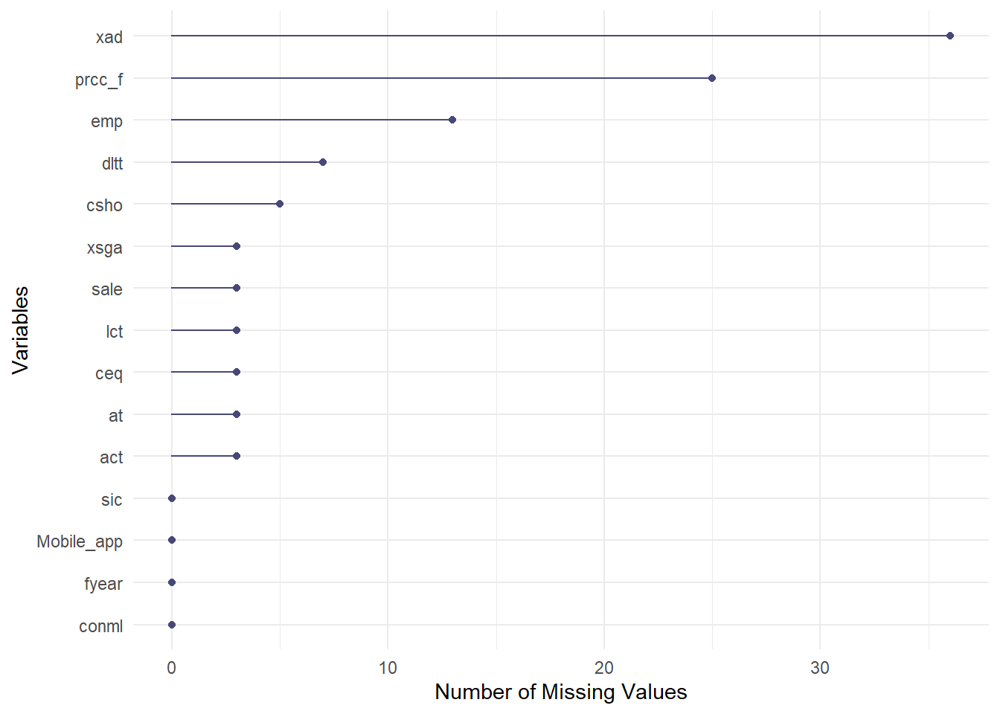

There are 104 missing values in total, distributed across various variables. The most missing values occur in:
- `xad` (Advertising expenditures) with 36 missing values
  - Missing values in `xad` were replaced with 0, assuming that the firm did not allocate advertising expenditures during that period.
- `prcc_f` (Closing share price at the end of the year) with 25 missing values
- Observations with more than one missing value were removed to avoid inaccurate imputation, preserving the quality of the analysis.
- Remaining missing values (18) were imputed using a decision tree algorithm (mice).

The following new variables were created:
- Firm Performance Metrics: market share, Tobin's q
- Managerial Decisions: advertising intensity, marketing investments
- Firm Characteristics: age, size, financial liquidity, leverage
- Industry Characteristics: industry-specific dummy variables (3 dummies)

The firm’s foundation year was merged with the dataset to calculate the age of each firm.

Several variables, including investment status and SIC codes, were initially stored as numeric values. These were corrected to categorical data types.

#### Outliers:
- Outliers, especially in the variable `market share`, were addressed by removing a specific observation for the year 2020.
- The outliers are due to the size/scale of the retailers (primarily TJX Companies, Gap and Nordstrom). This is the case for all variables which describe the firm (e.g. total assets, current assets, long term debt,…).
- The variable book value (`ceq`) also had some negative values which come from firms with more liabilities than assets
- The variable market share has an outlier with the value “1”: This is because there is only one observation for the financial year 2020 (company Ascena Retail Group Inc.). It was not deleted since it is still correct within the available data.
- The original variables have, in general, more outliers than the created variables.

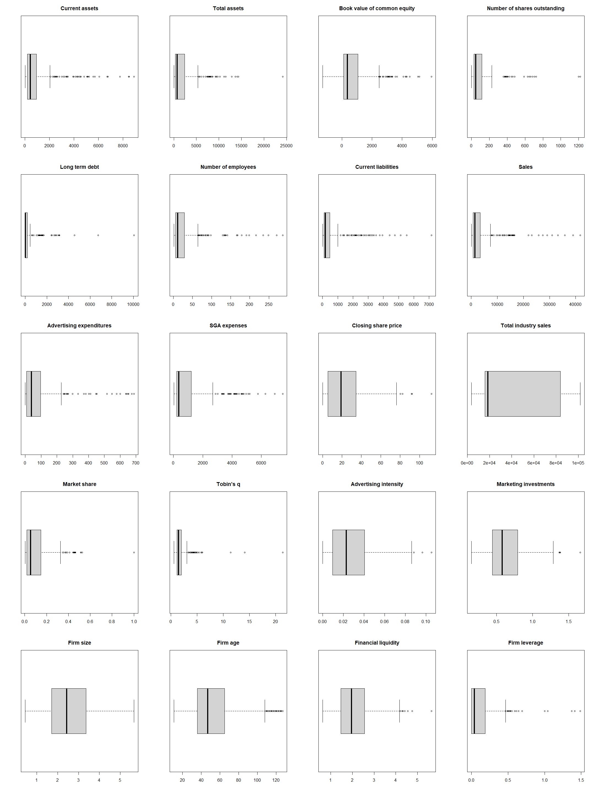

In the boxplot for the market share, we identified an outlier:
- Further investigation showed that there is only one observation for the financial year 2020
- Since this can be misleading our analysis, we decided to delete this observation
- The boxplots revealed many further outliers:
  - These outliers would influence our further analysis and possibly mislead it
  - Hence, observations that contain outliers were deleted, leaving us with 84.3% of the original data data (15.7% were outliers).

#### Min-Max normalization
For further analysis, the data will be normalised using Min-Max normalization to ensure that all variables are on the same scale. 

In the following parts of the report, a multivariate linear regression model will be developed. 
- This algorithm does not require the data to be normally distributed, so achieving normality will not be pursued.
- However, when working with numeric variables, it is crucial to consider that they have varying ranges. To compare the impact of multiple numeric variables on the response variable, the predictors must be normalised.

Min-Max normalisation was used to ensure that values fall between 0 and 1, which facilitates convenient comparison of the impact of each predictor on the response variable. 
- This normalisation guarantees that all variables are on the same scale and are considered equally.
- The normalised data cannot be used for exploratory data analysis, as it makes interpretation more difficult.

#### Summary Statistics for Numerical Variables

A table of summary statistics for numerical variables was generated, including measures of center, spread, and range. Most variables exhibited right-skewness, with the exception of advertising intensity.

- Measures of centre: mean, median
- Measures of spread: standard deviation (sd), interquartile range (iqr)
- Measures of range: min, max

- Indication of skewed data:
  - Right-skewed: median < mean
  - Left-skewed: median > mean
  - As the values show, all of our variables are right-skewed (except `adv_int`)
  - Especially the variables that were originally in the dataset (e.g., sales, total and current assets) are right-skewed
- All variables except the book value contain only positive value

| Variable               | Mean  | Median | SD    | IQR   | Min   | Max   |
|------------------------|-------|--------|-------|-------|-------|-------|
| act                    | 1036  | 444    | 1574  | 740   | 27    | 8891  |
| at                     | 2026  | 741    | 3036  | 2040  | 42    | 24145 |
| ceq                    | 800   | 367    | 1081  | 942   | -1272 | 5948  |
| csho                   | 103   | 48     | 156   | 88    | 0     | 1217  |
| dltt                   | 410   | 22     | 995   | 201   | 0     | 10053 |
| emp                    | 30    | 12     | 46    | 24    | 2     | 286   |
| lct                    | 584   | 197    | 1011  | 379   | 18    | 7150  |
| sale                   | 3940  | 1507   | 6467  | 2714  | 135   | 41717 |
| xad                    | 85    | 40     | 129   | 88    | 0     | 687   |
| xsga                   | 1028  | 376    | 1357  | 992   | 41    | 7455  |
| prcc_f                 | 24    | 19     | 21    | 29    | 0     | 112   |
| total_industry_sales   | 46079 | 18656  | 35119 | 68248 | 3718  | 101697|
| market_share           | 0     | 0      | 0     | 0     | 0     | 1     |
| tobin_q                | 2     | 1      | 2     | 1     | 1     | 21    |
| adv_int                | 0     | 0      | 0     | 0     | 0     | 0     |
| marketing_inv          | 1     | 1      | 0     | 0     | 0     | 2     |
| firm_size              | 3     | 2      | 1     | 2     | 0     | 6     |
| liquidity              | 2     | 2      | 1     | 1     | 1     | 6     |
| leverage               | 0     | 0      | 0     | 0     | 0     | 1     |
| firm_age               | 54    | 47     | 27    | 29    | 11    | 127   |

**Number of retailers per industry**

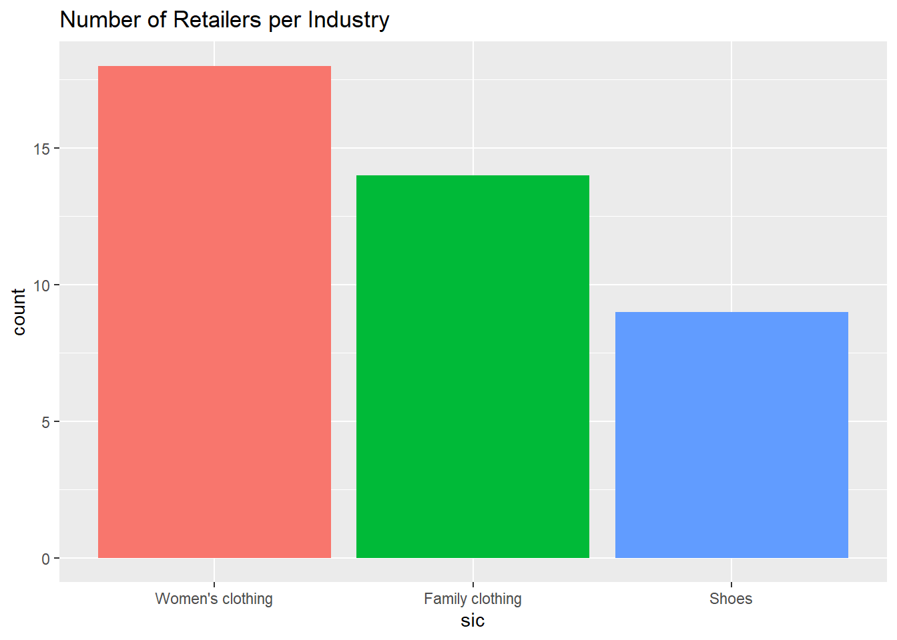

In total, there are 43 different retailers, of which:
- 19 are women´s clothing stores
- 14 are family clothing stores
- 10 are shoe stores

**Number of retailers with an app per industry**

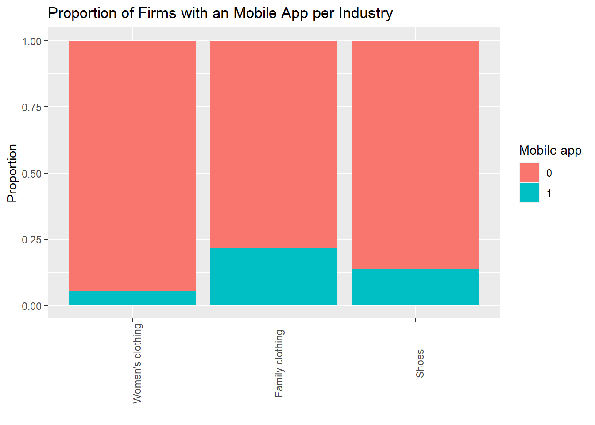

- In the dataset, 12 companies have introduced an app at some point between 2010 and 2020:
  - 1 is a women’s clothing store
  - 9 are Family clothing stores
  - 2 are Shoe stores
- The normalized barplot shows the proportion of firms in each industry that have introduced an app
- The most significant proportion of retailers to launch an app is selling family clothing, and the minor proportion is selling women’s clothing

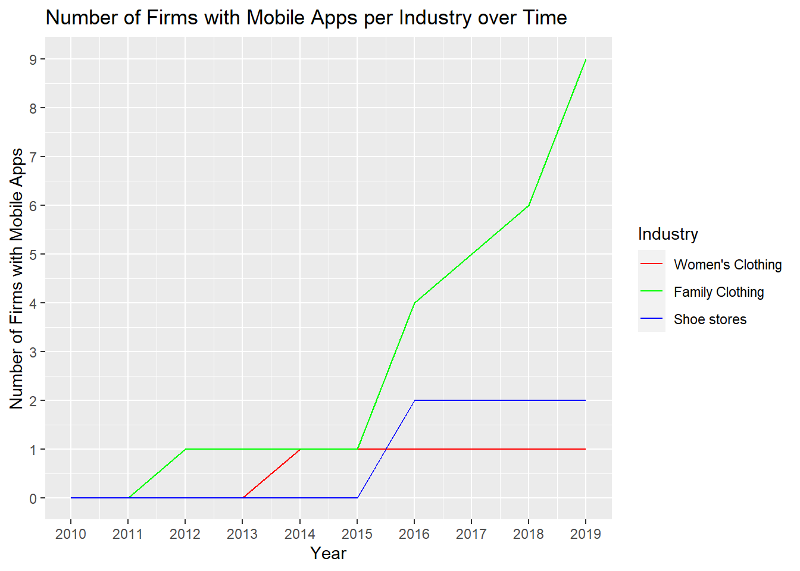

The time series plot provides insight into how the key players within each industry have evolved over the years, with particular attention paid to the major shifts from 2010 to 2019. This allows us to observe the competition dynamics and dominance of major players.

- There is only one firm whose data is available for the financial year 2020, and that firm (Ascena Retail Group Inc.) has not introduced an app. For this reason, the time series plot shows information about financial years 2010-2019.

- Women’s clothing stores:
  - The only app was launched in 2014
- Family clothing stores:
  - The first app was introduced in 2012
  - The next launches occurred in 2016, with three other retailers introducing their apps to the market
  - The latest app launch was in 2019 when another three apps were released
- Shoe stores:
  - Both apps introduced by the retailers in the dataset were launched in 2016

**Average sales by industry**

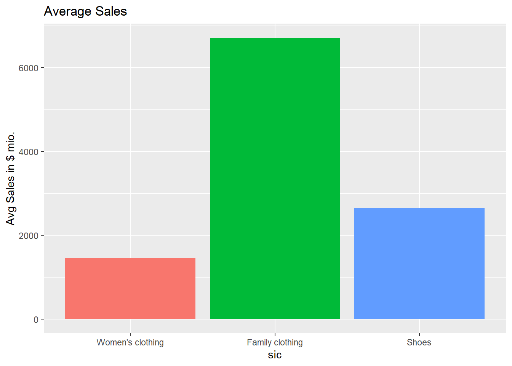

- Family clothing industry:
  - In general, the average sales are significantly higher than in the women’s clothing or shoe industry
  - Average sales were equal to 5 billion dollars in 2010
  - Sales increased significantly in the next nine years to nearly 8.5 billion in the year 2019
- Shoe industry:
  - At the beginning of the given period, average sales in the shoe industry were equal to about 2 billion dollars
  - Throughout next years, this amount steadily increased to 3.1 billion in 2019
- Women’s clothing industry:
  - In general, this industry makes the least gross sales
  - In the year 2010, retailers earned 1.25 billion in gross sales on average
  - From 2010 to 2019, sales in this industry did not rise significantly. Hence, there was only a small increase in sales in comparison to the other two industries

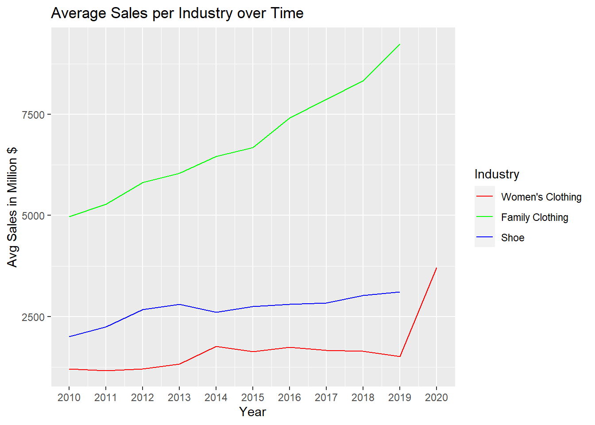

**Average advertising expenditures per industry**

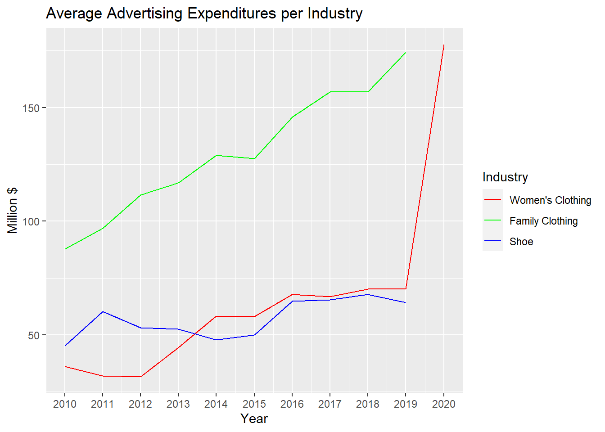

- Women’s clothing industry:
  - In 2010, the average spending of retailers was approximately 40-45 million dollars
  - The expenditures steadily increased with fluctuation in the years from 2013 to 2015 years and continued to grow to average spending of 70-75 million in the year 2019
  - The sudden peak of advertising expenditures to 180 million dollars in 2020 comes from the fact that there is only one observation for 2020; hence it might be misleading
- Shoe Industry:
  - In 2010, retailers spent on average nearly 50 million dollars on advertising per year
  - The growth was steady throughout the years with small fluctuations and grew to almost 90 million in 2018 before reverting into a decline in average spending to 80 million in 2019
- Family clothing:
  - In this industry, retailers spent on average significantly higher amounts than companies in the shoe and women’s clothing industries
  - Their spending was on average 90 million dollars on advertising
  - The advertising expenditures increased drastically throughout the following years to almost 175 million dollars in 2019
- It is interesting to see the correlation between the average advertising expenditures and the average sales per industry.
- This might be a two-way correlation:
  - As sales rise, the firm has more money to spend on advertising
  - As the firm’s advertising expenditures rise, they attract more customers and convince them makes purchases; hence sales rise

**Financial Liquidity**
- Financial Liquidity is the ratio of the current assets to current liabilities
  - This measure assesses whether a firm has sufficient working capital to meet its short-term needs
  - The higher this ratio, the more working capital the firm has available

The following bar chart shows the average financial liquidity of the retailers per industry:

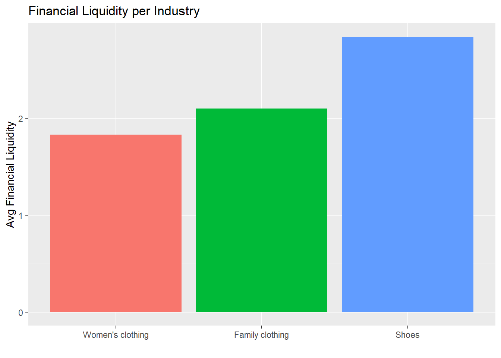

Comparison among the three industries:

- The financial liquidity is the lowest for the women’s clothing industry, followed by the family clothing industry and the shoe industry, with the highest liquidity ratio
- This means, on average, the shoe industry has more available short-term/working capital available than the other two industries
- Comparison to other industries
  - For large U.S. firms in 2018, the quartile values [25%, median, 75%] are: [1.2, 1.8, 2.9]
  - With values of 1.8, 2.1 and 2.75, the shoe, women’s clothing and family clothing industries are all doing well
  - Their financial liquidity ratios lie within the third quartile

**Tobin’s Q over Time**
- Tobin’s q is the market value of a company divided by its assets’ replacement cost
  - It is an important measure to evaluate if a business is overvalued or undervalued
  - The average Tobin’s q value is about 0.8

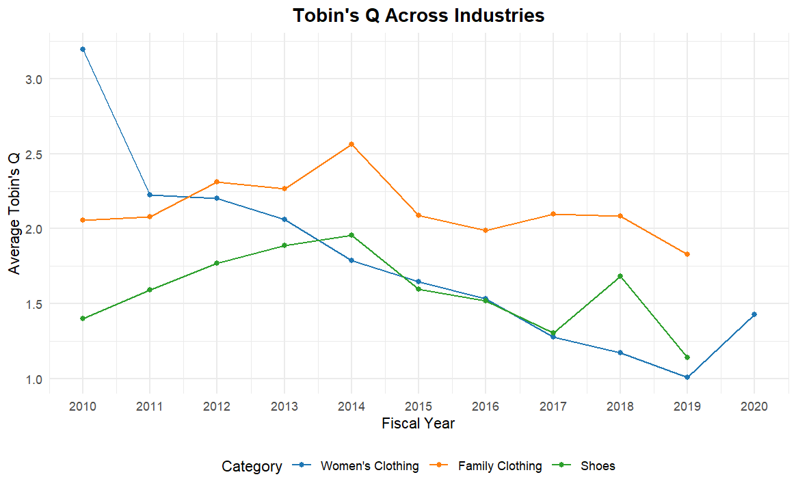

- Women’s clothing industry:
  - The retailer in this industry has a relatively high Q ratio
  - This implies that their stock is overvalued
  - The data shows a downward sloping trend in the Q ratio
- Family clothing industry:
  - In general, the retailers in this industry show a higher Q ratio (2.14) than the retailers in the other two industries
  - This also indicates that their stocks are overvalue
  - The average Tobin’s Q shows a strong peak up to 2.55 in 2014
- Shoe industry:
  - Again, the Q ratios indicate that retailers in the shoe industry are overvalued
  - We can observe two strong peaks in 2014 and 2018
  - Still, after 2014, there is an overall downward sloping trend
  - Changes in the average Tobin’s Q could be due to changing market trends and demand

**Market Share**
- Market share can be used as a measure of firm performance
- The market shares of each industry for two years (2010 and 2019) is shown beloz

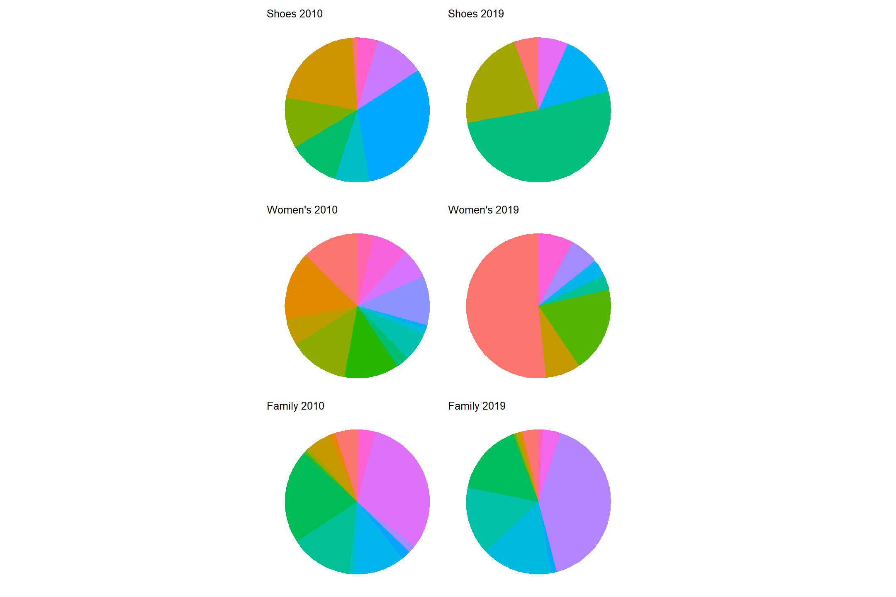

The most interesting observations are stated below:
- Shoe industry:
  - In 2010, the industry is dominated by the retailers Foot Locker and Collective Brands
  - Looking at 2019, Foot Locker was able to increase its share by 20%, occupying more than half of the market alone
- Women’s clothing industry:
  - The market is split up between multiple retailers and not dominated by one/a few large retailers like in the shoe industry
  - In 2019, this has changed and the market is being dominated by the Ascena Retail Group, with a share of 42%
- Family clothing industry:
- The market is strongly dominated by TJX Companies, followed by Gap, Nordstrom and Ross Stores
- There are relatively many retailers with only a small market share
- In 2019, the market is still dominated by the same retailers
- TJX Companies’ share increased by about 10% in 2019, compared to 2010

**Correlation of numerical variables**
- Meaning of the correlation coefficients:
  - “0” = no correlation
  - “1” = perfect correlation

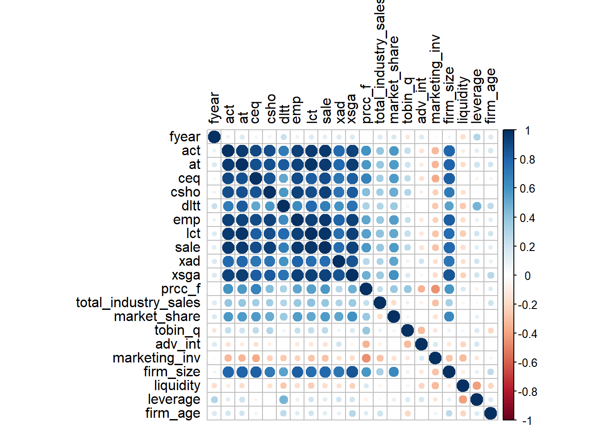

The variables that describe firm characteristics (variables that were initially in the dataset) show moderate/strong correlation among each other. The fact that they strongly depend upon each other also makes much sense: - The more sales a retailer makes, the more assets they have and the more they can spend on advertising 

- The number of employees also correlates strongly with the assets, expenditures, sales, outstanding shares and more. A firm with many employees tends to be large; hence, they make more sales, have more shares outstanding and other
- - The book value correlates strongly with the assets and liabilities, which also makes sense since the book value is calculated as their difference
  - The total assets and current assets have a very strong correlation since the current assets is a part of the total assets
  - The selling and general administrative expenses correlated strongly with the assets, liabilities and sales. The more sales a firm makes, the more they increase their assets and the more money they can spend on advertising, increasing sales again. More sales also mean higher selling expenses.

- The firm size shows a moderate correlation with multiple descriptive variables of firm’ characteristics. The larger a firm, the more likely they are to have higher sales, assets, expenditures and more
- The table shows the p-values of the correlations:
  - The variables with a high correlation show a very low p-value
  - If the p-value is lower than the significance level of 0.05, the correlation is statistically significant

--- 

### Aggregate Data Models
#### Cross-Sectional Data
- Data Aggregation: The dataset was aggregated to create a cross-sectional representation, with one observation per firm, by calculating the mean of the numerical variables across each firm.
- Categorical Data Handling: Since categorical variables (e.g., industry dummies, mobile app availability) cannot be averaged, these were extracted and merged with the aggregated dataset.
- Dataset Structure: The code snippet below demonstrates the aggregation and merging process, followed by handling of missing categorical values.

- Correlation Analysis:
  - Observation: The correlation between the variables is generally low, with firm size and market share showing a slight correlation.
  - Visualization: A correlation matrix was generated to visualize the relationships between numerical variables.

- Summary Statistics:
  - Minimal Impact of Outliers: Summary statistics were calculated, showing that removing outliers had minimal effect on the variables.

 - Normalization:
   - Procedure: All independent numerical variables were normalized, with the exception of the dependent variables (market share and Tobin's Q), which do not require normalization.

### Models Built On Aggregate Data
#### Linear Regression:

  
    $\widehat{\text{market\_share}} = -0.04762 + 0.01211(\text{Mobile\_app}_{1}) + 0.0662(\text{women\_clothes}_{1}) + 0.11953(\text{shoes}_{1}) + 0.01703(\text{adv\_int}) - 0.03087(\text{marketing\_inv}) - 0.04767(\text{firm\_age}) + 0.31413(\text{firm\_size}) - 0.05046(\text{liquidity}) - 0.02931(\text{leverage})$
  

- Model Details:
  - The dependent variable is market share, while Tobin’s Q was excluded from the model.
  - A regression model was fit using normalized data, showing that firm size and industry type are significant predictors of market share.
  - The variable family_clothes was excluded because we used it as our reference level

- Quality of the model:
  - The adjusted R-squared shows that the model explains 75.64% of the variance in the dependent variable. This is a relatively good fit.
  - The p-value associated with the F-statistic is lower than the 5% significance level, meaning that at least one independent variable is significantly related to the market share.
  - While this model does not explain the relationships between all of the predictors and market share, it can be used to indicate which managerial investment decisions and firm characteristics are related to the market share and in what way.

- Interpretation of the results:
  - Since the variables are normalized, we cannot say by how much the market share would change with a change in any of the independent variables. However, we can compare the influence of different predictors and whether they are positively or negatively related to the market share.
  - Based on the t-statistic and corresponding p-values, we can conclude that the coefficients of only 3 out of 9 predictors are significantly different from zero: firm size and industry dummy variables. There is not enough evidence to conclude a linear relationship between the other predictors and the response variable.
  - The coefficient of the `firm_size` is positive, meaning the larger the firm, the higher the market shares.
  - The coefficients of the industry dummy variables indicate that, out of the three industries analyzed in this report, retailers selling shoes have, on average, the highest market share and retailers selling family clothes (reference level) have on average the lowest market shares.
  - Even though the rest of the variables are not significant in predicting the market share, we may analyze them as if they were statistically significant:
    - Firms with higher advertising intensity (ratio of advertising expenditures and total revenues) are expected to have larger market shares than otherwise identical companies with low advertising intensity.
    - Firms whose marketing investments (ratio of marketing expenditures and total assets) are higher, holding all else equal, are expected to have a lower market share.
    - The model indicates that younger firms, on average, have a larger market share.
    - Firms with high financial liquidity (more working capita) have a lower market share on average.
    - Retailers with high firm leverage (firms relying more heavily on debt as a source of financing) are expected to have a lower market share (holding all else equal).
    - Introducing a mobile app is associated with a higher market share, assuming that we compare otherwise identical companies.

 - Firm’s with the objective to increase their market share should satisfy the following characteristics:
   - High advertising intensity
   - Low marketing investment ratio
   - Be young and large
   - Low financial liquidity
   - Low firm leverage
   - Have a mobile app
 - However, the only statistically significant firm characteristic is the firm size (apart from the industry). Hence, a retailer should try to grow in size.

Overall:
- Larger firms tend to have higher market shares.
- Retailers in the shoe industry tend to have higher market shares compared to family clothing retailers.
- Industry dummies and firm size were the only statistically significant variables.
        
#### Tobin’s Q Regression:

  $$\widehat{\text{tobin\_q}} = 2.75514 + 0.20194(\text{Mobile\_app}_{1}) - 0.11558(\text{women\_clothes}_{1}) - 0.26118(\text{shoes}_{1}) - \\
  0.99538(\text{adv\_int}) - 0.83539(\text{marketing\_inv}) - 0.69895(\text{firm\_age}) + 0.84023(\text{firm\_size}) - \\
  0.80121(\text{liquidity}) - 0.78311(\text{leverage})$$

- Model Details:
  - The dependent variable is Tobin’s Q, and similar to the market share regression, industry and firm-specific variables were included.
  - Only advertising intensity was found to have a significant impact, with a negative relationship to Tobin’s Q.
- The variable family_clothes was excluded because we used it as our reference level

- Quality of the model:
  - The adjusted R-squared shows that the model explains 25.25% of the variance in the dependent variable. Since this value is much lower than for the market share model, it is a relatively poor fit.
  - The p-value associated with the F-statistic is also lower than the 5% significance level, which means that at least one independent variable is significantly related to Tobin's Q. 

- Interpretation of the results:
  - Similar to the market share regression model, the variables are also normalised. This means we cannot precisely determine how much Tobin's Q would change due to a change in the independent variables. However, it is possible to compare the significance of the different predictors and whether these predictors are positively or negatively related to Tobin's Q. 
  - Based on the t-score and corresponding p-values, we can conclude that only one predictor has coefficients significantly different from zero, which is advertising intensity (`adv_int`) .
  - Advertising intensity: The coefficient of `adv_int` is negative. This inverse relationship implies that firms that invest more intensely in advertising are expected to have a lower Tobin's Q ratio.

- Despite the other variables are not significant in predicting the market share, we may analyse them as if they were statistically significant:
  - `marketing_inv`: Firm that invests more in marketing, ceteris paribus, are expected to have a lower Q ratio.
  - `firm_age`: younger firms are expected to have a lower Q ratio. 
  - `firm_size`: firms that are larger are expected to have a higher Q ratio.
  - `liquidity`: firms with higher financial liquidity are expected to have a lower Q ratio.
  - `leverage`: firms with higher firm leverage are expected to have a lower Q ratio.
  - `Mobile_app`: firms with a mobile app are expected to have a higher Q ratio
  - `women_clothes` and `shoes`: the coefficients indicate that firms that sell women's clothes have, on average, the highest Q ratio.

- All in all, it can be concluded that for a firm to have a high Q ratio, it should have the following characteristics:
  - Low advertising intensity
  - Low marketing investments
  - A young and large firm
  - Low financial liquidity
  - Low firm leverage
  - Have a mobile app
- Since the only statistically significant firm characteristic was advertising intensity, a retailer wishing to increase their Tobin's Qshould lower their advertising intensity.
  
        
#### Comparison of Models:

- The key differences between the market share and Tobin's Q models were notable, with the market share regression model performing better due to a higher adjusted R-squared value. Tobin's Q, being more focused on long-term value, reflects less immediate impact from current strategies.
- As previously discussed, both models predominantly indicate the insignificance of certain variables. However, we chose to include all variables in our analysis, as even those that are statistically insignificant can offer valuable insights.
- Advertising Intensity:
  - An increase in advertising intensity is associated with a rise in market share, but conversely, it leads to a decrease in Tobin's Q. This suggests that while advertising efforts may drive immediate sales growth, they may not necessarily enhance the firm's long-term market value relative to its book value.
- Industry Comparison:
  - Retailers in the shoe and women's clothing industries tend to have a higher market share compared to those in the family clothing sector. However, these retailers in shoes and women’s clothing typically exhibit a lower Tobin’s Q, indicating that while they capture a larger share of the market, their long-term market value is relatively lower.

Tobin's Q:
- Tobin’s Q represents the ratio of a firm's market value to the replacement cost of its assets. This metric focuses on the long-term performance and reflects the relationship between market value and asset worth. However, it's important to note that current actions may not be immediately reflected in Tobin’s Q.

Market Share:
- In contrast, market share is more directly linked to a company's day-to-day activities and decisions. Consequently, the impact of business actions on market share is often visible in the short term.
- As a result, the model predicting market share appears to provide a better fit compared to the model for Tobin’s Q, as evidenced by the higher adjusted R-squared value.

#### Expected Performance of an Average Firm:
- Predictions were made for an "average" firm, using the means of numerical variables and categorical combinations for different industries.
- Results:
  - The shoe industry is predicted to have the highest market share (14.4%), with a slight increase when a mobile app is introduced
  - Women's clothing firms are predicted to have a 9% market share, with an increase to 10.2% with a mobile app.
  - Family clothing retailers show the lowest market share but have the highest average Tobin’s Q ratio.
This analysis provides insight into how various factors such as advertising intensity, firm size, and industry type impact key performance indicators like market share and Tobin’s Q, with recommendations for firms based on regression results.

---

### Disaggregate Data Models
- All numerical variables in the dataset are first normalised to standardize the range of values. 
- Lead and lag variables for certain predictors (e.g. market share and Tobin’s Q) were then created to capture time-based effects.
  - Lead variables for the market share and Tobin's Q.
  - Lag variables for the advertising intensity and marketing investments.

#### Models with Disaggregate Data
Using the same variables as in the previous regressions using aggregate data, 

  $$\widehat{\text{market\_share}} = -0.03708 + 0.01573(\text{Mobile\_app}_{1}) + 0.06068(\text{women\_clothes}_{1}) + 0.10602(\text{shoes}_{1}) + \\
  0.01611(\text{adv\_int}) - 0.03311(\text{marketing\_inv}) + 0.25848(\text{firm\_size}) - \\
  0.05589(\text{liquidity}) - 0.01939(\text{leverage}) - 0.03436(\text{firm\_age})$$

  $$\widehat{\text{tobin\_q}} = 2.63177 - 0.10969(\text{Mobile\_app}_{1}) - 0.14522(\text{women\_clothes}_{1}) - 0.4479(\text{shoes}_{1}) - \\
  0.9181(\text{adv\_int}) - 1.02824(\text{marketing\_inv}) + 0.8744(\text{firm\_size}) - \\
  0.16803(\text{liquidity}) - 1.10329(\text{leverage}) - 0.62909(\text{firm\_age})$$

#### Models with Lead and Lag Variables

- The lead and lag variables have multiple missing values:
  - The companies “DSW Inc-Old” and “TJX Companies Inc (The)” both only have one observation. Therefore, the lead and lag variables cannot be computed for these observations. Hence, we omitted them.
    - Other missing values:
      - We computed the average increase in the lead and lag variables for each retailer.
      - For the lead variables, we multiplied the factor we just computed with the nearest observation in that variable for the retailer.
      - For the lag variables, we divided the factor we just computed with the nearest observation in that variable for the retailer.
      - This method is based on the assumption that each retailer has the goal to grow. Hence, it is likely that the performance measures increase over time. Therefore, we took the average change to compute the missing values.
    - This method did not take care of all missing values. Seventeen missing values are left, which the regression algorithm omitted.

  $$\widehat{\text{lead\_market\_share}} = -0.01848 + 0.01536(\text{Mobile\_app}_{1}) + 0.06791(\text{women\_clothes}_{1}) + 0.10788(\text{shoes}_{1}) + \\
  0.01692(\text{adv\_int}) - 0.05655(\text{marketing\_inv}) + 0.24591(\text{firm\_size}) - \\
  0.08165(\text{liquidity}) - 0.02832(\text{leverage}) - 0.02965(\text{firm\_age}) + 0.00137(\text{lag\_adv\_int}) + \\
  0.00927(\text{lag\_marketing\_inv})$$

  $$\widehat{\text{lead\_tobin\_q}} = 2.61415 - 0.06834(\text{Mobile\_app}_{1}) - 0.25335(\text{women\_clothes}_{1}) - 0.44089(\text{shoes}_{1}) + \\
  0.48277(\text{adv\_int}) - 1.38049(\text{marketing\_inv}) + 1.1359(\text{firm\_size}) - \\
  0.44458(\text{liquidity}) - 1.22359(\text{leverage}) - 0.78181(\text{firm\_age}) - 1.31545(\text{lag\_adv\_int}) + \\
  0.37416(\text{lag\_marketing\_inv})$$

#### Comparison of Models: 
- The adjusted R-squared of models developed using the disaggregated data is slightly higher compared to models developed with aggregate data.
- The p-values associated with the F-statistics for both models are lower below the 5% significance level, meaning that at least one independent variable (in each model) is significantly related to the market share. The t-scores and corresponding p-values indicate that more variables are statistically significant in both models created with the disaggregated data. That is, their coefficients are significantly different from zero:
  - Model estimating market share: 7 out of 9 when using a significance level of 5% and 9 out of 9 when using a 10% significance level.
  - Model estimating Tobin’s q: 5 out of 9 variables are significant (dummy indicating whether the firm sells shoes, advertising intensity, marketing investments, firm size, financial leverage and firm age).
- Overall, models developed using disaggregated data are a slightly better fit than models with aggregate data. However, neither of the models estimating Tobin’s q is a good fit they do not explain enough variance in the response variable.

#### Comparison of Firms:

- Market Share:
  - The characteristics of a firm that would have a high market share are the same for all three models.
  - The only difference between these indications is that the model including lead and lag variables indicates that:
    - firms with high advertising intensity in the previous year are expected to have higher market shares.
    - firms with high marketing investments in the previous year have, on average higher market shares.
- Tobin’s q:
  - All of the models indicate that retailers selling family clothes had higher Tobin’s q than firms in other industries when comparing otherwise identical firms.
  - Different models indicate opposite effects of some of the predictors, depending on the dataset used to develop the model.
  - `Mobile_app`: The model with aggregate data indicates a positive relationship between the firm having a mobile app and Tobin’s q. However, the other models suggest that having a mobile app is associated with lower Tobin’s q.
  - `adv_int`: Model including leads and lags indicates that firms with high advertising intensity, on average, have higher Tobin’s q. The other models indicate the opposite effect of high advertising intensity on Tobin’s q.
  - The model, including lag and lead variables, indicates that:
    - firms with high advertising intensity in the previous year are expected to have lower Tobin’s q.
    - firms with high marketing investments in the previous year have, on average, higher Tobin’s q.

 #### Conclusion
 After performing analysis with the regression models, it can be concluded that companies should base their interpretation on the data obtained each year rather than on average indicators. This is because more variables influence the performance of the firms from a statistical point of view.

Recommendations for Companies Across All Industries:

- Retailers seeking to increase their market share should consider the following actions:
  - Increasing their firm size
  - Launching a mobile app to sell their products
  - Reducing investment in marketing
  - Additionally, retailers should note that firm age is a significant predictor of market share. In general, younger companies tend to have a higher market share

- For retailers aiming to increase their Tobin’s Q (the market value over the book value), they should consider:
  - Increasing their firm size
  - Reducing investment in marketing
  - Lowering leverage ratios (i.e., the extent to which assets are financed through debt)
  - Retailers should also be aware that younger companies may have a higher Q ratio

