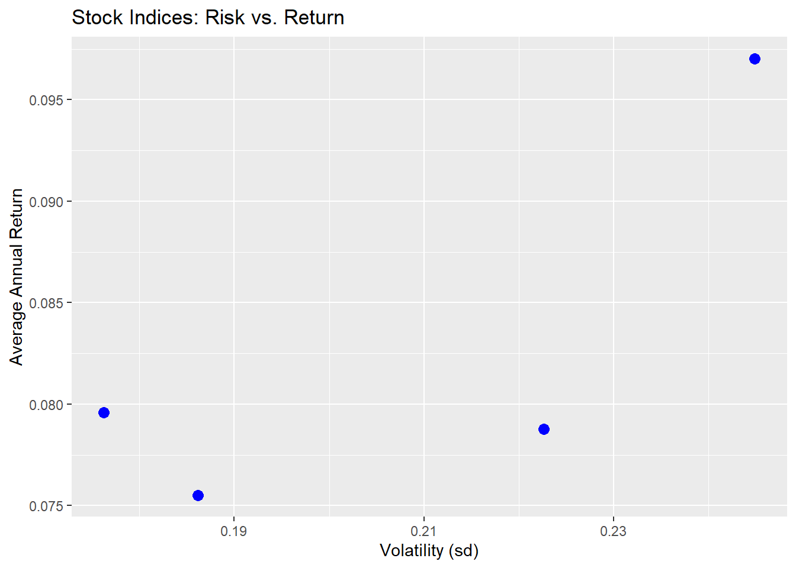
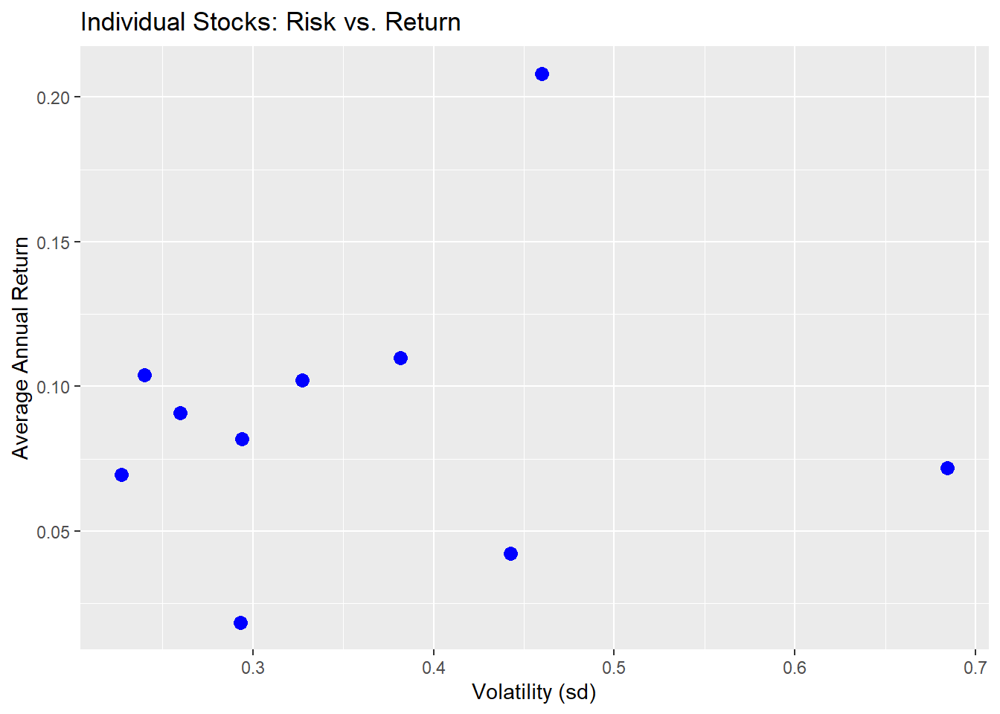
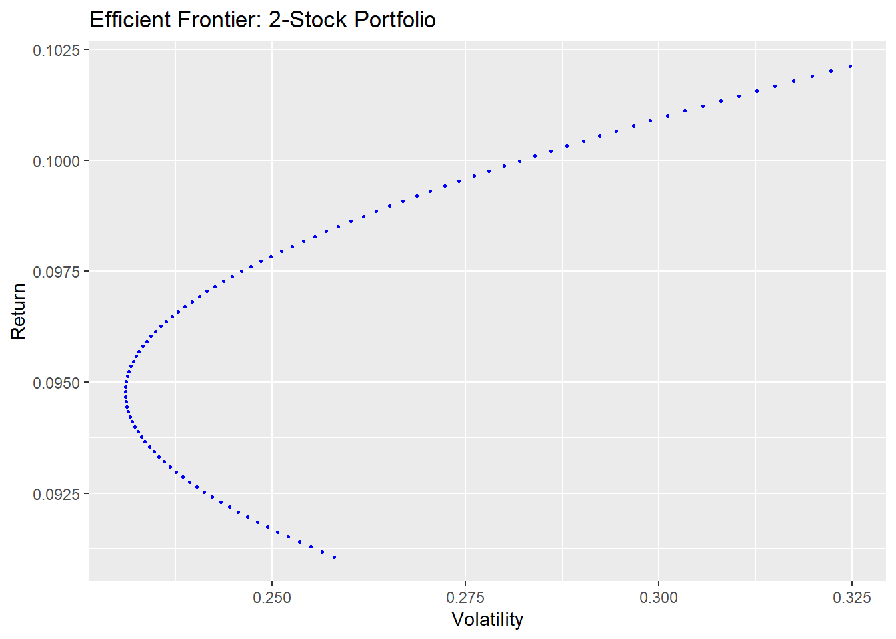
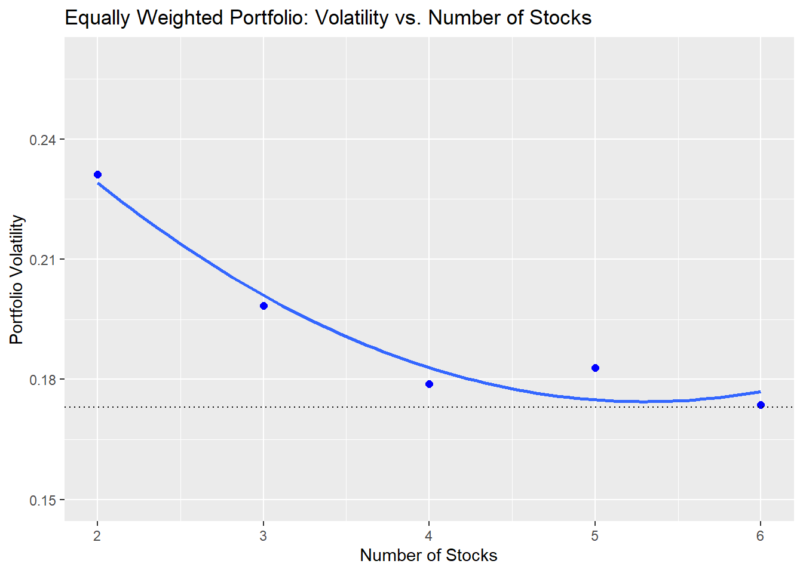

 # Finance - Risk and Return
This project aims to evaluate the Risk and Return for U.S. stocks and cryptocurrencies. 

## Data

The Excel file "datacase1.xls" contains daily end-of-day prices for a variety of US stocks and stock indices. The stock price data represents the closing prices at the end of each trading day. A second data file, "datacase2.xls," includes daily prices for some cryptocurrencies, which began trading much later (source: finance.yahoo.com). Assume an annualized risk-free rate of 3%. The data file contains the following series:

- US stock indices: Dow, S&P500, NASDAQ, Russel 2000.
- Individual US stocks: General Electric, Bank of America, Coca Cola, Intel, Apple inc, Mc Donalds Corp, Procter and Gamble, American Airlines, Caterpillar, Wallmart.
- Cryptocurrencies: Bitcoin, Ethereum, Ripple.

### a) Creating new Columns
```{r measures}
# creating the daily returns
df_sc_return <- df_sc %>%
  group_by(name) %>%
  mutate(daily_return = log(lead(price)/price)) %>%
  na.omit 

# creating other variables per stock
measures <- df_sc_return %>%
  group_by(name) %>%
  summarise(avg_annual_return = mean(daily_return) * 252,
            annual_risk = sd(daily_return) * sqrt(252),
            min_return = min(daily_return),
            max_return = max(daily_return),
            sharpe_ratio = (avg_annual_return-0.03)/annual_risk) %>%
  mutate(type = ifelse(name %in% c("bitcoin", "etherium", "ripple"),"crypto", ifelse(name %in% c("Russel_2000", "SP_500", "nasdaq", "Dow"), "index" , "stock")))
```

## **Risk and Return**

### b) Riskiness

| Type   | Average Annual Risk |
|--------|-----------------|
| Crypto | 1.4451970       |
| Stock  | 0.3609541       |
| Index  | 0.2074946       |

The relative riskiness of the stocks, stock indices and the cryptos are based on the annualized standard deviation: 

- The riskiness of an investment can be assessed using its standard deviation, also known as volatility. A higher volatility indicates that the returns deviate more from the average return, meaning the distribution is more spread out. As a result, the investment is considered riskier.

- The average annual volatility of the cryptocurrencies in our data is approximately 145%. Since this is the highest value, cryptocurrencies are significantly riskier than stocks or indices. Individual stocks have an average annual volatility of 36%, while indices exhibit a volatility of 21%. With the lowest average volatility, indices carry the least risk. Notably, it is striking to observe the substantial difference—greater than 100%—in the riskiness between stocks/indices and cryptocurrencies.

### c) Sharpe Ratios
| Type   | Average Sharpe Ratio |
|--------|------------------|
| Crypto | 0.7522424        |
| Index  | 0.2546488        |
| Stock  | 0.1759685        |


Comparison of the Sharpe ratios of the portfolios vs. the Sharpe ratios of the individual US stocks, and the Sharpe ratios of the cryptos relative to the other investments: 

- The Sharpe ratio measures the reward-to-volatility ratio and is used to assess an investment's return relative to its risk. A higher Sharpe ratio indicates a higher return per unit of volatility.

- Portfolios and indices, in comparison, have a higher Sharpe ratio than individual US stocks. Therefore, portfolios would be the optimal investment to combine with a risk-free asset.

- The average Sharpe ratio of cryptocurrencies is significantly higher than that of stocks and indices. As previously noted, investments in cryptocurrencies are riskier. However, investors are compensated for taking on this additional risk. The Sharpe ratio for cryptocurrencies suggests that the risk premium per unit of volatility is higher than that for stocks and indices.

### d) Investment Decision

| Type               | crypto_etherium | crypto_bitcoin | crypto_ripple | stock_Apple | stock_Mc_Donalds | index_Dow | index_nasdaq | index_SP_500 | stock_Walmart | stock_Caterpillar | index_Russel_2000 | stock_Intel | stock_Coke | stock_ProcterGamble | stock_Bank_of_America | stock_American_Airlines | stock_General_electric |
|--------------------|-----------------|-----------------|----------------|-------------|------------------|-----------|--------------|--------------|---------------|-------------------|--------------------|-------------|------------|---------------------|-----------------------|------------------------|------------------------|
| Sharpe Ratio       | 0.95556946       | 0.91567163       | 0.38548622      | 0.38756912  | 0.30750932       | 0.28125290| 0.27375701   | 0.24449104   | 0.23476097    | 0.22079363        | 0.21909422         | 0.20933348  | 0.17688346 | 0.17358498          | 0.06120883           | 0.02748151             | -0.03943999            |


I would invest in the cryptocurrency Ethereum since it has the highest Sharpe ratio - this investment would give the highest return per unit of volatility.

### e) Stock Indices



Results:

- An investment with higher volatility must provide a higher return to compensate investors for the additional risk. The excess return represents the risk premium that investors receive.

- On average, the data supports this relationship: the higher the volatility/risk, the higher the average annual return. The only exception is the S&P 500 index. Despite having slightly higher volatility than the Dow index, its average return is lower.

### f) Individual Stocks



Results:

- The assumption that a more volatile investment should yield a higher return does not hold for individual stocks. The plot reveals no clear relationship between volatility and return for these stocks.

- Additionally, we observe that the volatility of individual stocks is generally higher than that of indices. In most cases, individual stocks tend to be more volatile than indices or portfolios. Interestingly, larger stocks typically exhibit lower volatility overall.

### g) 2-Stock Portfolio

- Caterpillar (A)
- Walmart (B)
  


Results:

- The efficient frontier represents the set of optimal portfolios that offer the highest possible return for a given level of volatility. Portfolios located below the efficient frontier are considered inefficient, as there are other portfolios that provide a better balance of return and volatility. The efficient portfolio also corresponds to the portfolio with the highest Sharpe ratio.

- The portfolio with the lowest risk that remains on the efficient frontier is the one positioned furthest to the left on the graph: 35% Caterpillar and 65% Walmart.

### h) Portfolios

Correlation Matrix:
|                | General_electric | Walmart | Coke | ProcterGamble | Caterpillar | Mc_Donalds |
|----------------|------------------|---------|------|---------------|-------------|------------|
| General_electric | 1.00           | 0.45    | 0.32 | 0.28          | 0.37        | 0.41       |
| Walmart         | 0.45           | 1.00    | 0.55 | 0.49          | 0.42        | 0.47       |
| Coke            | 0.32           | 0.55    | 1.00 | 0.61          | 0.36        | 0.40       |
| ProcterGamble   | 0.28           | 0.49    | 0.61 | 1.00          | 0.39        | 0.43       |
| Caterpillar     | 0.37           | 0.42    | 0.36 | 0.39          | 1.00        | 0.50       |
| Mc_Donalds      | 0.41           | 0.47    | 0.40 | 0.43          | 0.50        | 1.00       |

Portfolio Metrics:
| n | volatility | correlation | portfolio_volatility |
|---|------------|-------------|----------------------|
| 2 | 0.2763231  | 0.3992157   | 0.2311237            |
| 3 | 0.2821342  | 0.2418647   | 0.1984141            |
| 4 | 0.2684255  | 0.2589649   | 0.1789059            |
| 5 | 0.2801813  | 0.2823347   | 0.1828422            |
| 6 | 0.2735053  | 0.2835459   | 0.1736177            |


Plot of Equally Weighted Portfolio: Volatility vs. Number of Stocks



**Results:**

- The graph illustrates the relationship between portfolio volatility and the number of stocks. As more stocks are added to the portfolio, volatility decreases. However, this effect diminishes over time, with the reduction in volatility being more significant when adding a second stock compared to when adding a fifth. By diversifying with more stocks, we reduce diversifiable risk. Eventually, volatility reaches a point where it can no longer decrease, as the remaining correlated market risk (or common risk) cannot be diversified away.

- The curvature in the graph is driven by the correlation between the stocks. The first portfolio consists of General Electric and Walmart stocks, which have a relatively high correlation coefficient of 0.4, contributing to the correlated market risk. This correlated market risk is represented by the area beneath the curve, which cannot be eliminated through further diversification.
