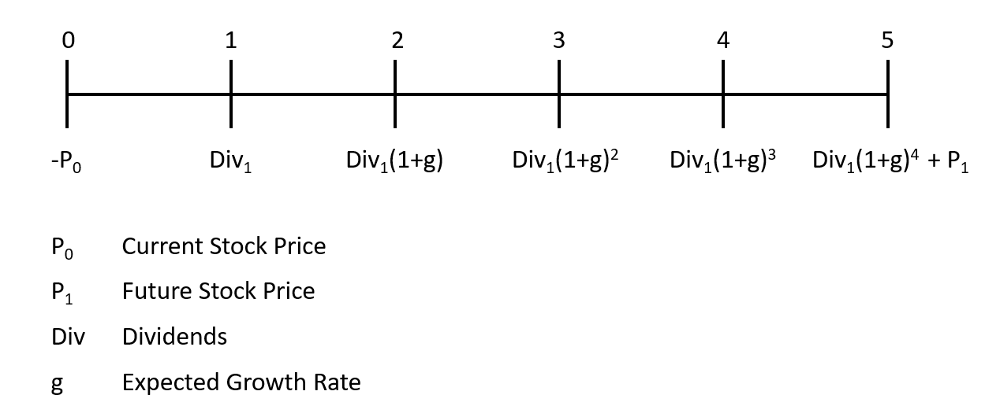
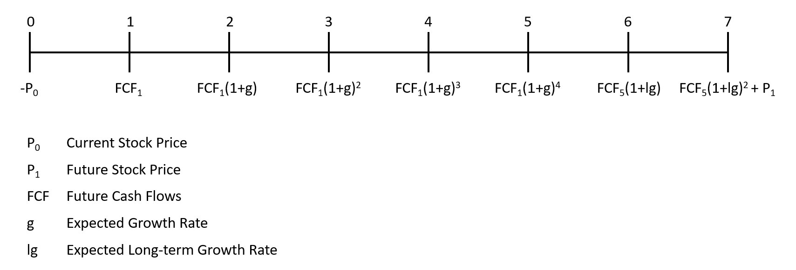

 # Finance - Valuation Methods
 Valuation of Apple Inc. stock by means of the dividend discount model (`DDM`) and discounted free cash flow (`DCF`) valuation method. 
 
## Assumptions:

- Assume Apple uses a cost of equity (𝑟𝑒), of 5.50 percent and an after-tax weighted average cost of capital (𝑟𝑤𝑎𝑐𝑐) of 9.50 percent. 
- The expected return on new investments is 4.00 percent.


## Data
| **Income Statement** |  |  |  |
|----------------------|--|--|--|
| **Year**             | **Total Revenue (in $)** | **EBIT (in $)** | **Pretax Income (in $)** | **Tax Provision (in $)** |
|----------------------|--------------------------|-----------------|---------------------------|--------------------------|
| 2020                 | 2.74515e+11              | 6.9964e+10      | 6.7091e+10                | 9.6800e+09               |
| 2019                 | 2.60174e+11              | 6.9313e+10      | 6.5737e+10                | 1.0481e+10               |
| 2018                 | 2.65595e+11              | 7.6143e+10      | 7.2903e+10                | 1.3372e+10               |

| **Balance Sheet**     |  |  |  |  |  |  |
|-----------------------|--|--|--|--|--|--|
| **Year**              | **PPE (in $)** | **Current Assets (in $)** | **Current Liabilities (in $)** | **Total Debt (in $)** | **Cash (in $)** | **NWC (in $)** |
|-----------------------|----------------|---------------------------|-------------------------------|-----------------------|-----------------|----------------|
| 2020                  | 3.6766e+10      | 1.43713e+11               | 1.05392e+11                   | 1.12436e+11           | 3.8016e+10      | 3.8321e+10      |
| 2019                  | 3.7378e+10      | 1.62819e+11              | 1.05718e+11                   | 1.08047e+11           | 4.8844e+10      | 5.7101e+10      |
| 2018                  | 4.1304e+10      | 1.31339e+11              | 1.16866e+11                   | 1.14483e+11           | 2.5913e+10      | 1.4473e+10      |

| **Cash Flow Statement** |  | 
|-------------------------|--|
| **Year**                | **Depreciation (in $)** |
|-------------------------|-------------------------|
| 2020                    | 1.1056e+10              |
| 2019                    | 1.2547e+10              |
| 2018                    | 1.0903e+10              |

## Divident-Discount Model

### a) Timeline


### b) Dividend Forcast
| **Dividend Forecast**   |  |
|-------------------------|--|
| **Year**                | **Div FC (in $)** |
|-------------------------|-------------------|
| 0                       | 0.880000          |
| 1                       | 1.029160          |
| 2                       | 1.203603          |
| 3                       | 1.407613          |
| 4                       | 1.646204          |
| 5                       | 1.925235          |


### c) Long-term Growth Rate

<p align="center">$g = (1 - \text{Payout Ratio}) \times \text{Return on New Investment}=0.032664$</p>

```{r 5c}
new_g <- (1-payout) * exp_ret
```

### d) Stock Price Year Five

<p align="center">$P_5 = \frac{Div_6}{r_e-g}=89.01$</p>

```{r 5d}
r <- 0.055
Div6 <- div_forecast[6,2] * (1 + new_g)

P5 <-  Div6 / (r-new_g)
round(P5, 2)
```

### e) Current Stock Price

<p align="center">$P_0 = \frac{Div_1}{1+r_e} + \frac{Div_2}{(1+r_e)^2} + \frac{Div_3}{(1+r_e)^3} + \frac{Div_4}{(1+r_e)^4} + \frac{Div_5}{(1+r_e)^5} + \frac{P_5}{(1+r_e)^5}=74.27$</p>

```{r 5e}
P0_DDM <- (div_forecast[2,2] / 1+r) + (div_forecast[3,2] / (1+r)^2) + (div_forecast[4,2] / (1+r)^3) + (div_forecast[5,2] / (1+r)^4) + (div_forecast[6,2] / (1+r)^5) + (P5 / (1+r)^5)
round(P0_DDM, 2)
```

## Discounted Free Cash Flow Model 

### a) Ratios
The average for years 2018, 2019 and 2020 are used.
  
```{r 6a}
ratios <- income %>%
  mutate(EBIT_margin = EBIT / total_revenue,
       tax_rate = tax_provision / pretax_income,
       PPE_Sales = balance$PPE / total_revenue,
       deprec_PPE =  cashflow$depreciation / balance$PPE,
       wc_sales = balance$NWC / total_revenue) %>%
  summarise(avg_EBIT_margin = mean(EBIT_margin), 
            avg_tax_rate = mean(tax_rate),
            avg_PPE_Sales = mean(PPE_Sales),
            avg_deprec_PPE = mean(deprec_PPE),
            avg_wc_sales = mean(wc_sales))
```
| **Ratios**             |  |  |  |  |
|------------------------|--|--|--|--|
| **Avg EBIT Margin**    | **Avg Tax Rate** | **Avg PPE/Sales** | **Avg Deprec PPE** | **Avg WC/Sales** |
|------------------------|------------------|-------------------|---------------------|------------------|
| 0.2693209              | 0.1623806        | 0.1443704         | 0.3001203           | 0.1378535        |


### b) Timeline



### c) Revenue Forcast
```{r 6c}
# revenue for 2020
revenue2020 <- as.numeric(income %>% filter(year == "2020") %>% select(total_revenue))
revenue_y5 <- revenue2020*(1+g)^5

year_dfc <- c(0, 1, 2, 3, 4, 5, 6, 7)
growth_factor <- c(1, (1+g), (1+g), (1+g), (1+g), (1+g), (1+new_g), (1+new_g))
revenue_fc <- c(revenue2020, revenue2020*(1+g), revenue2020*(1+g)^2, revenue2020*(1+g)^3, revenue2020*(1+g)^4, revenue_y5, revenue_y5*(1+new_g), revenue_y5*(1+new_g)^2)

forecast_rev <- as.data.frame(cbind(year = year_dfc, growth_factor, revenue_fc))
```
| **Revenue Forecast**    |  |  |
|-------------------------|--|--|
| **Year**                | **Growth Factor** | **Revenue FC (in $)** |
|-------------------------|-------------------|-----------------------|
| 0                       | 1.000000          | 274515000000          |
| 1                       | 1.169500          | 321045292500          |
| 2                       | 1.169500          | 375462469579          |
| 3                       | 1.169500          | 439103358172          |
| 4                       | 1.169500          | 513531377383          |
| 5                       | 1.169500          | 600574945849          |
| 6                       | 1.032664          | 620192125880          |
| 7                       | 1.032664          | 640450081480          |


### d) EBIT, PPE, Depreciation & NWC Forecast
```{r 6d}
forecast_dcf <- mutate(forecast_rev, EBIT_fc = ratios$avg_EBIT_margin * revenue_fc,
       PPE_fc = ratios$avg_PPE_Sales * revenue_fc,
       NWC_fc = ratios$avg_wc_sales * revenue_fc,
       depreciation_fc = ratios$avg_deprec_PPE * PPE_fc)
```
| **EBIT, PPE, Depreciation & NWC Forecast** |  |  |  |  |  |  |  |
|--------------------------------------------|--|--|--|--|--|--|--|
| **Year**                                   | **Growth Factor** | **Revenue FC (in $)** | **EBIT FC (in $)** | **PPE FC (in $)** | **NWC FC (in $)** | **Depreciation FC (in $)** |
|--------------------------------------------|-------------------|-----------------------|--------------------|-------------------|-------------------|-----------------------------|
| 0                                          | 1.000000          | 274515000000          | 73932616204        | 39631832996       | 37842842760       | 11894318239               |
| 1                                          | 1.169500          | 321045292500          | 86464194650        | 46349428689       | 44257204608       | 13910405181               |
| 2                                          | 1.169500          | 375462469579          | 101119875644       | 54205656851       | 51758800789       | 16268218859               |
| 3                                          | 1.169500          | 439103358172          | 118259694565       | 63393515688       | 60531917523       | 19025681955               |
| 4                                          | 1.169500          | 513531377383          | 138304712794       | 74138716597       | 70792077543       | 22250535047               |
| 5                                          | 1.169500          | 600574945849          | 161747361613       | 86705229060       | 82791334687       | 26022000737               |
| 6                                          | 1.032664          | 620192125880          | 167030677432       | 89537368662       | 85495630843       | 26871983369               |
| 7                                          | 1.032664          | 640450081480          | 172486567480       | 92462017272       | 88288260129       | 27749729834               |

### e) Free Cash Flow Forecast

<p align="center">$FCF_t = EBIT * (1-𝜏_c) + Depreciation - CAPEX - (NWC_t - NWC_{t-1})$</p>

```{r 6e}
FCF_forecast <- mutate(forecast_dcf, CAPEX = PPE_fc - lag(PPE_fc),
         NWC_change = NWC_fc - lag(NWC_fc),
         FCF = EBIT_fc * (1- ratios$avg_tax_rate) + depreciation_fc - CAPEX - NWC_change)
FCF_forecast[-1,c(1,10)]
```
| **Free Cash Flow Forecast** |  |
|-----------------------------|--|
| **Year**                    | **FCF (in $)** |
|-----------------------------|----------------|
| 1                           | 73202533838    |
| 2                           | 85610363324    |
| 3                           | 100121319907   |
| 4                           | 117091883632   |
| 5                           | 136938957907   |
| 6                           | 161243682175   |
| 7                           | 166510545810   |


### f) Horizon Enterprise Value Year Seven

<p align="center">$V_7 = \frac{FCF_8}{r_{wacc}-g} = \frac{FCF_7*(1+g)}{r_{wacc}-g} = 2.758429e+12$</p>

```{r 6f}
r_wacc <- 0.095
FCF7 <- as.numeric(filter(FCF_forecast, year == "7") %>% select(FCF))
V7 <- (FCF7 * (1 + new_g)) / (r_wacc - new_g)
```

### g) Enterprise Value

<p align="center">$V_0 = \frac{FCF_1}{1+r_{wacc}} + \frac{FCF_2}{(1+r_{wacc})^2} + \frac{FCF_3}{(1+r_{wacc})^3} + \frac{FCF_4}{(1+r_{wacc})^4} + \frac{FCF_5}{(1+r_{wacc})^5} + \frac{FCF_6}{(1+r_{wacc})^6} + \frac{FCF_7+V_7}{(1+r_{wacc})^7}=2.026078e+12$</p>

```{r 6g}
V0 <- FCF_forecast[2,10]/(1+r_wacc) + FCF_forecast[3,10]/(1+r_wacc)^2 + FCF_forecast[4,10]/(1+r_wacc)^3 + FCF_forecast[5,10]/(1+r_wacc)^4 + FCF_forecast[6,10]/(1+r_wacc)^5 + FCF_forecast[7,10]/(1+r_wacc)^6 + (FCF_forecast[8,10] + V7)/(1+r_wacc)^7
```

### h) Current Stock Price

<p align="center">$P_0 = \frac{EnterpriseValue_0 + Cash_0 - Debt_0}{Shares Outstanding}=116.24$</p>

```{r 6h}
cash2020 <- balance[1,6]
debt2020 <- balance[1,5]

P0_DCF <- (V0 + cash2020 - debt2020) / shares
round(P0_DCF, 2)
```

## Interpretation of the Results

- Stock price calculated by dividend discount model: $74.27
- Stock price calculated by discounted free cash flow model: $116.24
- The current stock price: $131.46

The results show that the stock price calculated using the dividend discount model and discounted free cash flow model is lower than the current stock price.
This implies that the Apple stock is overvalued (current price > calculated prices). Therefore, the current stock price is not justified by the prospected dividends and free cash flows. In addition, it is more likely that there will be a correction of the stock. Based on our calculations, it is recommended that investors should sell the Apple stock.


## Differences in Stock Prices and Assumptions

The `DDM` (Dividend Discount Model) is based on forecasting future dividend payments to shareholders. However, these forecasts are inherently uncertain and depend on several assumptions. First, the model is highly sensitive to the dividend growth rate, which is assumed to remain constant. Second, forecasting future dividends also involves predicting future earnings, the dividend payout ratio, and the future share count. Third, earnings are influenced by factors such as interest expenses, the payout ratio, and whether the firm repurchases shares. Lastly, many of these decisions are made by the management team, which makes them challenging to predict. Additionally, it is assumed that the return on new investments remains constant over time.

The `DCF` (Discounted Cash Flow) model, on the other hand, focuses on the total value of the firm for both equity and debt holders by calculating the present value of projected free cash flow. A key advantage of the DCF model is that it does not require forecasting dividends, share repurchases, or debt usage to determine the firm's value. However, the free cash flow forecast in the DCF model is also highly sensitive to the growth rate. It is assumed that the growth rate remains constant for the first five years, after which it transitions to a constant long-term growth rate. Note that the free cash flow will be distributed to both debt and equity holders, so the weighted average cost of capital (WACC) must be used.

As mentioned earlier, the price returned by my models is significantly lower than the actual stock price. This discrepancy arises because the models only consider a limited number of factors. Investors also assess stocks using non-financial metrics, such as a company’s reputation, the quality of its management team, anticipated R&D successes, and much more. Positive factors like these can drive the stock price higher, leading to a divergence from the model’s calculations. In particular, Apple enjoys a strong reputation and a history of successes, so many investors remain willing to purchase the stock, even at a premium, despite its overvaluation.
