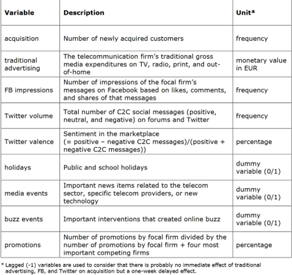
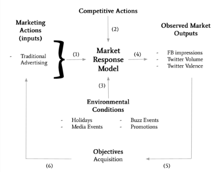
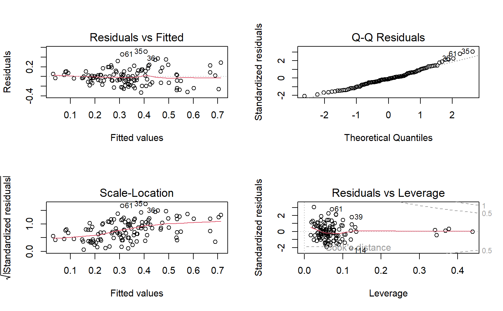

# Marketing - Market Response Modelling (MRM)
This project aims to use market response modelling to develop the optimal marketing mix for a hypothetical telecommunications provider. 

In this scenario, the telecommunications provider currently relies on traditional advertising (primarily TV) and Facebook to promote its subscriptions.

## Data
This project analyzes the effectiveness of the current marketing channels in acquiring new customers. The following data were collected for this analysis:

- The number of newly acquired customers over 118 weeks.
- The investment in traditional advertising.
- The number of impressions from Facebook posts initiated by the telecommunications provider.
- Information about media and buzz events, holiday periods, and promotions.
- Marketing buzz related to the telecommunications provider on Twitter.

The variables and their descriptions are shown below:

## Categorisation
The first step is to categorise all variables in the form of a market response framework. 

## Linear Regression Analysis
The data was cleaned prior to being uploaded into R. Therefore, we can proceed with a linear regression analysis on the dataset.

- All variables are numeric. 
- Since the variables have different ranges, min-max standardisation is applied to scale each variable's values between 0 and 1.

| **Linear Model Summary**                |               |                |             |             |                  |
|-----------------------------------------|---------------|----------------|-------------|-------------|------------------|
| **Statistic/Parameter**                 | **Value**     | **Std. Error** | **t value** | **Pr(>|t|)** | **Significance** |
| **(Intercept)**                         | 0.068409      | 0.054156       | 1.263       | 0.209219    |                  |
| **buzz.event**                          | 0.005015      | 0.101408       | 0.049       | 0.960645    |                  |
| **media.event**                         | 0.144434      | 0.041402       | 3.489       | 0.000702    | ***              |
| **holidays**                            | 0.060637      | 0.039139       | 1.549       | 0.124212    |                  |
| **promotions_n**                        | 0.275896      | 0.072476       | 3.807       | 0.000233    | ***              |
| **lag_traditional.advertising_n**       | 0.296964      | 0.065331       | 4.546       | 1.43e-05    | ***              |
| **lag_Twitter_valence_n**               | 0.303281      | 0.096155       | 3.154       | 0.002081    | **               |
| **lag_Twitter_volume_n**                | -0.201797     | 0.070405       | -2.866      | 0.004986    | **               |
| **lag_FB_impressions_n**                | 0.084160      | 0.122632       | 0.686       | 0.493995    |                  |
| **Residual Min**                        | -0.32888      |                |             |             |                  |
| **Residual 1Q**                         | -0.10356      |                |             |             |                  |
| **Residual Median**                     | -0.01784      |                |             |             |                  |
| **Residual 3Q**                         | 0.10310       |                |             |             |                  |
| **Residual Max**                        | 0.51593       |                |             |             |                  |
| **Residual Standard Error**             | 0.1702        |                |             |             |                  |
| **Degrees of Freedom**                  | 109           |                |             |             |                  |
| **Multiple R-squared**                  | 0.4277        |                |             |             |                  |
| **Adjusted R-squared**                  | 0.3857        |                |             |             |                  |
| **F-statistic**                         | 10.18         | 
| **p-value**                             | 1.565e-10     | 

## Regression model performance

The performance of the linear regression model will be evaluated in 3 ways:

1.  Model Assumptions
2.  Model fit
3.  Significance of coefficients (via T-tests)

### Model Assumptions

- **Linearity of the data**: A linear relationship between the predictors and outcome variables can be assumed, as the Residuals vs. Fitted plot shows no discernible pattern, and the red line is approximately horizontal at zero.
- **Homoscedasticity**: Residuals can be assumed to have constant variance, as the residuals in the Scale-Location plot are spread relatively evenly across the range of predictors.
- **Independence**: Independence can be assumed between and within customers, as each customer is a unique individual (ratings by one customer are not expected to depend on ratings by other customers).
- **Normality**: Normality can be assumed, as the normal probability plot of residuals approximately follows a straight line.
- **Metric scale**: All variables are measured on a metric scale.

### Model Fit

- The adjusted R-squared is only 0.3857, meaning that approximately 38.6% of the variance in the dependent variable is explained by the model. This suggests that the model is not a good fit.
- The p-value associated with the F-statistic is less than 0.05, indicating that at least one independent variable is significantly related to acquisition.
- The F-statistic of 10.18 is relatively small, considering the size of the dataset.
- The model has an RMSE of 0.314, which is relatively good, as there is little variation in the spread of the data.

Before evaluating the significance of the coefficients, a two-fold cross-validation was performed, and the dataset was split into a training subgroup with 88 observations and a test set with 30 observations.

### Significance of coefficients (via T-tests)

| **T-test Results**                  |               |                |             |             |                  |
|--------------------------------------|---------------|----------------|-------------|-------------|------------------|
| **Variable**                         | **t-value**   | **df**         | **p-value** | **Confidence Interval**            | **Mean (Training)** | **Mean (Testing)** |
|--------------------------------------|---------------|----------------|-------------|-------------------------------------|---------------------|--------------------|
| **buzz.event**                       | -0.3461       | 37.904         | 0.7312      | [-0.0924, 0.0654]                  | 0.0222              | 0.0357            |
| **media.event**                      | 0.25201       | 46.288         | 0.8022      | [-0.1497, 0.1926]                  | 0.2000              | 0.1786            |
| **holidays**                         | -0.87709      | 41.331         | 0.3855      | [-0.2909, 0.1147]                  | 0.2333              | 0.3214            |
| **promotions_n**                     | -0.76908      | 51.405         | 0.4454      | [-0.1316, 0.0587]                  | 0.2880              | 0.3244            |
| **lag_traditional.advertising_n**    | 0.67524       | 42.129         | 0.5032      | [-0.0823, 0.1650]                  | 0.3258              | 0.2845            |
| **lag_Twitter_valence_n**            | -0.034452     | 45.032         | 0.9727      | [-0.0828, 0.0800]                  | 0.4080              | 0.4094            |
| **lag_Twitter_volume_n**            | 0.99834       | 46.039         | 0.3233      | [-0.0540, 0.1602]                  | 0.4319              | 0.3788            |
| **lag_FB_impressions_n**             | -0.69889      | 36.128         | 0.4891      | [-0.095, 0.0463]                   | 0.0475              | 0.0718            |

## Dynamic Effects

- Marketing efforts can sometimes impact sales in future periods, a phenomenon known as the carryover effect.
- One specific type of carryover effect is the delayed-response effect. For instance, certain variables (e.g., traditional advertising and Twitter volume) are lagged by one week to account for the delayed impact these actions may have on customer acquisition.
- This model incorporates dynamic effects that are relevant to this scenario.
- However, while including information from past observations in a time series captures some historical patterns, it may not account for omitted variables that explain variations in the data. The exclusion of such variables could limit the model's ability to produce more accurate forecasts.

## Influence of Traditional Advertising on Acquisition
- The coefficient for traditional advertising is 0.297 (rounded to 3 significant figures), indicating a positive correlation between traditional advertising and customer acquisition.
- Specifically, an increase in traditional gross media expenditures is likely to result in a higher number of newly acquired customers.
- Note: The coefficient of 0.297 represents a proportional effect.

## Influence of Facebook Impressions on Acquisition
- The coefficient for Facebook impressions is 0.084, indicating that, similar to traditional advertising, Facebook impressions are positively correlated with acquiring new customers, albeit to a smaller extent.
- This suggests that an increase in the number of impressions on Facebook is likely to lead to an increase in the number of newly acquired customers.

## Conclusion

| **Variable**                     | **Coefficient** | 
|----------------------------------|-----------------|
| **Traditional Advertising**      | 0.296964        | 
| **Twitter Valence**              | 0.303281        | 
| **Twitter Volume**               | -0.201797       | 
| **Facebook Impressions**         | 0.084160        | 

Results:
- **Most Effective Communication Channel**: The model identifies Twitter as the most effective communication channel, as it has the highest coefficient. This highlights Twitter’s ability to engage a broad audience quickly and effectively, making it a powerful tool for customer acquisition.
- **Comparison of Channels**: The difference between Twitter and the second most effective channel, traditional advertising, is relatively small. However, the gap between Facebook impressions (the least effective channel) and traditional advertising is significantly larger. This suggests that while Facebook impressions contribute to acquisition, their impact is limited compared to other channels.
- **Relative Influence**: Twitter's influence on customer acquisition is over three times greater than that of Facebook impressions. This insight can guide the company in allocating resources more strategically toward channels with higher returns.
  - **Traditional Advertising's Role**: Despite the dominance of digital platforms, traditional advertising remains impactful. Its broad reach and credibility complement digital efforts, making it a valuable part of a balanced marketing strategy.
  - **Combined Effects**: The analysis suggests that digital advertising achieves higher effectiveness when paired with traditional advertising. Traditional media provides credibility that enhances the precision targeting and engagement offered by digital platforms.

Recommendations for the Telecommunications Provider
1. **Adopt a "Digital First" Strategy**: The company should prioritize modern advertising methods, particularly Twitter, based on its strong performance in customer acquisition. A “digital-first” approach aligns with the preferences of tech-savvy consumers and provides a more holistic marketing communication strategy.
2. **Leverage Personal Communication Channels**: To enhance acquisition and profitability, the provider should explore personal communication methods such as face-to-face pitches and buzz marketing. These strategies capitalize on word-of-mouth influence for stronger customer engagement.
3. **Evaluate Advertising ROI**: The firm should assess its return on advertising investment by analyzing sales and profit effects relative to expenditures. Experimental approaches, such as varying advertising spend across different market areas and measuring differences in resulting sales/acquisition, can provide valuable insights into optimal resource allocation.

Insights from Research
- Twitter marketing remains highly relevant due to its ability to engage audiences quickly and organically through direct interactions.
- Traditional advertising retains its value by offering credibility and broad reach, which can amplify the effectiveness of digital campaigns.
- Social media platforms like Facebook have limited impact compared to Twitter but still contribute to brand visibility when used strategically.

