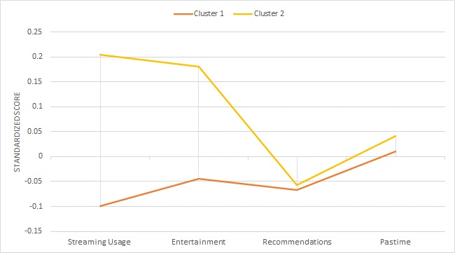

# Marketing - Segmentation Targeting & Positioning
This project demonstrates the process of segmentation, targeting, and positioning using clustering analysis (k-means). 

## Data 
The dataset used in this analysis contains consumer behavior data, including variables related to willingness to pay (WTP), streaming usage, entertainment preferences, demographics, and more.
Before diving into the analysis, the dataset was filtered to focus on younger consumers (under 24 years old). Additionally, some unnecessary columns (such as `Nationality_4_TEXT` and respondent `ID`) were removed to make the data more manageable.
The `WTP` column was seperated as segmentation bases for clustering while other variables were kept as descriptors.

## Segmentation with K-Means Clustering

K-means clustering was applied to the data with WTP (Willingness to Pay) as the basis for segmentation. The algorithm divided the dataset into two clusters based on the consumers' spending behavior.

- Cluster 1: 56 consumers with an average WTP of €7.87.

- Cluster 2: 38 consumers with an average WTP of €18.9.

The compactness (similarity within clusters) was around 60%, meaning the two clusters are somewhat distinct, but there is still some overlap in their characteristics.

## Validating the Clusters

A t-test was conducted to validate whether the differences in WTP between the two clusters were statistically significant. The results of the test indicated a p-value of 2.07e-13, which is far below the 5% significance level. This means the differences in WTP between the two clusters are statistically significant.

- Cluster 1 has a lower average WTP compared to Cluster 2, indicating that they are willing to pay less for the streaming service.

This validates the segmentation, as the two clusters clearly differ in terms of willingness to pay.

## Analysing Demographic Variables

To understand the characteristics of each segment, several demographic variables (such as gender, nationality, age, etc.) and their distribution across the clusters were analysed.

- Gender: A hypothesis test showed that there were no significant differences between the clusters in terms of gender distribution.

- Age: A t-test confirmed that there were no significant differences in age between the two clusters, suggesting that age is not a key differentiator for segmentation.

- Nationality: The Chi-squared test for nationality revealed no significant differences in the nationality distribution between the two clusters.

While there were no strong differences in gender or age, there was a significant difference in household size (`HHSize`) and device preferences between the clusters, which could provide useful insights for targeted marketing.

## Visualising the Results

  

A snake chart was used to visually profile both clusters. This chart helped identify key areas of difference between the two groups based on standardized variables such as:

- Streaming usage: Cluster 1 spends significantly more time streaming videos compared to Cluster 2.

- Entertainment: Cluster 1 shows lower engagement with streaming content for entertainment purposes, while Cluster 2 uses streaming primarily for entertainment.

- Recommendations: Both clusters showed a similar responsiveness to recommendations, indicating that neither cluster is highly influenced by platform suggestions.
- 
This visualization helped confirm that while both clusters share similar demographic characteristics (young consumers), their usage patterns and preferences for streaming content differ substantially.

## Conclusion and Marketing Recommendations
Insights:

- Cluster 1 is more pragmatic in their consumption of online videos, using streaming services for educational or informational purposes rather than entertainment.

- Cluster 2 is more entertainment-focused, using streaming services primarily for fun and enjoyment.

Marketing Strategy:

- Target Group: Cluster 2 is the ideal segment for Disney+ marketing, as they are more likely to use streaming for entertainment. Disney+ should tailor its content to appeal to the entertainment needs of this group.

- Differentiated Marketing: Disney+ can benefit from differentiated marketing strategies, catering content to each cluster's specific needs. For Cluster 1, content that can serve educational or practical purposes may be more appealing. For Cluster 2, Disney+ can focus on delivering fun, engaging content.

- Cost Consideration: While differentiated marketing will likely drive higher sales, it may also increase costs due to the need for more tailored content and campaigns.

- Nostalgia Marketing: Disney could leverage nostalgia marketing, especially for Cluster 2, targeting younger audiences who have grown up with Disney content.

Overall, Disney+ should focus on Cluster 2 for targeted entertainment content, while considering Cluster 1 for more practical content or educational streaming.

