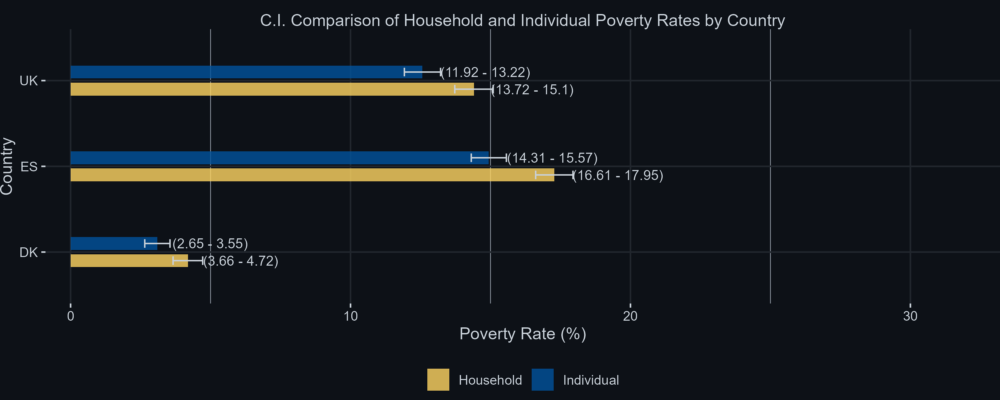
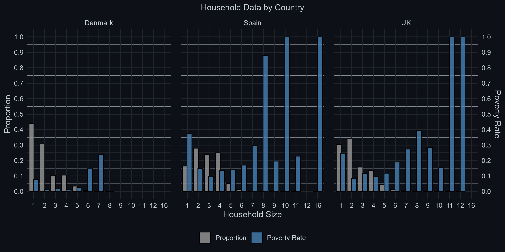
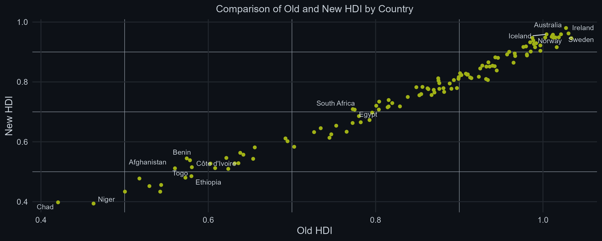
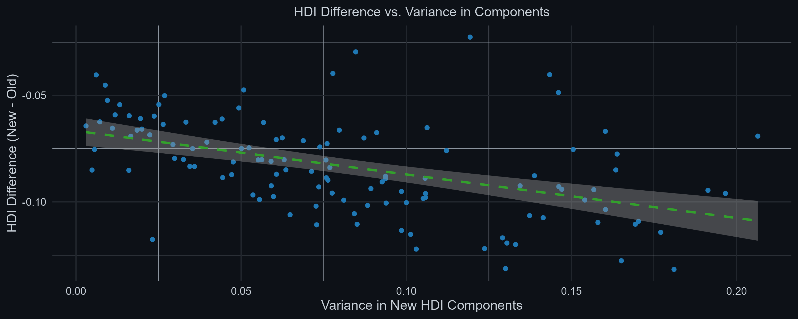

# Measurement Homework 3
---

## Exercise 1 - Poverty

### 1.2 Rates of poverty using US and European thresholds

#### 1.2.1a U.S. poverty lines (`usthr06`) in local currencies

**Table 1: Summary Statistics for Poverty Lines by Country (in Local Currency)**

| Country | Min Poverty Line | Max Poverty Line | Median Poverty Line | Mean Poverty Line | Standard Deviation | Observations |
|---------|------------------|------------------|----------------------|-------------------|--------------------|--------------|
| DK      | 80,204           | 293,162          | 111,982              | 126,529           | 37,061             | 5,711        |
| ES      | 7,126            | 32,906           | 11,622               | 11,896            | 3,646              | 12,205       |
| UK      | 6,739            | 31,120           | 9,410                | 10,102            | 3,170              | 9,902        |

- Denmark (DK):
  - Converted Poverty Lines: The minimum poverty line is around 80,204 DKK, while the maximum reaches 293,161 DKK. The median poverty line is approximately 111,983 DKK.
  - Mean and Standard Deviation: The average poverty line in Denmark is around 126,528 DKK, with a high standard deviation of 37,061 DKK, indicating a wide spread in poverty lines within the country.
  - Observations: Denmark has one of the highest converted poverty lines, largely due to its high exchange rate (8.295 DKK per USD). This reflects Denmark’s generally high cost of living and wage levels. The significant spread (high standard  
deviation) could imply considerable economic disparity or variations across regions or household types.

- Spain (ES):  
  - Converted Poverty Lines: The minimum poverty line is approximately 7,126 EUR, with a maximum of 32,906 EUR and a median of 11,622 EUR.  
  - Mean and Standard Deviation: The average poverty line is around 11,896 EUR with a standard deviation of 3,646 EUR.  
  - Observations: Spain’s converted poverty lines are substantially lower than Denmark’s. This aligns with the lower exchange rate of 0.737 EUR per USD, and potentially a lower cost of living compared to Nordic countries. The relatively moderate standard deviation suggests less variation in poverty lines across different regions or demographic groups.

- United Kingdom (UK):  
  - Converted Poverty Lines: The poverty line ranges from 6,740 GBP (minimum) to 31,120 GBP (maximum), with a median of 9,410 GBP.  
  - Mean and Standard Deviation: The average poverty line is 10,102 GBP, with a standard deviation of 3,170 GBP.  
  - Observations: The UK’s poverty line values are intermediate compared to those of Denmark and Spain. The exchange rate of 0.697 GBP per USD influences this. The standard deviation here indicates a moderate spread, which may point  
to some regional or economic variations within the country.

---

#### 1.2.1b US-defined household’s gross income

**Equation:**

$$
\text{Gross income (U.S.)} = (hy020 + hy120g + hy130g + hy140g - hy070g) \times hx010 \times hy025
$$

**Justifications:**

- HY020: Total disposable household income.  
- HY120G: Added back to represent taxes on wealth, reverting deductions.  
- HY140G: Added back to represent income and social contributions taxes.  
- HY070G: Subtracted because housing allowances are in-kind benefits not included in US gross income.  
- HX010: Multiplies the entire formula to adjust for the exchange rate to local currency.  
- HY025: Multiplies the entire formula to adjust for potential underrepresentation due to non-responding households.

---

#### 1.2.1c Weighted Household Poverty Rates (U.S.)

**Table 2: Household Poverty Rates by Country**

| Country | Poverty Rate (%) | Standard Error (%) | R2 | Adjusted R2 | Residual Std. Error | Residual DF |
|---------|------------------|---------------------|----|--------------|----------------------|--------------|
| DK      | 4.19             | 0.27                | 0  | 0            | 4.32                 | 5710         |
| ES      | 17.28            | 0.34                | 0  | 0            | 13.52                | 12148        |
| UK      | 14.41            | 0.35                | 0  | 0            | 17.83                | 9901         |

Note: *p<0.1 ; **p<0.05 ; ***p<0.01

---

#### 1.2.1d Weighted Individual Poverty Rates (U.S.)

**Table 3: Individual Poverty Rates by Country with Regression Summary Statistics**

| Country | Poverty Rate (%) | Standard Error (%) | R2 | Adjusted R2 | Residual Std. Error | Residual DF |
|---------|------------------|---------------------|----|--------------|----------------------|--------------|
| DK      | 3.10             | 0.23                | 0  | 0            | 5.31                 | 5710         |
| ES      | 14.94            | 0.32                | 0  | 0            | 21.29                | 12148        |
| UK      | 12.57            | 0.33                | 0  | 0            | 25.76                | 9901         |

Note: *p<0.1 ; **p<0.05 ; ***p<0.01

Since all the household and individual poverty rates across the three countries are significantly different (as shown by non-overlapping confidence intervals), we reject the null hypothesis as this indicates that poverty is experienced and distributed differently at the household and individual levels, which may reflect variations in household composition, economies of scale, or other factors influencing equivalized income thresholds.

- Within countries, the household-level poverty rates are consistently higher than the individual-level poverty rates across
all three countries. This difference suggests that households living in poverty tend to have more members/dependents per
household than non-poor households, amplifying the impact of household poverty.
  - In Denmark, where household sizes are smaller and more equal across income levels, the gap between household and
individual poverty rates is less pronounced than in Spain or the UK.
- Across countries, Spain and the UK exhibit both larger gaps between household and individual rates, and much higher
poverty rates overall compared to Denmark. This indicates higher levels of inequality and larger average household sizes in
poor families.

The new determinants of poverty (France):

1. Age: more than 1/4 of the households whose householder(head of household) is less than 30 years old are poor
2. Labour force status: more than 1/3 unemployed are poor
3. Family status: more than 1/3 of the single parent families are poor

---

#### 1.2.2a Equivalised Household Size and Adult-equivalent Income

According to Eurostat, equivalised disposable income is calculated by dividing the household’s total disposable income by the equivalised household size, where each household member is assigned a weight: 1.0 for the first adult, 0.5 for each additional adult, 0.3 for each child under 14.

Therefore, the equivalised household size (EHS) is given by:

$$
EHS = 1 + (0.5 \times (n_{adults} - 1)) + (0.3 \times n_{children})
$$

where $n_{adults}$ is the number of adults (14 years or older), and $n_{children}$ is the number of children (under 14 years).

Having found EHS, the adult-equivalent income (AEI) can be calculated as:

$$
AEI = \frac{hy020}{EHS}
$$

---

#### 1.2.2b Household’s Adult-Equivalent Income

Since the EU defines the poverty threshold as 60% of the national median adult-equivalent income, the median adult-equivalent income and poverty thresholds are as follows:

**Table 4: Poverty Thresholds at 60% of Median Income by Country**

| Country         | Median Income | 60% Poverty Threshold |
|------------------|---------------|------------------------|
| Denmark          | 21,154        | 12,692                 |
| Spain            | 11,200        | 6,720                  |
| United Kingdom   | 18,664        | 11,199                 |

The poverty threshold for each is equal to 60% of the median income, thus it is 12 692 Krones (Denmark), 6 720 euros (Spain), and 11 199 pounds (UK) respectively.

---

#### 1.2.2c Dummy Variables

**Table 5: Households Below EU Poverty Threshold by Country**

| Country | Households Below Poverty Threshold | Total Households | Percentage Poor (%) |
|---------|------------------------------------|------------------|----------------------|
| DK      | 350                                | 5711             | 6.13                 |
| ES      | 2806                               | 12205            | 22.99                |
| UK      | 1844                               | 9902             | 18.62                |

---

#### 1.2.2d Weighted Household and Individual Poverty Rates (EU)

**Table 6: Household and Individual Poverty Rates by EU Definition**

| Country | Household Poverty Rate (%) | Individual Poverty Rate (%) |
|---------|-----------------------------|-------------------------------|
| DK      | 11.94                       | 9.00                          |
| ES      | 20.51                       | 19.02                         |
| UK      | 18.85                       | 17.74                         |

---

### 1.3 Differences in Poverty Rates by US vs. EU Definitions

- US Poverty Threshold: An absolute measure, comparing gross income against a fixed threshold adjusted for purchasing power.  
  - Since it is an absolute measure, it does not vary across countries. This results in generally higher poverty rates under the EU definition, especially in countries with high-income inequality, as those below the 60% median threshold may still have incomes that meet basic needs but are low relative to the national stand. This is important because in the EU, disposable income accounts for redistribution, and transfers of wealth.
  - In-kind income should not be taken into account because:
     - Food stamps are a big part of social policy.
     - Anti-poverty policies might show up as inefficient and lose support.

- EU Poverty Threshold: A relative measure, set at 60% of the national median adult-equivalent income, adjusting for local income distribution.  
  - Since this is a relative measure, it is sensitive to the country’s median income.  
  - The EU definition also considers that children do not have the same weight regarding income as other adults, whereas the US definition does not. 

--- 

## Exercise 2 - Human Development Index (HDI)

### 2.1 HDI: Old vs. New Definition

#### 2.1a Functional Form (Arithmetic vs. Geometric Mean)
- Old HDI: Uses an arithmetic mean, which doesn’t account for disparities between components (health, education, income).
- New HDI: Uses a geometric mean, which penalizes imbalances, as a low score in one dimension reduces the overall index more
than in the arithmetic mean.

#### 2.1b Education Indicators
- Old HDI: Combines literacy rate (2/3 weight) and gross enrollment (1/3 weight).
- New HDI: Combines average years of schooling and expected years of schooling, providing a broader measure of educational
attainment.

#### 2.1c Income Indicator
- Old HDI: Based on logarithmic GDP per capita.
- New HDI: Uses Gross National Income (GNI) per capita, which adjusts for income earned by nationals abroad and offers a
more comprehensive measure of income

---

### 2.2 Old and New HDIs + Scatterplot
Given the data in hdi_2019, we calculate the HDI values using both definitions and create a scatterplot.

Generally, there is a strong positive correlation, indicating that countries with higher old HDI scores tend to have higher new HDI scores as well. On average, HDIs are slightly lower using the new definition. 
- Differences in calculation methods lead to slight variations between the two HDI scores. The new HDI calculation includes factors that may cause smaller or less developed
countries to have relatively lower scores compared to their old HDI.
- Countries at the bottom left, like Chad and Niger, show low scores on both old and new HDI, indicating lower development levels. Conversely, countries with high scores, such as Norway
and Australia, are located at the top right of the plot, reflecting high development levels. - Middle-income countries seem slightly worse off with the new definition.
- The adjusted HDI metrics from the new HDI calculations may slightly affect rankings but still maintain the overall distribution of development levels across countries.

---

### 2.3 Test for Penalization of Uneven Development in New HDI

We test the hypothesis that the new HDI penalizes countries with uneven development across the three components (health, education, and income). To do this, we regress the difference between the new and old HDI on the coefficient of variation (CV) of the three component indices.

**Table 7: Regression Results – HDI Difference vs. Component Variance**

| Term        | Coefficient | Std. Error | P-Value | Significance |
|-------------|-------------|------------|---------|--------------|
| (Intercept) | -0.067      | 0.003      | 0.000   | ***          |
| uneven_cv   | -0.205      | 0.035      | 0.000   | ***          |

These results indicate a statistically significant negative relationship between the coefficient of variation and the difference in HDI. Countries with higher variation across components (i.e., more uneven development) have lower HDI scores under the new definition compared to the old one. This confirms that the geometric mean penalizes uneven development.

---

### 2.4 Policy Considerations

#### 2.4a Policy to Maximize Average HDI (Old)

We simulate two policy scenarios:
- Policy (1): Increase life expectancy in the poorest 50% of the population by 3 years.
- Policy (2): Increase life expectancy in the richest 50% of the population by 3 years.

We then compare the average HDI across all countries under each policy scenario using the old HDI formula.

**Table 8: Intercept Estimates for HDI Across All Countries (Old)**

|         | No Policy | Policy (1) | Policy (2) |
|---------|-----------|------------|------------|
| Value   | 0.837***  | 0.844***   | 0.844***   |
| CI      | (0.809, 0.864) | (0.818, 0.871) | (0.816, 0.873) |
| Obs     | 120       | 120        | 120        |

The results show that Policy (2) slightly outperforms Policy (1) in improving average HDI under the old definition. This is likely because the arithmetic mean does not penalize uneven development, and increasing life expectancy among the richer population raises the average more effectively.

---

#### 2.4b Policy Comparison (New HDI)

We repeat the simulation using the new HDI formula, which uses the geometric mean.

**Table 9: Intercept Estimates for HDI Across All Countries (New)**

|         | No Policy | Policy (1) | Policy (2) |
|---------|-----------|------------|------------|
| Value   | 0.753***  | 0.760***   | 0.761***   |
| CI      | (0.726, 0.781) | (0.733, 0.787) | (0.732, 0.790) |
| Obs     | 120       | 120        | 120        |

Under the new definition, Policy (2) again yields a slightly higher average HDI than Policy (1). However, the difference is smaller than under the old HDI. This suggests that the geometric mean somewhat mitigates the advantage of targeting improvements in already better-off segments of the population.

---

#### 2.4c Proof using old HDI

Given:

$$
HDI_{old} = \frac{1}{3} (\text{Health Index} + \text{Education Index} + \text{Income Index})
$$

First, assuming that the education components $$MYS_i$$ and $$EYS_i$$ are constant, we can substitute the Health index into the Old HDI formula:

$$
HDI_{old} = \frac{1}{3} \left( \frac{LE_i - 20}{65} + \text{Education Index} + \frac{\ln GNI_i - \ln 100}{\ln 75000 - \ln 100} \right)
$$

Taking partial derivatives of $$HDI_{old}$$ with respect to $$LE_i$$ gives:

$$
\frac{\partial HDI_{old}}{\partial LE_i} = \frac{1}{3} \cdot \frac{1}{65} = \frac{1}{195}
$$

Next, using the Income index, we take partial derivatives with respect to $$\ln GNI_i$$:

$$
\frac{\partial HDI_{old}}{\partial \ln GNI_i} = \frac{1}{3} \cdot \frac{1}{\ln 75000 - \ln 100}
$$

Finally, equating the two marginal effects:

$$
\frac{1}{195} = \frac{1}{3 (\ln 75000 - \ln 100)} \cdot \Delta \ln GNI_i
$$

Solving for $$\Delta \ln GNI_i$$:

$$
\Delta \ln GNI_i = \frac{\ln 75000 - \ln 100}{65}
$$

---

#### 2.4d Proof using new HDI

Given:

$$
HDI_{new} = \left( \frac{LE_i - 20}{65} \right)^{1/3} \cdot \left( \frac{1}{2} \cdot \frac{MYS_i}{15} + \frac{1}{2} \cdot \frac{EYS_i}{15} \right)^{1/3} \cdot \left( \frac{\ln GNI_i - \ln 100}{\ln 75000 - \ln 100} \right)^{1/3}
$$

Taking partial derivatives with respect to $$LE_i$$:

$$
\frac{\partial HDI_{new}}{\partial LE_i} = \frac{1}{3} \cdot \left( \frac{LE_i - 20}{65} \right)^{-2/3} \cdot \frac{1}{65} \cdot \text{Education}^{1/3} \cdot \text{Income}^{1/3}
$$

Taking partial derivatives with respect to $$\ln GNI_i$$:

$$
\frac{\partial HDI_{new}}{\partial \ln GNI_i} = \frac{1}{3} \cdot \frac{1}{\ln 75000 - \ln 100} \cdot \left( \frac{LE_i - 20}{65} \right)^{1/3} \cdot \text{Education}^{1/3} \cdot \text{Income}^{-2/3}
$$

Equating marginal effects and solving gives:

$$
\Delta \ln GNI_i = f(LE_i, GNI_i, \text{Education}, \text{Income})
$$

**Interpretation:**
- When $$LE_i$$ is low → marginal effect of $$LE$$ is large
- When $$GNI_i$$ is low → marginal effect of $$GNI$$ is large
- Geometric mean magnifies the impact of imbalance across components

---

#### 2.4e Criticism of New HDI

- The main criticism of the new HDI, as derived from questions 2.4a and 2.4b, is that the geometric mean penalizes imbalances across health, education, and income more heavily than the arithmetic mean. While this approach aims to promote balanced
development, it may unintentionally undervalue progress in specific components (like health) if other components lag behind. For countries focusing resources on improving specific sectors where they are weakest, this can lead to an underrepresentation
of their development progress.
- In contrast, the old HDI’s arithmetic mean allows for higher scores even with imbalances, which could better reflect the effects of targeted improvements in a particular sector.

Adding 3 years of life expectancy to each of the 50% richest countries would increase the average HDI scores across all countries by 0.0120 (from a baseline of 0.7534)
- Doing so for the 50% poorest countries would increase the average HDI by 0.014.
- Naive conclusion if one accepted the tradeoffs embodied in the new HDI: promote human development in the world by investing in higher life expectancy in rich countries.

---
