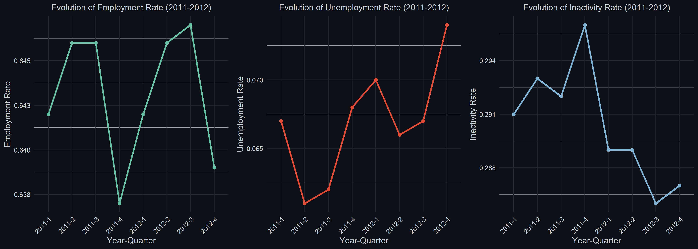

# Measurement Homework 5

## Analysing the French Labour Force

---

### 1. Labour Force Participation Rate, and Unemployment Rate

 **Labour Force Participation Rate (p):**

  $$
  p = \frac{Labour\ Force}{Working-Age\ Population}
  $$

 **Unemployment Rate (u):**

  $$
  u = \frac{Unemployed\ Population}{Labour\ Force}
  $$ 

Where:

- **Labour Force** = Employed population + Unemployed population  
- **Working-Age Population**: individuals aged 15-64  
- **Unemployed Population** = all individuals above a specified age (usually 15) observed in a reference period (a week) who are:
  - without work (during the reference period),
  - currently available for work (within two weeks),
  - actively seeking work (in the given reference period), or
  - have already found a job to start within the next three months.

---

### 2. French Employment and Unemployment Rates

  
**Table 1: Employment and Unemployment Rates by Year**
| Rate         | 2011         | 2012         |
|--------------|--------------|--------------|
| Employment   | 0.513 (0.001) | 0.511 (0.001) |
| Unemployment | 0.092 (0.001) | 0.098 (0.001) |

**Computations:**

- **Employment Rate:**
  - `traref == 1`: worked at least 1 hour in the reference week  
  - `aidref == 1 & tafref == 2`: unpaid work for a relative’s business (ILO)  
  - `temp == 1`: individuals aged 75+ who currently have a job  
  - `pastra == 1 & rabs %in% c(1, 3, 4, 7, 8, 10)`: temporarily absent but still employed  
  - `pastra == 1 & rabs == 2 & rabsp <= 365`: sick leave (<1 year)  
  - `pastra == 1 & rabs %in% c(5,6) & rabsp <= 91`: parental leave and other unpaid leave (<3 months)

- **Unemployment Rate:**
  - `traref == 2 & dispoc == 1 & dem == 1 & pastra == 2`: actively looking, no job (ILO)  
  - `traref == 2 & dispoc == 1 & dem == 1 & pastra == 1 & rabs == 11 & ultj <= 91`: waiting for job (INSEE)  
  - `tafref == 2 & dem == 1 & pastrb == 1 & ultj <= 91`: temporarily absent but returning to job in <3 months

> Overall, the decline in France’s employment rate in 2012 may have been driven by the lingering effects of the Eurozone debt crisis and the austerity measures implemented by President Sarkozy’s government to reduce the budget deficit.

---

### 3. Unemployment Rate

The ILO and INSEE define an unemployed individual as someone who:

- Is not employed (i.e., does not engage in at least 1 hour of paid or unpaid work per week).
- Is available to start a job within 2 weeks.
- Has actively sought work in the past 4 weeks (job search criterion).

However, the ILO recognises that discouraged workers exist and are excluded from the official unemployment measure. Thus, it remains relevant to include them in the unemployment metric, as the KILM framework considers waiting to start work as part of labour underutilisation.

Hence, discouraged workers who still meet availability conditions should be included. This includes those:

- Waiting to start a job in <3 months (`ultj <= 91`)
  - These individuals have a concrete job offer but haven’t started yet.
  - ILO justification: waiting to start work as part of labour underutilisation (KILM framework).
- Unable to look for work due to minor temporary obstacles (`nondic %in% c(4, 5, 6, 8)`)
  - 4 → Caring for a child or family member (but willing to work).  
  - 5 → Personal obligations (e.g., administrative barriers, relocation).  
  - 6 → Temporarily sick (short-term illness preventing job search).  
  - 8 → Participating in a short-term government training program.  
  - ILO/INSEE justification: these individuals would be working if not for minor short-term barriers.

Exclusions from the unemployment measure include completely inactive individuals. This encompasses chronically sick individuals, those with disabilities that prevent them from working, and full-time students who are not actively seeking employment. People who engage in informal or part-time work but do not self-identify as employed remain excluded. This definition is statistically sound as it balances the ILO/INSEE criteria with an expansion that avoids including completely inactive individuals, thus preventing overestimation. It reflects economic reality by accurately depicting the labour market and including those facing temporary barriers to job search.

  
**Table 2: New Unemployment Rates by Year**

| 2011           | 2012           |
|:--------------:|:--------------:|
| 0.089 (0.001)  | 0.095 (0.001)  |

The decrease in unemployment rates occurred because the expanded definition reclassified some individuals previously counted as unemployed into the inactive population. Specifically, those who were not actively looking for a job (`dem == 1`) and not available to work within the next two weeks (`dispoc == 1`) were removed from the unemployment count, aligning more closely with ILO and INSEE definitions. This adjustment reduced the numerator (unemployed individuals) while keeping the denominator (labour force) relatively stable, leading to a slight decline in the unemployment rate.

---

### 4. Unweighted Standard Errors

**Table 3: Comparison of Unemployment Standard Errors**

| Method     | 2011     | 2012     |
|:----------:|:--------:|:--------:|
| Weighted   | 0.00062  | 0.00064  |
| Unweighted | 0.00061  | 0.00062  |

**Comments:**

- The unweighted standard errors are slightly smaller than the weighted ones, which is an expected result. When using unweighted estimates, we assume a simple random sample, ignoring the stratification, clustering, and differential selection probabilities inherent in the survey design which underestimates variability.
- Conversely, weights account for the survey design and correct for unequal probabilities of selection. While this improves the accuracy of estimates by better reflecting the true population uncertainty, it also increases variability, leading to slightly larger standard errors. Ignoring the survey weights can overstate the precision of estimates, potentially leading to misleading conclusions about statistical significance and Type I errors in hypothesis testing.
- The 95% confidence intervals for the unemployment rates in 2011 and 2012 do not overlap, indicating a statistically significant increase. The difference of 0.006 between the rates is supported by a z-score of 4.24, well above the 1.96 threshold for 95% confidence. Therefore, we can conclude that the increase in the unemployment rate from 2011 to 2012 is statistically significant.

---

### 5. Evolution of Working-Age Population

**Table 4: Quarterly Rates and Changes for Working-Age Population**

| Year | Quarter | Employment | Unemployment | Inactivity | Δ Employment | Δ Unemployment | Δ Inactivity |
|:----:|:-------:|:----------:|:------------:|:----------:|:------------:|:--------------:|:------------:|
| 2011 |   1     |   0.642    |    0.067     |   0.291    |      NA      |       NA       |      NA      |
| 2011 |   2     |   0.646    |    0.061     |   0.293    |    0.004     |     -0.006     |    0.002     |
| 2011 |   3     |   0.646    |    0.062     |   0.292    |    0.000     |      0.001     |   -0.001     |
| 2011 |   4     |   0.637    |    0.068     |   0.296    |   -0.009     |      0.006     |    0.003     |
| 2012 |   1     |   0.642    |    0.070     |   0.289    |      NA      |       NA       |      NA      |
| 2012 |   2     |   0.646    |    0.066     |   0.289    |    0.004     |     -0.004     |    0.000     |
| 2012 |   3     |   0.647    |    0.067     |   0.286    |    0.001     |      0.002     |   -0.002     |
| 2012 |   4     |   0.639    |    0.074     |   0.287    |   -0.008     |      0.007     |    0.001     |

**Plots:**

**Summary:**

- Between quarters 1 and 2 of 2011, employment improved and unemployment fell, with a slight rise in inactivity.
- Between quarters 2 and 3 of 2011, the labour market remained stable, with marginal shifts.
- Between quarters 1 and 2 of 2012, employment increased and unemployment decreased notably, while inactivity remained constant.

---

### 6. Observations for 2012

**Table 5: Unemployment and Labour Force Participation Rates by Gender**

| Group  | Unemployment Rate (%) | Labour Force Participation Rate (%) |
|:------:|:--------------------:|:---------------------------------:|
| Male   |         7.27         |               75.59               |
| Female |         6.57         |               66.90               |

**Differences by Gender:**

- **Unemployment Rates:**  
  The higher unemployment rate among men could indicate greater exposure to sectors with higher job volatility (e.g., manufacturing, construction). By contrast, women may disproportionately work in sectors like healthcare or education, which tend to be more stable.

- **Labour Force Participation Rates:**  
  Male participation is much higher (75.59%) than female participation (66.90%).  
  The gap here could reflect the enduring impact of traditional gender roles in France, where women may prioritise caregiving responsibilities or face structural barriers to full-time labour market engagement, such as inadequate childcare facilities or wage gaps.

---

  
**Table 6: Unemployment and Labour Force Participation Rates by Age Group**

| Group  | Unemployment Rate (%) | Labour Force Participation Rate |
|--------|------------------------|-------------------------------|
| 15-24  | 8.35                   | 34.47                         |
| 25-49  | 8.01                   | 88.50                         |
| 50-64  | 4.31                   | 63.36                         |

**Differences by Age:**

- **Unemployment Rates:**
  - Youth unemployment (15-24) could be significantly higher due to structural barriers, including limited work experience, mismatched skills, and the prevalence of temporary or low-quality jobs. For older workers (50-64), the low unemployment rate is consistent with established career stability and a reduced likelihood of job transitions.
  - ILO recognises that the younger cohort often includes students or trainees, which partially explains the high unemployment rate among youth. Older workers nearing retirement may also be classified as inactive rather than unemployed if they leave the workforce entirely.

- **Labour Force Participation Rates:**
  - Participation among youth could be lower due to commitments to education or training. The prime working-age group (25-49) has the highest participation, reflecting peak employment years. Participation declines for those aged 50-64 as workers retire early or face health-related challenges.

---

  
**Table 7: Unemployment and Labour Force Participation Rates by Qualification**

| Group | Unemployment Rate (%) | Labour Force Participation Rate (%) |
|-------|------------------------|------------------------------------|
| 1     | 4.72                   | 86.71                              |
| 3     | 4.81                   | 86.54                              |
| 4     | 6.72                   | 69.08                              |
| 5     | 7.49                   | 78.25                              |
| 6     | 6.16                   | 45.66                              |
| 7     | 9.92                   | 57.57                              |

**Differences by Qualification:**

- **Unemployment Rates:**
  - Individuals with higher qualifications (e.g., Diplôme supérieur à baccalauréat + 2 ans) experience much lower unemployment rates due to greater access to specialised, high-demand roles and better job stability. In contrast, individuals with no qualifications (Group 7) face significantly higher unemployment rates, as they are often limited to low-skill jobs that are declining due to automation and outsourcing.
  - INSEE data supports the correlation between educational attainment and employment opportunities, where qualifications beyond the baccalauréat greatly reduce unemployment risk. Group 7’s high unemployment reflects structural issues, such as inadequate skill alignment with labour market demands.

- **Labour Force Participation Rates:**
  - Participation is highest among those with advanced education, as higher qualifications translate to higher earning potential and a stronger motivation to remain in the labour force. The sharp drop for Group 6 reflects challenges faced by individuals with minimal secondary education, who may be discouraged from seeking work or lack skills for sustainable employment.
  - INSEE highlights that those with no formal qualifications (Group 7) or minimal secondary education (Group 6) are more likely to drop out of the labour force entirely, often shifting to informal sectors or inactivity.

**Cross-Category Analysis:**

- **Younger Workers:** Young individuals with qualifications below Baccalauréat (Groups 5-7) are most vulnerable to both high unemployment and low participation. This highlights the need for accessible vocational training and apprenticeship programs.

- **Older Workers:** Older men in Groups 6 and 7 often leave the labour force early, reflecting a lack of retraining opportunities and high job demands in low-skill sectors.

- **Women in Qualification Groups 6 and 7:** Structural barriers such as childcare responsibilities and limited access to high-quality jobs further disadvantage low-qualified women.

---
