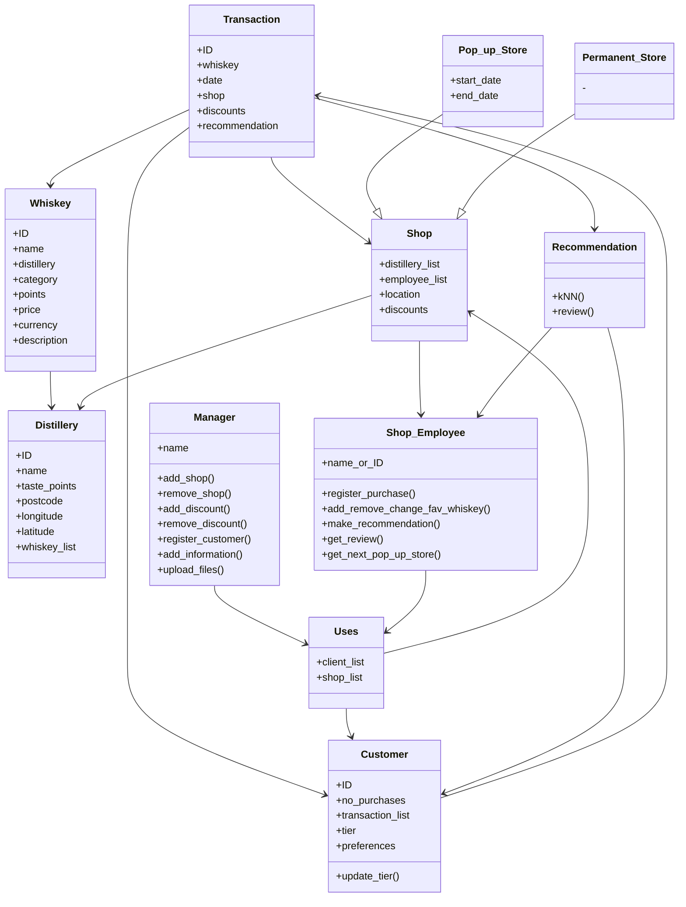

```mermaid
classDiagram

%% Classes and attributes
class Distillery {
  +ID
  +name
  +taste_points
  +postcode
  +longitude
  +latitude
  +whiskey_list}

class Whiskey {
  +ID
  +name
  +distillery
  +category
  +points
  +price
  +currency
  +description}

class Transaction {
  +ID
  +whiskey
  +date
  +shop
  +discounts
  +recommendation}

class Shop {
  +distillery_list
  +employee_list
  +location
  +discounts}

class Pop_up_Store {
  +start_date
  +end_date}

class Permanent_Store {
  %% visually empty using placeholder
-}

class Manager {
  +name
  +add_shop()
  +remove_shop()
  +add_discount()
  +remove_discount()
  +register_customer()
  +add_information()
  +upload_files()}

class Shop_Employee {
  +name_or_ID
  +register_purchase()
  +add_remove_change_fav_whiskey()
  +make_recommendation()
  +get_review()
  +get_next_pop_up_store()}

class Customer {
  +ID
  +no_purchases
  +transaction_list
  +tier
  +preferences
  +update_tier()}

class Recommendation {
  +kNN()
  +review()}

class Uses {
  +client_list
  +shop_list}

%% Relationships
Whiskey --> Distillery
Transaction --> Whiskey
Transaction --> Shop
Transaction --> Recommendation
Transaction --> Customer
Shop --> Distillery
Shop --> Shop_Employee
Pop_up_Store --|> Shop
Permanent_Store --|> Shop
Uses --> Customer
Uses --> Shop
Manager --> Uses
Shop_Employee --> Uses
Customer --> Transaction
Recommendation --> Shop_Employee
Recommendation --> Customer
```

**Legend**
- `-->` Composition
- `--|>` Inheritance
